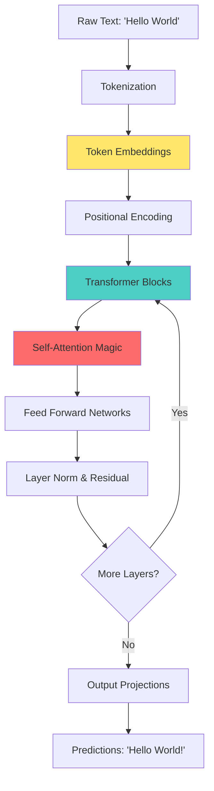
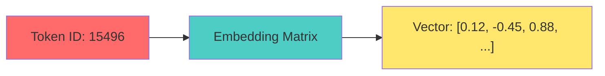
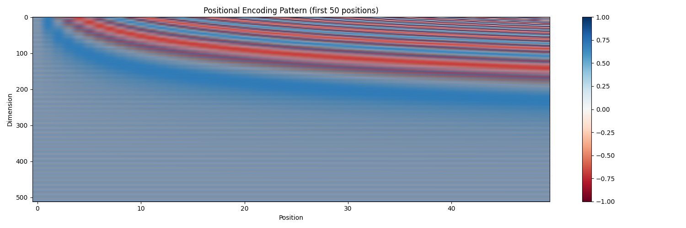
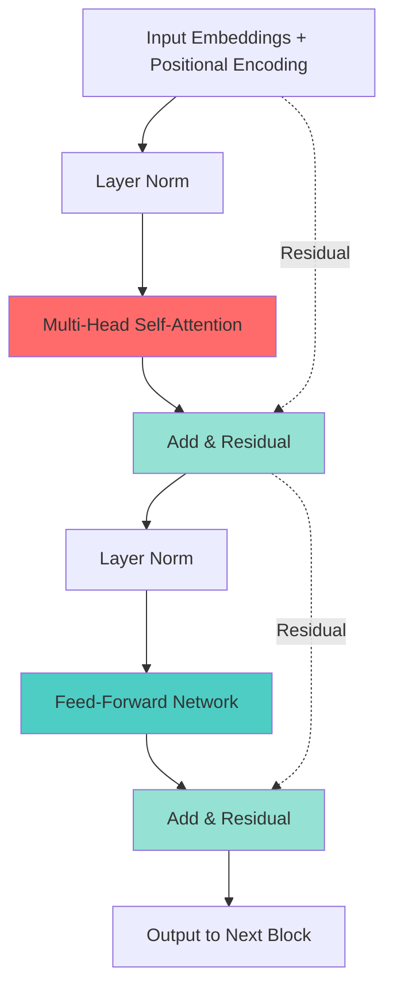

# The Hitchhiker's Guide to Large Language Models: Part 1
## *Or: How I Learned to Stop Worrying and Love the Transformer*

> "Any sufficiently advanced language model is indistinguishable from a very caffeinated undergraduate pulling an all-nighter." - Arthur C. Clarke (probably)

---

## Introduction: The Great Language Model Heist

Imagine you're trying to predict what comes next in a sentence. Humans do this constantly - we finish each other's sentences, anticipate plot twists, and know that "May the Force be..." will almost certainly end with "with you." But how do you teach a machine to do this?

The answer, my friend, is transformers. Not the robots-in-disguise kind, but the architecture that's been causing both excitement and existential dread since 2017. Let's take this journey together, building from the ground up.

> **A Note on Inspiration**: A huge shoutout to Andrej Karpathy and his incredible "Zero to Hero" series. If you haven't watched his videos, stop what you're doing (well, maybe finish reading this first) and go watch them. Much of the code structure here is inspired by his `nanoGPT` implementation, which is basically the gold standard for learning this stuff.



*Does that look terrifying? Yeah, I thought so too. Don't worry, we're going to break it down piece by piece until it looks like a simple Lego set.*

## Chapter 1: Tokenization - Breaking Up Is Hard to Do

### The Intuition

You can't feed raw text into a neural network. It's like trying to eat soup with a fork - technically possible, but messy and inefficient. We need to break text into **tokens**: the atomic units of language that our model will understand.

Think of tokenization like Lego blocks. You don't try to describe an entire castle; you describe it as a collection of standard blocks that can be reassembled.

*Personal take: When I first started, I thought we just fed words directly into the model. Turns out, computers really hate variable-length strings. Breaking them down into standard "sub-word" chunks was the breakthrough that made everything scalable.*

### The Types

1. **Character-level**: Each character is a token. Simple but inefficient.
2. **Word-level**: Each word is a token. Intuitive but creates huge vocabularies.
3. **Subword-level**: The Goldilocks solution. Words are broken into meaningful chunks.

Modern LLMs use **Byte Pair Encoding (BPE)** or **SentencePiece**, which learn the most frequent subword units from your corpus.

### The Math (Light Touch)

Given a vocabulary \(V\) of size \(|V|\), each token \(t\) gets mapped to an integer \(i \in [0, |V|-1]\).

```
tokenize("Hello") → [15496, 11393]  # Example BPE encoding
```

### The Code

```python
# Simple character-level tokenizer (for illustration)
class SimpleTokenizer:
    def __init__(self, text):
        # Create vocabulary from unique characters
        self.chars = sorted(list(set(text)))
        self.vocab_size = len(self.chars)
        
        # Create mappings
        self.char_to_idx = {ch: i for i, ch in enumerate(self.chars)}
        self.idx_to_char = {i: ch for i, ch in enumerate(self.chars)}
    
    def encode(self, text):
        """Convert text to list of integers"""
        return [self.char_to_idx[ch] for ch in text]
    
    def decode(self, indices):
        """Convert list of integers back to text"""
        return ''.join([self.idx_to_char[i] for i in indices])

# Usage
text = "Hello, World! Hello, AI!"
tokenizer = SimpleTokenizer(text)
encoded = tokenizer.encode("Hello")
print(f"Vocabulary size: {tokenizer.vocab_size}")
print(f"'Hello' encoded: {encoded}")
print(f"Decoded back: {tokenizer.decode(encoded)}")

# Output:
# Vocabulary size: 12
# 'Hello' encoded: [5, 6, 7, 7, 8]
# Decoded back: Hello
```

### Why It Works

Subword tokenization gives us the best of both worlds:
- **Efficiency**: Common words stay as single tokens
- **Flexibility**: Rare words break into recognizable parts
- **Coverage**: Can represent any text, even typos and new words

Fun fact: GPT-2 uses a vocabulary of ~50,000 tokens. That's like learning 50,000 Lego pieces to build any sentence in any language!

### Real World Example: `tiktoken`

Want to see this in action? OpenAI's `tiktoken` library shows exactly how modern LLMs see text.

```python
import tiktoken

# Load the encoding used by GPT-4
enc = tiktoken.get_encoding("cl100k_base")

text = "Hello, World!"
tokens = enc.encode(text)

print(f"Text: {text}")
print(f"Tokens: {tokens}")
print(f"Token breakdown:")
for token in tokens:
    print(f"  {token} -> '{enc.decode([token])}'")

# Output:
# Text: Hello, World!
# Tokens: [9906, 11, 4435, 0]
# Token breakdown:
#   9906 -> 'Hello'
#   11 -> ','
#   4435 -> ' World'
#   0 -> '!'
```

Notice how " World" includes the leading space! This is a common trick to handle whitespace efficiently.

---

## Chapter 2: Token Embeddings - Numbers Have Feelings Too

### The Intuition

Tokens are just integers, and integers are... boring. The number 42 doesn't inherently mean anything to a neural network. We need to convert these discrete symbols into **continuous vectors** that capture meaning.

Think of embeddings as giving each token a personality profile with hundreds of traits. "King" and "Queen" should have similar profiles (both royalty), but differ in specific dimensions (gender, perhaps).

### The Math

An embedding is a learned lookup table. Given:
- Vocabulary size: \(V\)
- Embedding dimension: \(d_{model}\) (typically 768, 1024, or larger)

We create a matrix \(E \in \mathbb{R}^{V \times d_{model}}\) where each row is the embedding for one token.

For token index \(i\), the embedding is simply:

$$e_i = E[i] \in \mathbb{R}^{d_{model}}$$

This is just fancy notation for "look up row \(i\) in the embedding table."



### The Pseudocode

```
function get_embedding(token_id, embedding_matrix):
    return embedding_matrix[token_id]  # Simple lookup!

function embed_sequence(token_ids, embedding_matrix):
    embeddings = []
    for token_id in token_ids:
        embeddings.append(get_embedding(token_id, embedding_matrix))
    return stack(embeddings)  # Shape: (sequence_length, d_model)
```

### The Code

```python
import numpy as np
import torch
import torch.nn as nn

class TokenEmbedding(nn.Module):
    def __init__(self, vocab_size, d_model):
        """
        Args:
            vocab_size: Size of vocabulary
            d_model: Dimension of embeddings
        """
        super().__init__()
        # This is our learned lookup table
        self.embedding = nn.Embedding(vocab_size, d_model)
        self.d_model = d_model
    
    def forward(self, x):
        """
        Args:
            x: Token indices, shape (batch_size, seq_length)
        Returns:
            Embeddings, shape (batch_size, seq_length, d_model)
        """
        # Scale embeddings by sqrt(d_model) - this is from the original paper
        # Helps with gradient flow (we'll see why later)
        return self.embedding(x) * np.sqrt(self.d_model)

# Example usage
vocab_size = 50000
d_model = 512
seq_length = 10
batch_size = 2

embed_layer = TokenEmbedding(vocab_size, d_model)

# Simulate some token IDs
token_ids = torch.randint(0, vocab_size, (batch_size, seq_length))
print(f"Input shape: {token_ids.shape}")

# Get embeddings
embeddings = embed_layer(token_ids)
print(f"Output shape: {embeddings.shape}")
print(f"First token's embedding (first 10 dims): {embeddings[0, 0, :10]}")

# Output:
# Input shape: torch.Size([2, 10])
# Output shape: torch.Size([2, 10, 512])
# First token's embedding (first 10 dims): tensor([...], grad_fn=<SliceBackward0>)
```

### Why It Works

The magic happens during training! Initially, embeddings are random. But through backpropagation:

1. The model learns that "king" and "queen" should have similar embeddings
2. Semantic relationships emerge: `king - man + woman ≈ queen`
3. Syntax relationships form: verbs cluster together, nouns cluster together

The embedding layer is essentially a **compression algorithm** that maps discrete symbols into a continuous space where distance = similarity.

**The Secret Sauce**: We scale by \(\sqrt{d_{model}}\) because attention mechanisms (coming up!) compute dot products. Larger dimensions lead to larger dot products, which can cause gradients to vanish when we apply softmax. Scaling keeps things numerically stable.

---

## Chapter 3: Positional Encoding - Where Am I?

### The Intuition

Houston, we have a problem. Our embeddings capture *what* each token is, but not *where* it appears in the sequence. The sentence "dog bites man" is very different from "man bites dog," but with just token embeddings, they'd look identical to our model!

We need to inject positional information. But how? We could just add a position index (0, 1, 2, 3...), but that's problematic:
- Different sequences have different lengths
- Numbers get arbitrarily large
- No natural notion of "relative position"

The solution: **sinusoidal positional encodings** - a stroke of genius from the original Transformer paper.

### The Math

For position \(pos\) and dimension \(i\), the positional encoding is:

$$PE_{(pos, 2i)} = \sin\left(\frac{pos}{10000^{2i/d_{model}}}\right)$$

$$PE_{(pos, 2i+1)} = \cos\left(\frac{pos}{10000^{2i/d_{model}}}\right)$$

Where:
- Even dimensions use sine
- Odd dimensions use cosine
- Each dimension has a different frequency (wavelength from \(2\pi\) to \(10000 \cdot 2\pi\))

**Why these specific functions?** 
1. They're bounded (between -1 and 1)
2. They're periodic (the model can learn relative positions)
3. For any fixed offset \(k\), \(PE_{pos+k}\) can be represented as a linear function of \(PE_{pos}\)

This last property is mind-blowing: it means the model can learn to attend to relative positions naturally!

### The Pseudocode

```
function positional_encoding(position, d_model):
    encoding = zeros(d_model)
    
    for i in range(0, d_model, 2):
        denominator = 10000 ^ (i / d_model)
        encoding[i] = sin(position / denominator)
        encoding[i + 1] = cos(position / denominator)
    
    return encoding

function add_positional_encoding(embeddings):
    seq_length, d_model = shape(embeddings)
    
    for pos in range(seq_length):
        pos_encoding = positional_encoding(pos, d_model)
        embeddings[pos] += pos_encoding
    
    return embeddings
```

### The Code

```python
import torch
import torch.nn as nn
import matplotlib.pyplot as plt

class PositionalEncoding(nn.Module):
    def __init__(self, d_model, max_len=5000, dropout=0.1):
        """
        Args:
            d_model: Dimension of embeddings
            max_len: Maximum sequence length we want to support
            dropout: Dropout rate to apply after adding positional encoding
        """
        super().__init__()
        self.dropout = nn.Dropout(p=dropout)
        
        # Create the positional encoding matrix
        pe = torch.zeros(max_len, d_model)
        position = torch.arange(0, max_len, dtype=torch.float).unsqueeze(1)
        
        # Create the division term: 10000^(2i/d_model)
        div_term = torch.exp(
            torch.arange(0, d_model, 2).float() * 
            (-np.log(10000.0) / d_model)
        )
        
        # Apply sin to even indices
        pe[:, 0::2] = torch.sin(position * div_term)
        # Apply cos to odd indices
        pe[:, 1::2] = torch.cos(position * div_term)
        
        # Add batch dimension: (1, max_len, d_model)
        pe = pe.unsqueeze(0)
        
        # Register as buffer (not a parameter, but part of state)
        self.register_buffer('pe', pe)
    
    def forward(self, x):
        """
        Args:
            x: Embeddings, shape (batch_size, seq_length, d_model)
        Returns:
            Embeddings with positional encoding added
        """
        # Add positional encoding to embeddings
        x = x + self.pe[:, :x.size(1), :]
        return self.dropout(x)

# Example usage
d_model = 512
max_len = 100

pos_encoder = PositionalEncoding(d_model, max_len)

# Create some dummy embeddings
batch_size = 2
seq_length = 20
embeddings = torch.randn(batch_size, seq_length, d_model)

# Add positional encoding
encoded = pos_encoder(embeddings)
print(f"Input shape: {embeddings.shape}")
print(f"Output shape: {encoded.shape}")

# Visualize the positional encodings
plt.figure(figsize=(15, 5))
pe_matrix = pos_encoder.pe[0, :50, :].numpy()
plt.imshow(pe_matrix.T, cmap='RdBu', aspect='auto')
plt.colorbar()
plt.xlabel('Position')
plt.ylabel('Dimension')
plt.title('Positional Encoding Pattern (first 50 positions)')
plt.tight_layout()
# plt.savefig('positional_encoding.png')
print("Notice the wave patterns! Different frequencies for different dimensions.")
```




### Visualizing the Magic

When you plot positional encodings, you see beautiful wave patterns:
- **Low dimensions**: Fast oscillations (high frequency)
- **High dimensions**: Slow oscillations (low frequency)
- **Result**: Each position gets a unique "fingerprint"

```
Position 0:  [0.0000,  1.0000,  0.0000,  1.0000, ...]
Position 1:  [0.8415,  0.5403,  0.0100,  0.9999, ...]
Position 2:  [0.9093, -0.4161,  0.0200,  0.9998, ...]
```

### Why It Works

1. **Uniqueness**: No two positions have the same encoding
2. **Boundedness**: Values stay between -1 and 1 (good for gradients)
3. **Extrapolation**: The model can potentially handle sequences longer than it was trained on
4. **Relative Position Learning**: The linear combination property means \(PE(pos+k)\) is a linear function of \(PE(pos)\), allowing the model to learn patterns like "3 tokens ahead"

**Alternative Approach**: Learned positional embeddings (like GPT uses) where positions are just another embedding table. Both work! Sinusoidal is more elegant mathematically; learned embeddings are simpler but require explicit training for each position.

---

## Chapter 4: The Transformer Block - The Main Attraction

### The Intuition

We've got our tokens embedded and position-aware. Now comes the real magic: **transformer blocks**. These are the fundamental building blocks (pun intended) that stack to create deep language models.

A transformer block does two main things:
1. **Multi-Head Self-Attention**: Let tokens "talk" to each other
2. **Feed-Forward Network**: Process each token individually

Both are wrapped with:
- **Residual connections**: Highway lanes for gradients
- **Layer normalization**: Keep things stable



### The Math (High Level)

For input \(X\):

$$\text{Output}_1 = \text{LayerNorm}(X + \text{MultiHeadAttention}(X))$$

$$\text{Output}_2 = \text{LayerNorm}(\text{Output}_1 + \text{FFN}(\text{Output}_1))$$

The \(+\) operations are **residual connections** - we add the input back to the output. This creates gradient highways that prevent the vanishing gradient problem in deep networks.

### The Code (Structure Only - Details Coming)

```python
import torch
import torch.nn as nn

class TransformerBlock(nn.Module):
    def __init__(self, d_model, num_heads, d_ff, dropout=0.1):
        """
        Args:
            d_model: Dimension of embeddings
            num_heads: Number of attention heads
            d_ff: Dimension of feed-forward layer
            dropout: Dropout rate
        """
        super().__init__()
        
        # Multi-head self-attention
        self.attention = MultiHeadAttention(d_model, num_heads, dropout)
        
        # Feed-forward network
        self.ffn = FeedForwardNetwork(d_model, d_ff, dropout)
        
        # Layer normalization layers
        self.norm1 = nn.LayerNorm(d_model)
        self.norm2 = nn.LayerNorm(d_model)
        
        # Dropout layers
        self.dropout1 = nn.Dropout(dropout)
        self.dropout2 = nn.Dropout(dropout)
    
    def forward(self, x, mask=None):
        """
        Args:
            x: Input tensor (batch_size, seq_length, d_model)
            mask: Optional attention mask
        Returns:
            Output tensor (batch_size, seq_length, d_model)
        """
        # Self-attention block with residual connection
        # Pre-norm architecture (norm before, not after)
        attended = self.attention(self.norm1(x), mask)
        x = x + self.dropout1(attended)  # Residual connection
        
        # Feed-forward block with residual connection
        fed_forward = self.ffn(self.norm2(x))
        x = x + self.dropout2(fed_forward)  # Residual connection
        
        return x
```

### Why It Works

**Residual Connections**: Imagine trying to learn the identity function \(f(x) = x\). Hard! But learning \(f(x) = x + g(x)\) where \(g(x) = 0\) is easy - just set \(g\) to output zeros. Residual connections make it easy for the network to learn small refinements to the input.

**Layer Normalization**: Normalizes across the feature dimension, keeping activations in a reasonable range. This prevents numerical instability and speeds up training.

> **Analogy**: Think of Layer Norm like "grading on a curve" or standardizing test scores. If one student (neuron) always shouts (high values) and another whispers (low values), it's hard to listen to both. Layer Norm makes sure everyone speaks at a similar volume so the next layer can hear everyone clearly.

**Pre-Norm vs Post-Norm**: Modern architectures use pre-norm (normalize before the sublayer) rather than post-norm. Why? Better gradient flow in deep networks!

---

## Interlude: The Road Ahead

We've covered the foundational components:
- ✅ Tokenization: Converting text to numbers
- ✅ Embeddings: Giving tokens meaning
- ✅ Positional Encoding: Adding position awareness
- ✅ Transformer Block Structure: The overall architecture

In **Part 2**, we'll dive into the real stars of the show:

1. **Self-Attention**: How tokens "communicate" with each other
2. **Multi-Head Attention**: Running multiple attention patterns in parallel
3. **Feed-Forward Networks**: The computational workhorse
4. **The Complete Transformer**: Putting it all together
5. **Training & Inference**: Making predictions

We'll get into the beautiful math behind attention (including those famous Query, Key, and Value matrices), implement everything from scratch, and understand why this architecture took over the AI world.

**Spoiler alert**: Attention is all you need. (See what I did there?)

---

## Quick Recap: Where We Are

```python
# What we've built so far (conceptually)
text = "Hello, World!"

# Step 1: Tokenization
tokens = tokenizer.encode(text)  # [15496, 11, 2159, 0]

# Step 2: Embeddings
embeddings = token_embedding(tokens)  # Shape: (4, 512)

# Step 3: Positional Encoding
pos_encoded = positional_encoding(embeddings)  # Shape: (4, 512)

# Step 4: Ready for transformer blocks!
# output = transformer_block(pos_encoded)  # Coming in Part 2!
```

Each token is now represented as a 512-dimensional vector that captures both its meaning and its position. These vectors will now flow through multiple transformer blocks, where the real magic happens.

**Stay tuned for Part 2, where we'll unlock the secrets of attention and watch our language model come to life!** 🚀

---

*"The Transformer is the most elegantly over-engineered solution to autocomplete that humanity has ever devised."* - Anonymous ML Engineer

