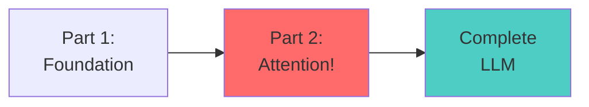
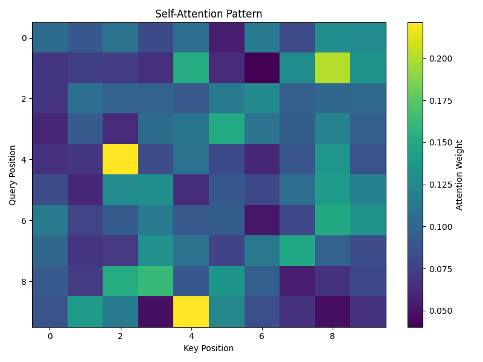
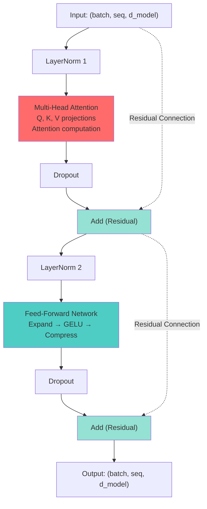
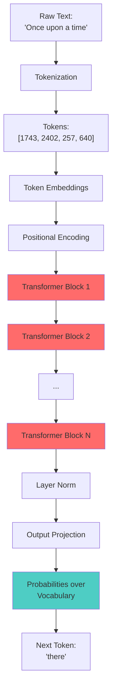

# The Hitchhiker's Guide to Large Language Models: Part 2
## *The Heart of Darkness: Inside the Attention Mechanism*

> "I attended to the problem of attention, but got distracted by how beautiful the math was." - Every ML researcher ever

---

## Welcome Back, Intrepid Explorer!

In Part 1, we built the foundation: tokenization, embeddings, and positional encodings. We stood at the gates of the Transformer block. Now, we're going inside.

This is where things get **really** interesting. We're about to understand the mechanism that changed AI forever: **Self-Attention**.



---

## Chapter 5: Self-Attention - The Cocktail Party Problem

### The Intuition

Imagine you're at a cocktail party (remember those?). You're having a conversation with someone, but your attention keeps drifting:

- You hear your name from across the room → **High attention**
- Someone mentions "pizza" nearby → **Medium attention**  
- Background music → **Low attention**
- The hum of the AC → **Zero attention**

Your brain is constantly computing **relevance scores** for different inputs and focusing computational resources accordingly. That's exactly what self-attention does!

In language, context is everything:
- "The **bank** was robbed" (financial institution)
- "I sat by the river **bank**" (geographical feature)

The word "bank" needs to look at other words in the sentence to understand which meaning is appropriate. Self-attention lets each word "look at" every other word and decide what's important.

### The Key Insight

Traditional RNNs process sequences one token at a time, left to right. They're like reading with a flashlight in the dark—you can only see the current word and vaguely remember what came before.

**Self-attention says**: "Forget sequential processing! Every word can look at every other word simultaneously and decide what's relevant."

> **Pro Tip**: This is the "Aha!" moment. If you understand nothing else, understand this: RNNs are like reading a book word-by-word through a straw. Transformers are like looking at the whole page at once.

This is revolutionary because:
1. **Parallelization**: Process all tokens at once (GPUs love this!)
2. **Long-range dependencies**: Token 1 can directly attend to token 1000
3. **Context-aware representations**: Each token's representation is influenced by relevant context

### The Math: Query, Key, Value (QKV)

Here's the big idea in one metaphor:

**Imagine a library:**
- **Query (Q)**: "I'm looking for books about neural networks"
- **Keys (K)**: The index cards describing each book
- **Values (V)**: The actual books

You compare your query against all the keys to find relevant books, then retrieve those books weighted by relevance.

**In math terms**, for input $X \in \mathbb{R}^{n \times d_{model}}$ where $n$ is sequence length:

1. **Create Q, K, V through linear projections:**

$$Q = XW^Q, \quad K = XW^K, \quad V = XW^V$$

Where $W^Q, W^K, W^V \in \mathbb{R}^{d_{model} \times d_k}$ are learned weight matrices.

2. **Compute attention scores** (how much each token should attend to every other token):

$$\text{scores} = QK^T \in \mathbb{R}^{n \times n}$$

This creates a matrix where entry $(i,j)$ is the dot product of query $i$ with key $j$—measuring their similarity.

3. **Scale the scores** (for numerical stability):

$$\text{scaled\_scores} = \frac{QK^T}{\sqrt{d_k}}$$

Why divide by $\sqrt{d_k}$? As dimensions grow, dot products get larger, pushing softmax into regions with tiny gradients (saturation). Scaling prevents this.

4. **Apply softmax** (convert scores to probabilities):

$$\text{attention\_weights} = \text{softmax}\left(\frac{QK^T}{\sqrt{d_k}}\right)$$

Now each row sums to 1—these are probability distributions over which tokens to attend to.

5. **Weighted sum of values**:

$$\text{Attention}(Q, K, V) = \text{softmax}\left(\frac{QK^T}{\sqrt{d_k}}\right)V$$

This gives us context-aware representations!

### The Complete Formula

The legendary attention equation from "Attention Is All You Need":

$$\boxed{\text{Attention}(Q, K, V) = \text{softmax}\left(\frac{QK^T}{\sqrt{d_k}}\right)V}$$

**Dimensions:**
- Input: $X \in \mathbb{R}^{n \times d_{model}}$
- Q, K, V: $\mathbb{R}^{n \times d_k}$
- $QK^T$: $\mathbb{R}^{n \times n}$ (attention scores matrix)
- Attention weights: $\mathbb{R}^{n \times n}$
- Output: $\mathbb{R}^{n \times d_k}$

### The Pseudocode

```
function self_attention(X, W_q, W_k, W_v):
    # Project to Q, K, V
    Q = X @ W_q  # Shape: (n, d_k)
    K = X @ W_k  # Shape: (n, d_k)
    V = X @ W_v  # Shape: (n, d_k)
    
    # Compute attention scores
    scores = (Q @ K.transpose()) / sqrt(d_k)  # Shape: (n, n)
    
    # Apply softmax to get attention weights
    attention_weights = softmax(scores, dim=-1)  # Shape: (n, n)
    
    # Weighted sum of values
    output = attention_weights @ V  # Shape: (n, d_k)
    
    return output, attention_weights
```

### The Code

```python
import torch
import torch.nn as nn
import torch.nn.functional as F
import math

class SelfAttention(nn.Module):
    def __init__(self, d_model, d_k):
        """
        Args:
            d_model: Dimension of input embeddings
            d_k: Dimension of queries, keys, and values
        """
        super().__init__()
        self.d_k = d_k
        
        # Linear projections for Q, K, V
        self.W_q = nn.Linear(d_model, d_k, bias=False)
        self.W_k = nn.Linear(d_model, d_k, bias=False)
        self.W_v = nn.Linear(d_model, d_k, bias=False)
    
    def forward(self, x, mask=None):
        """
        Args:
            x: Input tensor (batch_size, seq_length, d_model)
            mask: Optional mask (batch_size, seq_length, seq_length)
                  Used to prevent attending to certain positions
        Returns:
            output: Attention output (batch_size, seq_length, d_k)
            attention_weights: Attention weights (batch_size, seq_length, seq_length)
        """
        batch_size, seq_length, d_model = x.shape
        
        # Project to Q, K, V
        Q = self.W_q(x)  # (batch_size, seq_length, d_k)
        K = self.W_k(x)  # (batch_size, seq_length, d_k)
        V = self.W_v(x)  # (batch_size, seq_length, d_k)
        
        # Compute attention scores
        # Q @ K^T: (batch_size, seq_length, d_k) @ (batch_size, d_k, seq_length)
        #        = (batch_size, seq_length, seq_length)
        scores = torch.bmm(Q, K.transpose(1, 2)) / math.sqrt(self.d_k)
        
        # Apply mask if provided (for causal/masked attention)
        if mask is not None:
            scores = scores.masked_fill(mask == 0, float('-inf'))
        
        # Softmax to get attention weights
        attention_weights = F.softmax(scores, dim=-1)
        
        # Weighted sum of values
        # attention_weights @ V: (batch_size, seq_length, seq_length) @ 
        #                        (batch_size, seq_length, d_k)
        #                      = (batch_size, seq_length, d_k)
        output = torch.bmm(attention_weights, V)
        
        return output, attention_weights

# Example usage
batch_size = 2
seq_length = 5
d_model = 512
d_k = 64

attention = SelfAttention(d_model, d_k)
x = torch.randn(batch_size, seq_length, d_model)

output, weights = attention(x)

print(f"Input shape: {x.shape}")
print(f"Output shape: {output.shape}")
print(f"Attention weights shape: {weights.shape}")
print(f"\nAttention weights for first sample, first token:")
print(weights[0, 0, :])  # Should sum to 1
print(f"Sum: {weights[0, 0, :].sum()}")

# Visualize attention pattern
import matplotlib.pyplot as plt

plt.figure(figsize=(8, 6))
plt.imshow(weights[0].detach().numpy(), cmap='viridis', aspect='auto')
plt.colorbar(label='Attention Weight')
plt.xlabel('Key Position')
plt.ylabel('Query Position')
plt.title('Self-Attention Pattern')
plt.tight_layout()
# plt.savefig('attention_pattern.png')
```




### Why It Works: The Intuitive Explanation

Let's trace through a concrete example:

**Sentence**: "The cat sat on the mat"

**Token 2 ("sat") wants to understand its context:**

1. **Query generation**: "sat" creates a query vector asking "What's relevant to me?"
2. **Key matching**: Every word creates a key describing itself
3. **Scoring**: "sat" compares its query with all keys:
   - "cat" (subject doing the action) → High score
   - "on" (preposition showing relationship) → Medium score
   - "the" (article) → Low score
   
4. **Value retrieval**: "sat" takes a weighted combination of all tokens' values, emphasizing "cat" and "on"

5. **Result**: "sat" now has a representation enriched with information about its subject and related preposition

**The Beauty**: This happens for ALL tokens SIMULTANEOUSLY. Every token gets a context-aware representation in one parallel operation!

### The Masking Trick: Causal Attention

For language modeling (predicting the next token), we need **causal attention**—tokens can only attend to previous tokens, not future ones. Otherwise, it's cheating!

```python
def create_causal_mask(seq_length):
    """
    Creates a causal mask: upper triangular matrix of -inf
    """
    mask = torch.triu(torch.ones(seq_length, seq_length), diagonal=1)
    mask = mask.masked_fill(mask == 1, float('-inf'))
    return mask

# Example: sequence of length 4
mask = create_causal_mask(4)
print(mask)

# Output:
# tensor([[  0., -inf, -inf, -inf],
#         [  0.,   0., -inf, -inf],
#         [  0.,   0.,   0., -inf],
#         [  0.,   0.,   0.,   0.]])

# When added to attention scores before softmax:
# - Position 0 can only attend to position 0
# - Position 1 can attend to positions 0-1
# - Position 2 can attend to positions 0-2
# - Position 3 can attend to positions 0-3
```

This simple trick prevents future information leakage!

**Visualizing the Mask**:

```
      Token 0  Token 1  Token 2  Token 3
Token 0  [ 1       0        0        0    ]
Token 1  [ 1       1        0        0    ]
Token 2  [ 1       1        1        0    ]
Token 3  [ 1       1        1        1    ]
```

(Where `0` means "masked out" / `-inf` in the scores)

---

## Chapter 6: Multi-Head Attention - More Heads Are Better

### The Intuition

Single-head attention learns one way of relating tokens. But language has **multiple types of relationships**:

- **Syntactic**: Subject-verb agreement ("The cat sits" not "The cat sit")
- **Semantic**: Meaning relationships ("cat" relates to "pet", "animal")
- **Positional**: Adjacent words often relate ("New York")
- **Long-range**: Pronouns to referents ("John ate pizza. He was hungry.")

**Multi-head attention** runs multiple attention mechanisms in parallel, each learning different relationship patterns!

Think of it as having multiple experts in a room:
- Expert 1: Focuses on grammar
- Expert 2: Focuses on meaning
- Expert 3: Focuses on word order
- Expert 4: Focuses on long-range dependencies

Each expert produces their opinion, then we concatenate and combine them.

### The Math

Given $h$ attention heads:

1. **Split the model dimension** into $h$ heads:

$$d_k = d_v = \frac{d_{model}}{h}$$

2. **For each head $i$**, compute attention with separate Q, K, V projections:

$$\text{head}_i = \text{Attention}(XW^Q_i, XW^K_i, XW^V_i)$$

Where $W^Q_i, W^K_i, W^V_i \in \mathbb{R}^{d_{model} \times d_k}$

3. **Concatenate all heads**:

$$\text{MultiHead}(X) = \text{Concat}(\text{head}_1, ..., \text{head}_h)W^O$$

Where $W^O \in \mathbb{R}^{d_{model} \times d_{model}}$ is a final projection.

**Complete formula:**

$$\boxed{\text{MultiHead}(Q,K,V) = \text{Concat}(\text{head}_1, ..., \text{head}_h)W^O}$$

where $\text{head}_i = \text{Attention}(QW^Q_i, KW^K_i, VW^V_i)$

### The Pseudocode

```
function multi_head_attention(X, num_heads):
    d_k = d_model / num_heads
    heads = []
    
    for i in range(num_heads):
        # Each head has its own Q, K, V projections
        Q_i = X @ W_q[i]
        K_i = X @ W_k[i]
        V_i = X @ W_v[i]
        
        # Compute attention for this head
        head_i = self_attention(Q_i, K_i, V_i, d_k)
        heads.append(head_i)
    
    # Concatenate all heads
    multi_head = concatenate(heads, dim=-1)
    
    # Final projection
    output = multi_head @ W_o
    
    return output
```

### The Code

```python
import torch
import torch.nn as nn
import torch.nn.functional as F
import math

class MultiHeadAttention(nn.Module):
    def __init__(self, d_model, num_heads, dropout=0.1):
        """
        Args:
            d_model: Dimension of embeddings
            num_heads: Number of attention heads
            dropout: Dropout rate
        """
        super().__init__()
        assert d_model % num_heads == 0, "d_model must be divisible by num_heads"
        
        self.d_model = d_model
        self.num_heads = num_heads
        self.d_k = d_model // num_heads  # Dimension per head
        
        # Single linear layers for all heads (more efficient than separate ones)
        self.W_q = nn.Linear(d_model, d_model)
        self.W_k = nn.Linear(d_model, d_model)
        self.W_v = nn.Linear(d_model, d_model)
        self.W_o = nn.Linear(d_model, d_model)
        
        self.dropout = nn.Dropout(dropout)
    
    def split_heads(self, x):
        """
        Split the last dimension into (num_heads, d_k)
        Args:
            x: (batch_size, seq_length, d_model)
        Returns:
            (batch_size, num_heads, seq_length, d_k)
        """
        batch_size, seq_length, d_model = x.shape
        # Reshape to (batch_size, seq_length, num_heads, d_k)
        x = x.view(batch_size, seq_length, self.num_heads, self.d_k)
        # Transpose to (batch_size, num_heads, seq_length, d_k)
        return x.transpose(1, 2)
    
    def combine_heads(self, x):
        """
        Combine heads back into d_model dimension
        Args:
            x: (batch_size, num_heads, seq_length, d_k)
        Returns:
            (batch_size, seq_length, d_model)
        """
        batch_size, num_heads, seq_length, d_k = x.shape
        # Transpose to (batch_size, seq_length, num_heads, d_k)
        x = x.transpose(1, 2)
        # Reshape to (batch_size, seq_length, d_model)
        return x.contiguous().view(batch_size, seq_length, self.d_model)
    
    def forward(self, x, mask=None):
        """
        Args:
            x: Input tensor (batch_size, seq_length, d_model)
            mask: Optional mask (batch_size, 1, 1, seq_length) for padding
                  or (batch_size, 1, seq_length, seq_length) for causal
        Returns:
            output: (batch_size, seq_length, d_model)
        """
        batch_size = x.shape[0]
        
        # Linear projections for all heads at once
        Q = self.W_q(x)  # (batch_size, seq_length, d_model)
        K = self.W_k(x)
        V = self.W_v(x)
        
        # Split into multiple heads
        Q = self.split_heads(Q)  # (batch_size, num_heads, seq_length, d_k)
        K = self.split_heads(K)
        V = self.split_heads(V)
        
        # Compute attention scores
        scores = torch.matmul(Q, K.transpose(-2, -1)) / math.sqrt(self.d_k)
        # Shape: (batch_size, num_heads, seq_length, seq_length)
        
        # Apply mask if provided
        if mask is not None:
            scores = scores.masked_fill(mask == 0, float('-inf'))
        
        # Apply softmax
        attention_weights = F.softmax(scores, dim=-1)
        attention_weights = self.dropout(attention_weights)
        
        # Weighted sum of values
        attended = torch.matmul(attention_weights, V)
        # Shape: (batch_size, num_heads, seq_length, d_k)
        
        # Combine heads
        attended = self.combine_heads(attended)
        # Shape: (batch_size, seq_length, d_model)
        
        # Final linear projection
        output = self.W_o(attended)
        
        return output

# Example usage
batch_size = 2
seq_length = 10
d_model = 512
num_heads = 8

mha = MultiHeadAttention(d_model, num_heads)
x = torch.randn(batch_size, seq_length, d_model)

# Create causal mask for autoregressive modeling
causal_mask = torch.triu(torch.ones(seq_length, seq_length), diagonal=1)
causal_mask = causal_mask.masked_fill(causal_mask == 1, 0)
causal_mask = causal_mask.view(1, 1, seq_length, seq_length)

output = mha(x, mask=causal_mask)

print(f"Input shape: {x.shape}")
print(f"Output shape: {output.shape}")
print(f"Number of heads: {num_heads}")
print(f"Dimension per head: {d_model // num_heads}")
print(f"\nTotal parameters in MHA:")
total_params = sum(p.numel() for p in mha.parameters())
print(f"{total_params:,} parameters")
```

### Why It Works: The Ensemble Effect

Multiple heads learn complementary patterns:

**Example from real GPT-2 analysis**:
- **Head 1**: Attends strongly to the previous token (bigram patterns)
- **Head 2**: Attends to the first token (sentence-level context)
- **Head 3**: Attends to nouns (semantic relationships)
- **Head 4**: Attends to the same word elsewhere (coreference)

By learning different patterns in parallel:
1. **Robustness**: If one head is wrong, others can compensate
2. **Expressiveness**: Capture complex, multifaceted relationships
3. **Specialization**: Each head can focus on a specific aspect

**The $W^O$ projection** at the end combines these diverse perspectives into a unified representation.

### Computational Cost

Multi-head attention's complexity is $O(n^2 \cdot d_{model})$ where $n$ is sequence length:

- **The $n^2$ term**: Each token attends to all others (quadratic in sequence length)
- **The $d_{model}$ term**: Computing attention over the embedding dimension

This is why long sequences are expensive! (And why there's tons of research on efficient attention variants)

---

## Chapter 7: Feed-Forward Networks - The Compute Powerhouse

### The Intuition

Attention is about **communication**—tokens sharing information with each other. But we also need **computation**—actually processing that information!

Enter the **Feed-Forward Network (FFN)**: a simple but powerful two-layer neural network applied to each position independently.

Think of it as:
- **Attention**: The discussion phase (tokens talk to each other)
- **FFN**: The thinking phase (each token processes what it learned)

### The Math

For each position independently, we apply:

$$\text{FFN}(x) = \max(0, xW_1 + b_1)W_2 + b_2$$

Or more generally with any activation:

$$\text{FFN}(x) = \sigma(xW_1 + b_1)W_2 + b_2$$

Where:
- $W_1 \in \mathbb{R}^{d_{model} \times d_{ff}}$ (expand)
- $W_2 \in \mathbb{R}^{d_{ff} \times d_{model}}$ (compress)
- $d_{ff}$ is typically $4 \times d_{model}$ (e.g., 2048 for a 512-dim model)
- $\sigma$ is usually ReLU or GELU

**The pattern**: Expand → Activate → Compress

### The Pseudocode

```
function feed_forward_network(x, W1, b1, W2, b2):
    # Expand dimension
    hidden = x @ W1 + b1  # (batch, seq, d_ff)
    
    # Non-linear activation
    hidden = gelu(hidden)  # Element-wise
    
    # Compress back to d_model
    output = hidden @ W2 + b2  # (batch, seq, d_model)
    
    return output
```

### The Code

```python
import torch
import torch.nn as nn
import torch.nn.functional as F

class FeedForwardNetwork(nn.Module):
    def __init__(self, d_model, d_ff, dropout=0.1):
        """
        Args:
            d_model: Input/output dimension
            d_ff: Hidden dimension (typically 4 * d_model)
            dropout: Dropout rate
        """
        super().__init__()
        
        self.linear1 = nn.Linear(d_model, d_ff)
        self.linear2 = nn.Linear(d_ff, d_model)
        self.dropout = nn.Dropout(dropout)
    
    def forward(self, x):
        """
        Args:
            x: Input tensor (batch_size, seq_length, d_model)
        Returns:
            Output tensor (batch_size, seq_length, d_model)
        """
        # Expand
        x = self.linear1(x)  # (batch_size, seq_length, d_ff)
        
        # Activate (GELU is smooth ReLU, preferred in transformers)
        x = F.gelu(x)
        
        # Apply dropout
        x = self.dropout(x)
        
        # Compress
        x = self.linear2(x)  # (batch_size, seq_length, d_model)
        
        return x

# Example usage
batch_size = 2
seq_length = 10
d_model = 512
d_ff = 2048

ffn = FeedForwardNetwork(d_model, d_ff)
x = torch.randn(batch_size, seq_length, d_model)

output = ffn(x)

print(f"Input shape: {x.shape}")
print(f"Output shape: {output.shape}")
print(f"Hidden dimension: {d_ff}")
print(f"\nFFN parameters:")
total_params = sum(p.numel() for p in ffn.parameters())
print(f"{total_params:,} parameters")
print(f"(That's {total_params / 1e6:.2f}M parameters just for FFN!)")
```

### Why It Works

1. **Position-wise Processing**: Each token gets individually "thought about"
2. **Non-linearity**: GELU/ReLU allows learning complex functions
3. **Overparameterization**: The 4x expansion gives the model capacity to learn rich transformations
4. **Parameter Concentration**: ~2/3 of transformer parameters are in FFNs!

The FFN is essentially learning:
- Feature extraction and transformation
- Memorization of common patterns
- Non-linear decision boundaries

**Fun fact**: The FFN can be viewed as a **key-value memory network** where the first layer retrieves patterns and the second layer aggregates them!

---

## Chapter 8: The Complete Transformer Block (With All the Pieces)

### Putting It All Together

Now we combine everything into a complete transformer block:

```python
import torch
import torch.nn as nn

class TransformerBlock(nn.Module):
    def __init__(self, d_model, num_heads, d_ff, dropout=0.1):
        """
        Complete transformer block with multi-head attention and FFN
        
        Args:
            d_model: Dimension of embeddings
            num_heads: Number of attention heads
            d_ff: Feed-forward hidden dimension
            dropout: Dropout rate
        """
        super().__init__()
        
        # Multi-head self-attention
        self.attention = MultiHeadAttention(d_model, num_heads, dropout)
        
        # Feed-forward network
        self.ffn = FeedForwardNetwork(d_model, d_ff, dropout)
        
        # Layer normalization (one for each sub-layer)
        self.norm1 = nn.LayerNorm(d_model)
        self.norm2 = nn.LayerNorm(d_model)
        
        # Dropout (one for each sub-layer output)
        self.dropout1 = nn.Dropout(dropout)
        self.dropout2 = nn.Dropout(dropout)
    
    def forward(self, x, mask=None):
        """
        Args:
            x: Input tensor (batch_size, seq_length, d_model)
            mask: Optional attention mask
        Returns:
            Output tensor (batch_size, seq_length, d_model)
        """
        # Multi-head attention with residual connection
        # Pre-Norm Architecture:
        # In the original paper (Post-Norm), it was: Norm(x + Sublayer(x))
        # In modern LLMs (Pre-Norm), it is: x + Sublayer(Norm(x))
        # Pre-Norm is much more stable during training!
        attended = self.attention(self.norm1(x), mask)
        x = x + self.dropout1(attended)  # Residual connection
        
        # Feed-forward with residual connection  
        # Pre-norm: normalize before FFN
        fed_forward = self.ffn(self.norm2(x))
        x = x + self.dropout2(fed_forward)  # Residual connection
        
        return x

# Test it
batch_size = 2
seq_length = 10
d_model = 512
num_heads = 8
d_ff = 2048

block = TransformerBlock(d_model, num_heads, d_ff)
x = torch.randn(batch_size, seq_length, d_model)

output = block(x)
print(f"Input shape: {x.shape}")
print(f"Output shape: {output.shape}")
print(f"Parameters: {sum(p.numel() for p in block.parameters()):,}")
```

### The Flow Visualization



---

## Chapter 9: The Complete Language Model

### The Final Architecture

A complete transformer language model stacks multiple transformer blocks and adds:
1. **Input embedding layer** (with positional encoding)
2. **N transformer blocks**
3. **Output projection** to vocabulary

```python
import torch
import torch.nn as nn
import torch.nn.functional as F

class GPTLanguageModel(nn.Module):
    def __init__(self, vocab_size, d_model=512, num_heads=8, 
                 num_layers=6, d_ff=2048, max_seq_length=512, dropout=0.1):
        """
        Complete GPT-style language model
        
        Args:
            vocab_size: Size of vocabulary
            d_model: Dimension of embeddings
            num_heads: Number of attention heads
            num_layers: Number of transformer blocks
            d_ff: Feed-forward hidden dimension
            max_seq_length: Maximum sequence length
            dropout: Dropout rate
        """
        super().__init__()
        
        self.d_model = d_model
        self.vocab_size = vocab_size
        
        # Token embedding
        self.token_embedding = nn.Embedding(vocab_size, d_model)
        
        # Positional encoding
        self.pos_encoding = PositionalEncoding(d_model, max_seq_length, dropout)
        
        # Stack of transformer blocks
        self.transformer_blocks = nn.ModuleList([
            TransformerBlock(d_model, num_heads, d_ff, dropout)
            for _ in range(num_layers)
        ])
        
        # Final layer norm
        self.final_norm = nn.LayerNorm(d_model)
        
        # Output projection to vocabulary
        self.output_projection = nn.Linear(d_model, vocab_size)
        
        # Tie input and output embeddings (common practice)
        self.output_projection.weight = self.token_embedding.weight
        
        # Initialize parameters
        self.apply(self._init_weights)
    
    def _init_weights(self, module):
        """Initialize weights following GPT-2 strategy"""
        if isinstance(module, nn.Linear):
            torch.nn.init.normal_(module.weight, mean=0.0, std=0.02)
            if module.bias is not None:
                torch.nn.init.zeros_(module.bias)
        elif isinstance(module, nn.Embedding):
            torch.nn.init.normal_(module.weight, mean=0.0, std=0.02)
    
    def create_causal_mask(self, seq_length, device):
        """Create causal attention mask"""
        mask = torch.triu(torch.ones(seq_length, seq_length, device=device), 
                         diagonal=1)
        mask = mask.masked_fill(mask == 1, 0)
        return mask.view(1, 1, seq_length, seq_length)
    
    def forward(self, x, targets=None):
        """
        Args:
            x: Input token indices (batch_size, seq_length)
            targets: Target token indices for training (batch_size, seq_length)
        Returns:
            logits: Predictions (batch_size, seq_length, vocab_size)
            loss: Cross-entropy loss (if targets provided)
        """
        batch_size, seq_length = x.shape
        
        # Token embeddings
        token_emb = self.token_embedding(x) * math.sqrt(self.d_model)
        
        # Add positional encoding
        x = self.pos_encoding(token_emb)
        
        # Create causal mask
        mask = self.create_causal_mask(seq_length, x.device)
        
        # Pass through transformer blocks
        for block in self.transformer_blocks:
            x = block(x, mask)
        
        # Final layer norm
        x = self.final_norm(x)
        
        # Project to vocabulary
        logits = self.output_projection(x)
        
        # Compute loss if targets provided
        loss = None
        if targets is not None:
            # Reshape for cross entropy
            # logits: (batch_size * seq_length, vocab_size)
            # targets: (batch_size * seq_length)
            loss = F.cross_entropy(
                logits.view(-1, self.vocab_size),
                targets.view(-1)
            )
        
        return logits, loss
    
    @torch.no_grad()
    def generate(self, idx, max_new_tokens, temperature=1.0, top_k=None):
        """
        Generate new tokens autoregressively
        
        Args:
            idx: Starting token indices (batch_size, seq_length)
            max_new_tokens: Number of tokens to generate
            temperature: Sampling temperature (higher = more random)
            top_k: If set, only sample from top k tokens
        Returns:
            Generated token indices (batch_size, seq_length + max_new_tokens)
        """
        for _ in range(max_new_tokens):
            # Crop to max sequence length if needed
            idx_cond = idx if idx.size(1) <= 512 else idx[:, -512:]
            
            # Get predictions
            logits, _ = self(idx_cond)
            
            # Focus on last time step
            logits = logits[:, -1, :] / temperature
            
            # Optionally crop to top k
            if top_k is not None:
                v, _ = torch.topk(logits, min(top_k, logits.size(-1)))
                logits[logits < v[:, [-1]]] = -float('Inf')
            
            # Apply softmax to get probabilities
            probs = F.softmax(logits, dim=-1)
            
            # Sample from distribution
            idx_next = torch.multinomial(probs, num_samples=1)
            
            # Append to sequence
            idx = torch.cat((idx, idx_next), dim=1)
        
        return idx

# Create a model
vocab_size = 50000
model = GPTLanguageModel(
    vocab_size=vocab_size,
    d_model=768,
    num_heads=12,
    num_layers=12,
    d_ff=3072,
    max_seq_length=1024,
    dropout=0.1
)

print(f"Model created!")
print(f"Total parameters: {sum(p.numel() for p in model.parameters()):,}")
print(f"Trainable parameters: {sum(p.numel() for p in model.parameters() if p.requires_grad):,}")

# Example forward pass
batch_size = 2
seq_length = 20
x = torch.randint(0, vocab_size, (batch_size, seq_length))
targets = torch.randint(0, vocab_size, (batch_size, seq_length))

logits, loss = model(x, targets)
print(f"\nInput shape: {x.shape}")
print(f"Logits shape: {logits.shape}")
print(f"Loss: {loss.item():.4f}")

# Example generation
print("\n--- Generation Example ---")
start_tokens = torch.zeros((1, 1), dtype=torch.long)  # Start with token 0
generated = model.generate(start_tokens, max_new_tokens=20, temperature=0.8, top_k=50)
print(f"Generated shape: {generated.shape}")
print(f"Generated tokens: {generated[0].tolist()}")
```

### Model Sizes in the Wild

Here's how different model scales compare:

| Model | Layers | d_model | Heads | Params |
|-------|--------|---------|-------|---------|
| GPT-2 Small | 12 | 768 | 12 | 117M |
| GPT-2 Medium | 24 | 1024 | 16 | 345M |
| GPT-2 Large | 36 | 1280 | 20 | 762M |
| GPT-2 XL | 48 | 1600 | 25 | 1.5B |
| GPT-3 | 96 | 12288 | 96 | 175B |

**The scaling pattern**: More layers, wider embeddings, more heads = better performance (and bigger bills)!

---

## Chapter 10: Training - Teaching the Beast

### The Objective

Language modeling is surprisingly simple: **predict the next token**.

Given sequence: "The cat sat on the"
- Input: "The cat sat on the"
- Target: "cat sat on the mat"

We shift by one position and train the model to predict each next token.

### The Loss Function

**Cross-entropy loss** between predicted probability distribution and true next token:

$$\mathcal{L} = -\frac{1}{N}\sum_{i=1}^{N} \log P(w_{i+1} | w_1, ..., w_i)$$

Where $N$ is the sequence length.

### Training Code

```python
import torch
import torch.nn as nn
from torch.utils.data import Dataset, DataLoader

class TextDataset(Dataset):
    def __init__(self, text, tokenizer, seq_length):
        self.tokenizer = tokenizer
        self.seq_length = seq_length
        self.tokens = tokenizer.encode(text)
    
    def __len__(self):
        return len(self.tokens) - self.seq_length
    
    def __getitem__(self, idx):
        # Input: tokens[idx:idx+seq_length]
        # Target: tokens[idx+1:idx+seq_length+1]
        chunk = self.tokens[idx:idx + self.seq_length + 1]
        x = torch.tensor(chunk[:-1], dtype=torch.long)
        y = torch.tensor(chunk[1:], dtype=torch.long)
        return x, y

def train(model, train_loader, optimizer, device, epochs=1):
    """
    Training loop
    """
    model.train()
    
    for epoch in range(epochs):
        total_loss = 0
        
        for batch_idx, (x, y) in enumerate(train_loader):
            x, y = x.to(device), y.to(device)
            
            # Forward pass
            logits, loss = model(x, y)
            
            # Backward pass
            optimizer.zero_grad()
            loss.backward()
            
            # Gradient clipping (prevent exploding gradients)
            torch.nn.utils.clip_grad_norm_(model.parameters(), max_norm=1.0)
            
            # Update weights
            optimizer.step()
            
            total_loss += loss.item()
            
            if batch_idx % 100 == 0:
                print(f"Epoch {epoch}, Batch {batch_idx}, Loss: {loss.item():.4f}")
        
        avg_loss = total_loss / len(train_loader)
        print(f"Epoch {epoch} completed. Average loss: {avg_loss:.4f}")

# Training configuration
device = torch.device('cuda' if torch.cuda.is_available() else 'cpu')
model = model.to(device)

# Optimizer (AdamW with weight decay)
optimizer = torch.optim.AdamW(
    model.parameters(),
    lr=3e-4,
    betas=(0.9, 0.95),
    weight_decay=0.1
)

# Learning rate scheduler (cosine decay)
scheduler = torch.optim.lr_scheduler.CosineAnnealingLR(
    optimizer,
    T_max=1000
)

print("Training setup complete!")
print(f"Device: {device}")
print(f"Optimizer: AdamW")
print(f"Learning rate: 3e-4")
```

### Why This Works

The model learns through **gradient descent**:

1. **Forward pass**: Predict next tokens
2. **Compute loss**: How wrong were we?
3. **Backward pass**: Compute gradients (which direction to adjust weights)
4. **Update weights**: Take a small step in the direction that reduces loss

Repeat for millions/billions of steps, and the model learns:
- Grammar and syntax
- Facts and knowledge
- Reasoning patterns
- Writing styles

All from the simple objective of "predict the next token"!

---

## Chapter 11: Inference - Making Predictions

### Greedy Decoding

Simplest approach: always pick the most likely next token.

```python
def greedy_generate(model, start_tokens, max_length=50):
    model.eval()
    tokens = start_tokens.clone()
    
    with torch.no_grad():
        for _ in range(max_length):
            # Get predictions
            logits, _ = model(tokens)
            
            # Get last token's predictions
            next_token_logits = logits[:, -1, :]
            
            # Take argmax (most likely token)
            next_token = torch.argmax(next_token_logits, dim=-1, keepdim=True)
            
            # Append to sequence
            tokens = torch.cat([tokens, next_token], dim=1)
            
            # Stop if we generate end token
            if next_token.item() == END_TOKEN:
                break
    
    return tokens
```

**Problem**: Greedy decoding is boring and repetitive!

### Sampling with Temperature

Add randomness by sampling from the probability distribution:

```python
def sample_with_temperature(logits, temperature=1.0):
    """
    Args:
        logits: Raw predictions (vocab_size,)
        temperature: Controls randomness
                     < 1.0: More confident (sharper distribution)
                     = 1.0: Normal probabilities
                     > 1.0: More random (flatter distribution)
    """
    # Scale logits by temperature
    logits = logits / temperature
    
    # Convert to probabilities
    probs = F.softmax(logits, dim=-1)
    
    # Sample from distribution
    next_token = torch.multinomial(probs, num_samples=1)
    
    return next_token

### Visualizing Temperature

Think of temperature as a "flatness" control for your probability distribution:

- **Low Temp (0.1)**: The peak gets sharper. The model becomes conservative and repetitive.
- **High Temp (2.0)**: The distribution flattens out. Rare words become more likely. The model becomes creative but chaotic.

```mermaid
graph TD
    A[Logits] --> B{Temperature}
    B -->|Low T| C[Sharp Peak<br/>(Predictable)]
    B -->|High T| D[Flat Distribution<br/>(Random)]
```
```

### Top-K Sampling

Only sample from the K most likely tokens:

```python
def top_k_sampling(logits, k=50, temperature=1.0):
    """
    Sample from top K most likely tokens
    """
    # Get top k values and indices
    top_k_logits, top_k_indices = torch.topk(logits, k)
    
    # Scale by temperature
    top_k_logits = top_k_logits / temperature
    
    # Get probabilities
    probs = F.softmax(top_k_logits, dim=-1)
    
    # Sample from top k
    sampled_index = torch.multinomial(probs, num_samples=1)
    
    # Get actual token
    next_token = top_k_indices[sampled_index]
    
    return next_token
```

### Top-P (Nucleus) Sampling

Sample from the smallest set of tokens whose cumulative probability exceeds P:

```python
def top_p_sampling(logits, p=0.9, temperature=1.0):
    """
    Nucleus sampling: sample from smallest set with cumulative prob > p
    """
    # Scale by temperature
    logits = logits / temperature
    
    # Sort logits descending
    sorted_logits, sorted_indices = torch.sort(logits, descending=True)
    
    # Get probabilities
    probs = F.softmax(sorted_logits, dim=-1)
    
    # Compute cumulative probabilities
    cumulative_probs = torch.cumsum(probs, dim=-1)
    
    # Remove tokens with cumulative prob > p
    sorted_indices_to_remove = cumulative_probs > p
    
    # Keep at least one token
    sorted_indices_to_remove[0] = False
    
    # Set removed tokens to -inf
    sorted_logits[sorted_indices_to_remove] = float('-inf')
    
    # Sample from remaining distribution
    probs = F.softmax(sorted_logits, dim=-1)
    sampled_index = torch.multinomial(probs, num_samples=1)
    
    # Get actual token
    next_token = sorted_indices[sampled_index]
    
    return next_token
```

---

## Conclusion: You've Built a Language Model!

Congratulations! You've journeyed through the complete architecture of a Large Language Model:

1. ✅ **Tokenization**: Breaking text into pieces
2. ✅ **Embeddings**: Converting tokens to vectors
3. ✅ **Positional Encoding**: Adding position information
4. ✅ **Self-Attention**: Letting tokens communicate
5. ✅ **Multi-Head Attention**: Multiple communication channels
6. ✅ **Feed-Forward Networks**: Processing information
7. ✅ **Transformer Blocks**: Combining everything
8. ✅ **Language Model**: The complete architecture
9. ✅ **Training**: Teaching through next-token prediction
10. ✅ **Inference**: Generating text

### The Big Picture



### Why It All Works

The transformer architecture is brilliant because:

1. **Parallelization**: Unlike RNNs, we can process entire sequences at once
2. **Long-range dependencies**: Attention connects distant tokens directly
3. **Scalability**: Stack more layers, make them wider → better performance
4. **Simplicity**: Despite the complexity, it's conceptually clean
5. **Flexibility**: Same architecture works for translation, summarization, chat, code, etc.

### The Secret Sauce

What makes LLMs so powerful is:

- **Scale**: Billions of parameters
- **Data**: Trained on huge text corpora
- **Compute**: Thousands of GPUs for months
- **Simple objective**: Just predict the next token!

From this simple task emerges:
- Grammar understanding
- World knowledge
- Reasoning ability
- Creative writing
- Code generation

### What We Didn't Cover

There's still more to explore:
- **Tokenization algorithms** (BPE, WordPiece, SentencePiece)
- **Efficient attention** (Flash Attention, sparse attention)
- **Model parallelism** (training on multiple GPUs)
- **Fine-tuning** (RLHF, instruction tuning)
- **Alignment** (making models helpful and safe)

But you now have the foundation to understand all of these!

### Final Thoughts

Building an LLM from scratch teaches you that:

1. **Complexity emerges from simplicity**: The model just predicts next tokens, yet learns to reason
2. **Architecture matters**: The transformer's design enables scale
3. **Scale matters**: Bigger models + more data = better capabilities
4. **Math is beautiful**: Those attention equations are elegant solutions to hard problems

You now understand the technology that's changing the world. Use this power wisely!

---

## Appendix: Quick Reference

### Key Equations

**Self-Attention:**
$$\text{Attention}(Q, K, V) = \text{softmax}\left(\frac{QK^T}{\sqrt{d_k}}\right)V$$

**Multi-Head Attention:**
$$\text{MultiHead}(Q,K,V) = \text{Concat}(\text{head}_1, ..., \text{head}_h)W^O$$

**Positional Encoding:**
$$PE_{(pos, 2i)} = \sin\left(\frac{pos}{10000^{2i/d_{model}}}\right)$$
$$PE_{(pos, 2i+1)} = \cos\left(\frac{pos}{10000^{2i/d_{model}}}\right)$$

**Feed-Forward Network:**
$$\text{FFN}(x) = \max(0, xW_1 + b_1)W_2 + b_2$$

**Transformer Block:**
$$\text{Output} = \text{LayerNorm}(x + \text{FFN}(\text{LayerNorm}(x + \text{Attention}(x))))$$

### Typical Hyperparameters

- **d_model**: 768, 1024, 2048, 4096
- **num_heads**: 8, 12, 16, 24
- **num_layers**: 12, 24, 36, 48, 96
- **d_ff**: 4 × d_model
- **vocab_size**: 30K-100K tokens
- **dropout**: 0.1
- **learning_rate**: 3e-4 to 6e-4
- **batch_size**: As large as memory allows
- **sequence_length**: 512, 1024, 2048, 4096

---

*"In the beginning was the Word, and the Word was a token, and the token was embedded, and the embedding was transformed, and the transformation was scaled, and the scale was... well, you get the idea."* - The Gospel According to Transformer

**THE END** 🎉

Now go forth and build amazing things!

---

## Acknowledgements & Inspiration

I cannot stress enough how much this guide owes to the community. In particular:

- **Andrej Karpathy**: His "Let's build GPT: from scratch, in code, spelled out" is a masterpiece of education. If you want to see a master at work, watch it.
- **The "Attention Is All You Need" Authors**: For writing the paper that started it all.
- **You**: For actually reading this far. Seriously, most people stop at "matrix multiplication." You're one of the good ones.

