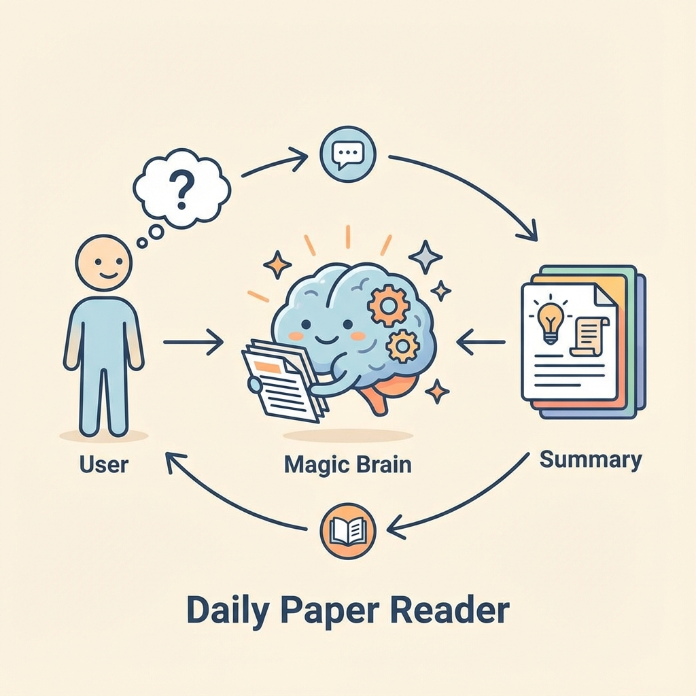
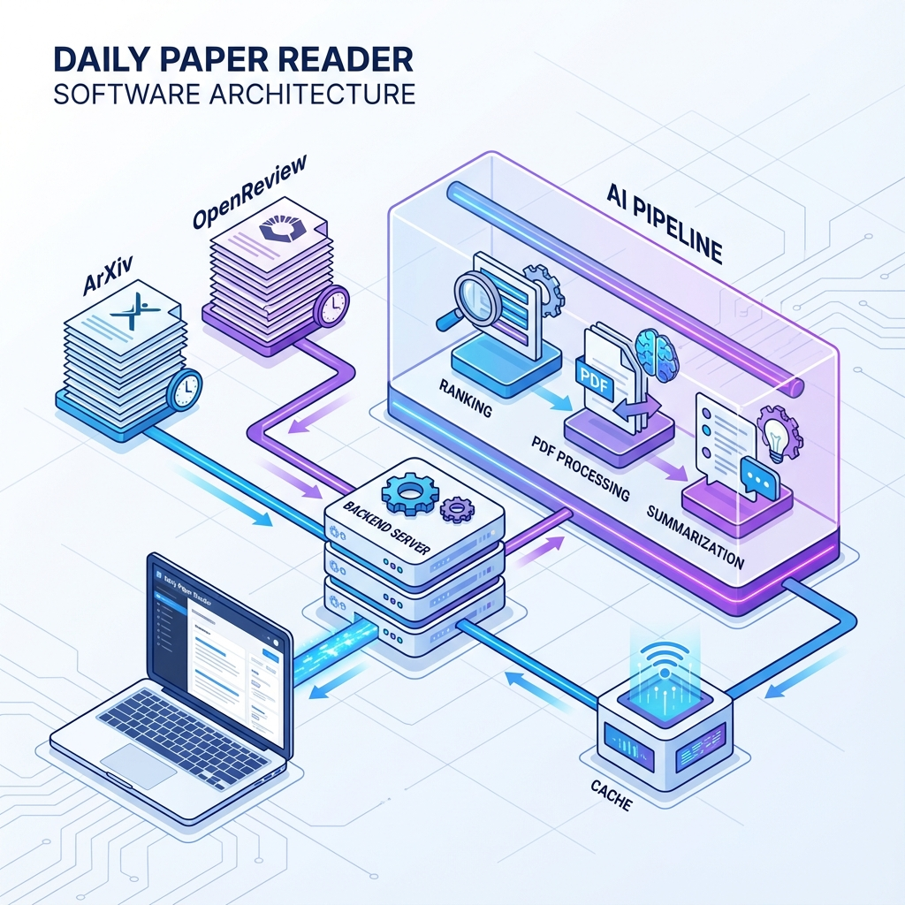
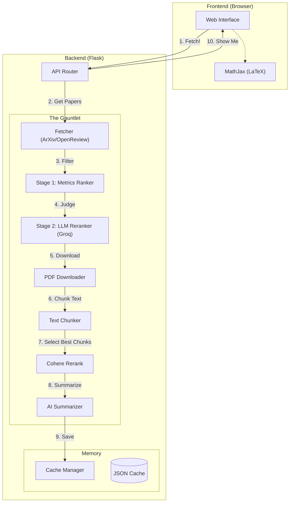
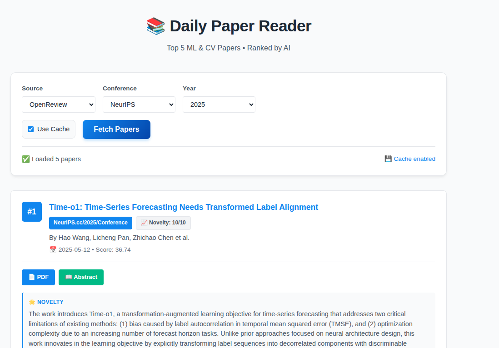
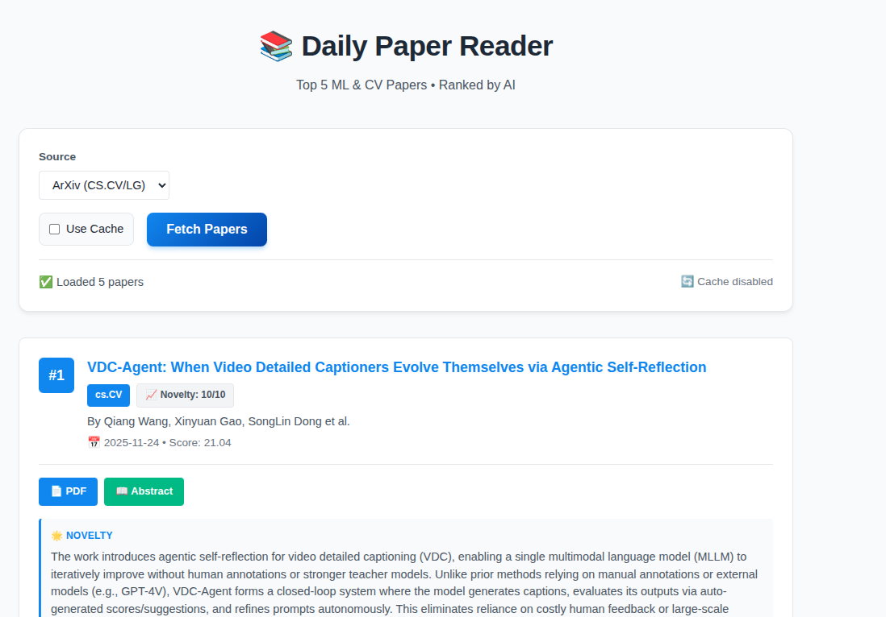

# How I Built an AI Research Assistant to Read Papers So I Don't Have To

*Or: A tale of APIs, PDFs, and teaching a computer to be picky.*

Let's face it: keeping up with AI research is like trying to drink from a firehose that is also on fire. Every day, ArXiv drops a fresh stack of papers, and conference seasons (NeurIPS, ICLR, CVPR) are basically natural disasters of information.

I decided I'd had enough. I didn't want to read *more*; I wanted to read *better*. So, I built the **Daily Paper Reader** - an AI agent that scours the web, reads the papers for me, and tells me what's actually worth my time.

Here is the deep dive into how it works, the tech stack we used, and why we brought in the big guns like Cohere and Groq.

## The Big Picture (For the Visual Learners)

At its core, the system is simple: You ask for papers, it finds them, reads them, and summarizes them.

But as any engineer knows, "simple" is just a word we use to trick ourselves into starting a project. Under the hood, it's a sophisticated pipeline designed to filter noise and extract signal.

## The "Secret Sauce": A Multi-Stage Rocket

The problem with most paper aggregators is that they just throw keywords at you. I wanted **quality**. To get that, I implemented a multi-stage ranking pipeline that treats every paper like a job applicant.

### Stage 1: The Bouncer (Coarse Ranking)
First, we fetch a *lot* of papers (usually 500+). We can't ask an expensive LLM to read all of them, so we use a heuristic "bouncer." This ranks papers based on:
- **Citations per day**: Is this paper blowing up?
- **Author H-Index**: Do the authors have a track record? (A bit elitist, I know, but it's a signal).
- **Recency**: New is always better, right?

### Stage 2: The Professor (LLM Reranking)
The top candidates from the bouncer get sent to the "Professor." Here, we use **Groq** (running `qwen/qwen3-32b`) to read the abstracts. It judges them based on:
- **Novelty**: Is this actually new?
- **Impact**: Will this change the field?
- **Relevance**: Is it about what I care about?

### Stage 3: The Precision Strike (Cohere Rerank)
For the absolute final selection, and specifically when dealing with the full text of the papers, we bring in **Cohere Rerank**. 
When we download a PDF, it's often 20+ pages of dense text. We can't just stuff all of that into a context window without going broke or confusing the model.
Instead, we chunk the PDF and use **Cohere Rerank** to semantically select the most relevant sections—the "meat" of the paper. This ensures our summarizer focuses on the core methodology and results, not the acknowledgments or the references.

## The Architecture: Where the Magic Happens

Here is what the full system looks like. It's a Flask app that orchestrates a symphony of APIs.

### The Technical Schematics

For those who prefer boxes and arrows over pretty isometric art, here is the raw data flow:

## The Challenges (AKA: Why I Cried)

### 1. OpenReview is a Maze
Fetching from ArXiv is easy. Fetching from OpenReview? That's a different beast. They have an API v1 and v2, and different conferences use different "invitation" patterns. We had to write a fetcher that tries *everything* - like a desperate burglar checking every door handle.

### 2. The PDF Problem
You'd think downloading a PDF is simple. But OpenReview sometimes gives you a direct link, and sometimes gives you a relative path like `/pdf/12345.pdf`. Our code now handles these edge cases with the grace of a bomb disposal robot.

### 3. Math is Hard
Rendering LaTeX in the browser is always fun. We integrated **MathJax** so that when the AI summarizes an equation like $E=mc^2$, it actually looks like math and not like a broken keyboard.

## The Result

The result is a dashboard that feels professional (thanks to some CSS love) and actually saves time. It caches results so I don't burn through my API credits, and it gives me a "Novelty Score" so I know if I should be excited or bored.

It's not perfect, but it's mine. And it reads faster than I do.

## The Dashboard

Here is what the final dashboard looks like, showing papers from both ArXiv and OpenReview:

### OpenReview Dashboard

### ArXiv Dashboard

---
*Built with Python, Flask, Groq, Cohere, and a lot of coffee.*
