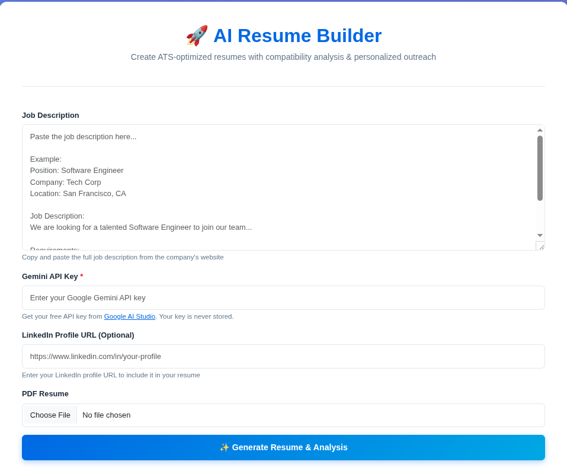
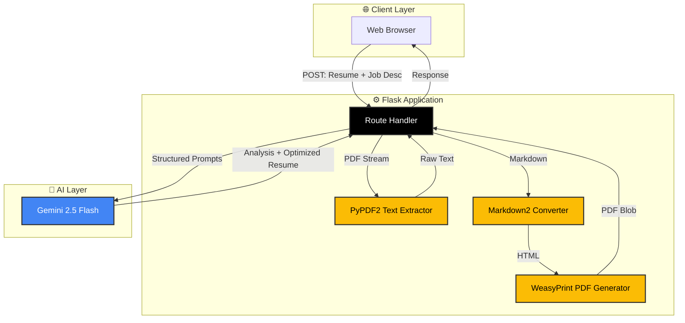
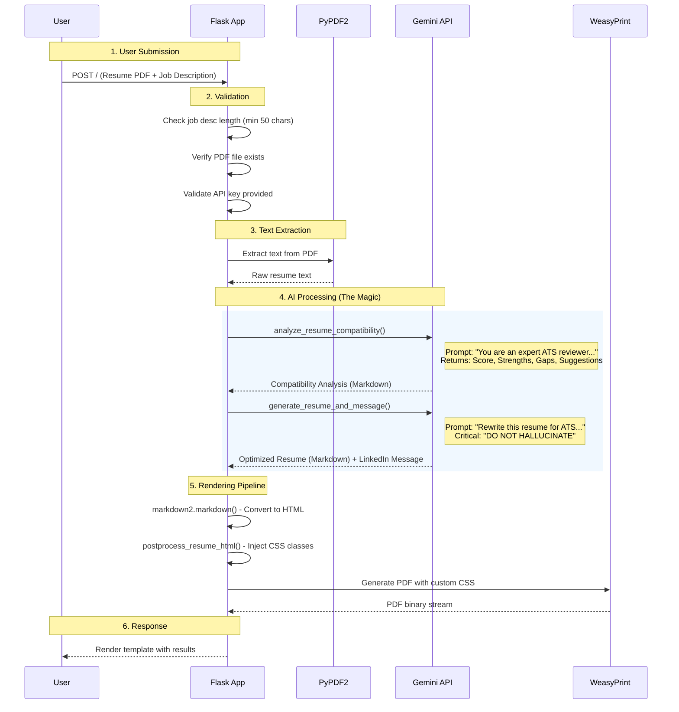
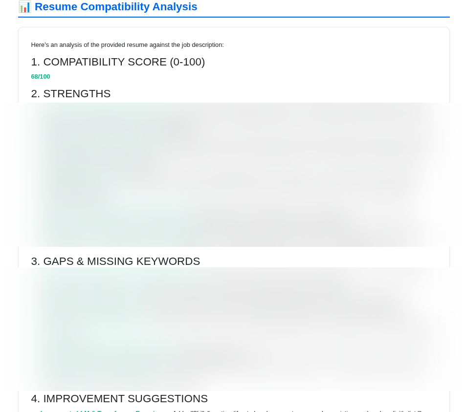
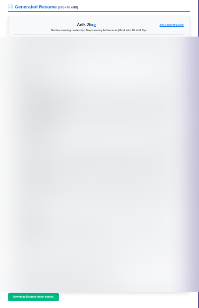
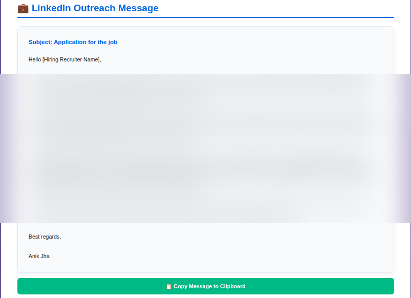

# AI Resume Builder: A Deep Dive into Beating the ATS Game

Let's be honest: job hunting in 2026 is like trying to get past a bouncer who's actually a robot. That bouncer is the Applicant Tracking System (ATS), and it's judging your resume before any human even glances at it. Miss a keyword? Into the digital trash you go. Format your contact info as an image? Rejected. Use a creative font? Nope.

I built the **AI Resume Builder** to solve this exact problem. It's a Flask-based web application that uses Google's Gemini to analyze your resume against a job description, then rewrites it to maximize your chances of getting past the ATS gatekeepers. Think of it as having a really smart friend who knows exactly what recruiters are looking for, except this friend works in milliseconds and doesn't judge you for applying to 47 jobs in one weekend.

**Try it yourself**: [AI Resume Builder on Hugging Face Spaces](https://huggingface.co/spaces/ml-stuff01/resume-builder)

## The Problem: Why Your Resume Gets Auto-Rejected

Here's the brutal truth: most companies use ATS software to filter out 75% of applications before a human ever sees them. These systems scan for:
- **Specific keywords** from the job description
- **Standard formatting** (no fancy tables or graphics)
- **Relevant experience** phrased in the "right" way
- **Quantifiable achievements** (numbers, percentages, metrics)

Your resume might be perfect for the job, but if it doesn't speak "ATS language," it's getting filtered out. And manually tailoring your resume for every single application? That's a full-time job in itself.

## The Solution: AI-Powered Resume Tailoring

This tool automates the entire process. You upload your resume (PDF), paste in the job description, and the system:

1. **Analyzes Compatibility**: Gives you a brutally honest score (0-100) on how well your current resume matches the job.
2. **Identifies Gaps**: Points out missing keywords and skills that the ATS is looking for.
3. **Rewrites Your Resume**: Generates a new version optimized for that specific job, without making stuff up.
4. **Creates a LinkedIn Message**: Drafts a personalized outreach message to recruiters.
5. **Generates a PDF**: Converts everything into a clean, ATS-friendly PDF that fits on one page.


*The input screen. Simple, clean, no BS. Just paste the job description, upload your resume, and let the AI do its thing.*

## System Architecture: How It All Works

The application is built on Flask (because sometimes simple is better) and leverages Google's Gemini API for the AI heavy lifting. Here's the architecture:



**Key Design Decisions:**
- **Flask over FastAPI**: We don't need async here. The bottleneck is the AI API call, not I/O.
- **Gemini 2.5 Flash**: Fast enough for real-time responses, smart enough for complex prompts.
- **WeasyPrint over Puppeteer**: Lighter weight, no headless browser needed.

## The Data Flow: From Upload to Download

Here's what happens when you hit that "Generate" button, step by step:




*The compatibility analysis screen. This is where the AI tells you exactly what's wrong with your resume and how to fix it. No sugarcoating.*

## Under the Hood: The Implementation Details

### 1. PDF Text Extraction

We use `PyPDF2` because it's simple and works for 95% of resumes. Here's the entire function:

```python
def get_pdf_content(pdf_file):
    try:
        reader = PyPDF2.PdfReader(pdf_file)
        text = ""
        for page in reader.pages:
            text += page.extract_text()
        return text
    except Exception as e:
        logger.exception(f"An error occurred while reading the PDF: {e}")
        return None
```

**Limitation**: This won't work for image-based PDFs (like scanned documents). For those, you'd need OCR, which is overkill for most use cases.

### 2. The Compatibility Analysis

This is where we ask Gemini to be brutally honest. The prompt is structured to force specific output sections:

```python
model = genai.GenerativeModel('gemini-2.5-flash')
analysis_prompt = f"""
You are an expert ATS (Applicant Tracking System) and HR resume reviewer.

Analyze the following resume against the job description and provide:

1. COMPATIBILITY SCORE (0-100): A numerical score...
2. STRENGTHS (3-5 bullet points): Key areas where the resume aligns...
3. GAPS & MISSING KEYWORDS (3-5 bullet points): Important skills...
4. IMPROVEMENT SUGGESTIONS (5-7 bullet points): Specific, actionable...
5. ATS COMPATIBILITY ISSUES (if any): Specific formatting issues...

Job Description:
{job_desc}

Resume Content:
{resume_content}
"""
```

The key here is **structured output**. By demanding specific section headers, we make the response easy to parse and display.

### 3. Resume Rewriting: The Ethical Tightrope

Here's the most important part of the entire system: **the resume rewriter must never hallucinate**. We're not creating fake experience. We're reframing real experience to match the job description.

The prompt includes these critical instructions:

```
4. TRUTHFULNESS & NO HALLUCINATION:
   - ONLY use information that is ALREADY PRESENT in the candidate's resume
   - DO NOT invent or fabricate any experience, skills, projects, or achievements
   - DO NOT add technologies, tools, or skills the candidate hasn't mentioned
   - If something from the job description isn't in the resume, DO NOT add it

5. OPTIMIZATION STRATEGY:
   - Reword and reframe EXISTING experiences to align with job description language
   - Highlight and emphasize relevant skills already present in the resume
   - Reorder bullet points to prioritize job-relevant achievements
```

This is the difference between "optimization" and "fraud." We're playing up what's already there, not making things up.

### 4. The Markdown-to-PDF Pipeline

Converting Markdown to a professional, ATS-friendly PDF is harder than it sounds. Here's the pipeline:

**Step 1: Markdown to HTML**
```python
resume_html = markdown2.markdown(resume_md, extras=[
    "fenced-code-blocks", 
    "tables", 
    "cuddled-lists", 
    "break-on-newline"
])
```

**Step 2: HTML Post-Processing**
We use regex to inject CSS classes for better styling:
```python
def postprocess_resume_html(html):
    # Add class to name (first h1)
    html = re.sub(r'<h1>', r'<h1 class="resume-name">', html, count=1)
    # Add class to contact info
    html = re.sub(r'<p>(.*@.*)</p>', r'<p class="resume-contact">\1</p>', html)
    return html
```

**Step 3: PDF Generation with Custom CSS**
```python
css = """
@page { size: A4; margin: 0.4cm 0.6cm; }
body { font-size: 8.5pt; font-family: 'Noto Sans', sans-serif; line-height: 1.3; }
h1, h2, h3 { margin-top: 0.3em; margin-bottom: 0.08em; font-size: 9pt; }
ul, ol { margin-bottom: 0.3rem; padding-left: 1.1em; }
"""
HTML(string=resume_html_pdf).write_pdf(pdf_filename, stylesheets=[CSS(string=css)])
```

The CSS is tuned to fit everything on **exactly one page**. Because if your resume is two pages, you've already lost half the recruiters.



*The generated resume. Clean, professional, ATS-friendly, and guaranteed to fit on one page.*

**But wait, there's more!** The resume isn't set in stone. After generation, you can click directly on the resume preview to edit it in real-time. Change a word, tweak a bullet point, fix a typo. The interface uses `contenteditable`, so it's as simple as clicking and typing. When you're happy with your edits, hit the "Download Resume (from edited)" button, and the app regenerates the PDF with your changes on the fly.

This is huge because sometimes the AI gets 95% of the way there, but you want to adjust the phrasing or add a specific detail. No need to regenerate from scratch or edit in a separate tool. Just click, edit, download.

### 5. The LinkedIn Outreach Message

As a bonus, the system also generates a personalized LinkedIn message to send to recruiters. This uses a separate prompt that:
- References **specific** achievements from your resume
- Mentions **specific** requirements from the job description
- Avoids generic templates like the plague


*The LinkedIn message generator. Because cold outreach is awkward enough without sounding like a bot.*

## The Tech Stack

- **Backend**: Flask (Python 3.12+)
- **AI**: Google Gemini 2.5 Flash via `google-generativeai`
- **PDF Reading**: PyPDF2
- **PDF Writing**: WeasyPrint
- **Markdown Processing**: markdown2
- **Web Scraping** (optional): BeautifulSoup4 + requests

## What Makes This Different

**1. No Hallucinations**
Unlike some AI resume tools, this doesn't make up experience. It only reframes what's already there.

**2. ATS-First Design**
Every formatting decision is made with ATS compatibility in mind. No fancy graphics, no weird fonts, no multi-column layouts that confuse parsers.

**3. One-Page Guarantee**
The CSS is specifically tuned to fit everything on one page. Because two-page resumes are for academics.

**4. Transparency**
You see the compatibility analysis before the rewrite. You know exactly what's being changed and why.

## Limitations and Future Improvements

**Current Limitations:**
- Only works with text-based PDFs (no OCR for scanned documents)
- Requires a Gemini API key (not free for high volume)
- Single template (no style variations)

**Future Roadmap:**
- **Multiple Templates**: Different styles for different industries
- **History/Versioning**: Save previous generations in a SQLite database
- **Batch Processing**: Upload multiple job descriptions at once
- **Direct ATS Integration**: Auto-apply to jobs (with user approval)

## The Bottom Line

Job hunting is a numbers game, but it's also a keyword game. This tool helps you play both. It won't get you the job (that's still on you), but it'll make sure your resume actually gets seen by a human.

And in 2026, that's half the battle.

---

*Built with Flask, Gemini, and a healthy dose of frustration with the modern hiring process.*
