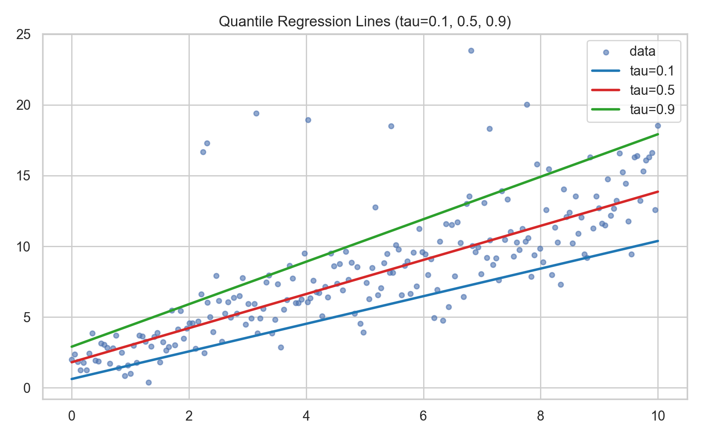

# Beyond the Average: Why Quantile Regression is a Game-Changer

*How moving from point predictions to distributional thinking transforms decision-making under uncertainty*

---

**Reading time: ~18 minutes** ☕️

---

Your model predicts the average. Great! But averages are for trivia night, not for decisions with consequences.

Imagine you're a product manager planning server capacity. Your demand forecasting model says: "Expected demand tomorrow: 1000 requests/sec." You provision accordingly. The next day, demand hits 1500. Your service crashes. Customers churn. Executives ask: "Why didn't we see this coming?"

**The answer:** You optimized for the average. The *distribution* told a different story.

---

> **🎯 Series Mission**: By the end of these 5 posts, you'll go from "What's quantile regression?" to deploying production QR systems that provide calibrated uncertainty estimates for high-stakes decisions. No PhD required—just curiosity and Python.

---

This is where **quantile regression** comes in. Instead of predicting "what's typical," it predicts:
- **What's the worst-case?** (90th percentile for capacity planning)
- **What's the best-case?** (10th percentile for cost optimization)
- **What's the full range?** (10th to 90th for risk assessment)

In this post, you'll learn:
- Why point predictions fail in high-stakes domains
- What quantile regression is and how it differs from ordinary regression
- When to use QR vs. traditional methods (with a decision framework)
- Real-world examples from housing, healthcare, and finance

By the end, you'll never look at a single-point forecast the same way again.

---

## The Failure Modes of Point Predictions

Let's start with three real-world scenarios where predicting the mean leads to disaster.

### Scenario 1: Housing Prices in San Francisco

You're a real estate investor. Your ML model predicts house prices based on square footage, bedrooms, location. For a specific property, it says: $1.2M.

You bid $1.25M (confident you're getting a deal). You lose. The property sells for $1.8M.

**What happened?**

Your model predicted the *conditional mean*: \(E[\text{price} \mid \text{features}] = 1.2M\). But houses in that neighborhood have **high variance**—some sell for $800K, others for $2M. The *distribution* is wide, and you were blindsided by the upper tail.

**With quantile regression**, you'd know:
- 10th percentile: $900K (bargain scenario)
- 50th percentile: $1.2M (typical)
- 90th percentile: $1.7M (hot market scenario)

You'd bid accordingly—or walk away.

---

### Scenario 2: Hospital Readmissions

You're building a model to predict 30-day hospital readmission risk. The model outputs: **"Patient X has 15% chance of readmission."**

The hospital discharges Patient X. They're readmitted 5 days later with complications.

**What happened?**

Your model predicted the population-level average risk for patients with similar features. But readmission risk is **heterogeneous**: depends on medication adherence, social support, comorbidities. Some patients with "15% average risk" have 5% true risk (stable, wealthy); others have 40% true risk (unstable, no support).

**With quantile regression**, you'd predict the *conditional distribution* of risk. You'd identify *which patients* are in the high-risk tail and allocate resources accordingly (social workers, home visits, medication monitoring).

---

### Scenario 3: Trading Strategy Risk

You're a quant designing an algorithmic trading strategy. Your backtest shows: **"Expected daily return: +0.5%, Sharpe ratio: 2.1."**

You deploy $10M. Three months later, you hit a single-day loss of -8%. Your fund liquidates the position. Career damage ensues.

**What happened?**

You optimized for mean return. But trading is about **tail risk**—the 1% of days that wipe you out. Your model didn't tell you:
- 5th percentile daily return: -3.2%
- 1st percentile: -6.5%
- Worst-case (0.1th percentile): -12%

**With quantile regression**, you'd model the *entire distribution* of returns. You'd set stop-losses at the 5th percentile. You'd size positions to survive the 1st percentile. You'd stay solvent.

---

## The Core Problem: Heteroscedasticity (Non-Constant Variance)

All three failures share a root cause: **heteroscedasticity**—a fancy term for "non-constant variance."

In plain English: *the spread of outcomes varies with the inputs*.

### Example: Temperature vs. Ice Cream Sales

- When temp = 60°F, sales are 100–150 cones/day (narrow range)
- When temp = 95°F, sales are 200–500 cones/day (wide range—depends on foot traffic, competition, weather surprises)

The *mean* increases with temperature (obvious). But the *variance* also increases (less obvious, more important).

**OLS (Ordinary Least Squares) assumes constant variance.** It fits a line minimizing squared errors. Result: it predicts the mean well but *ignores the changing spread*.

**Quantile regression models the changing spread.** It fits separate curves for the 10th, 50th, and 90th percentiles. Result: you see *how uncertainty changes* with inputs.

---

## What is Quantile Regression?

### The Math (Keep It Simple)

**OLS minimizes**:
$$\min_{\beta} \sum_{i=1}^{n} (y_i - x_i^T \beta)^2$$

**Quantile regression (for quantile τ) minimizes**:
$$\min_{\beta(\tau)} \sum_{i=1}^{n} \rho_{\tau}(y_i - x_i^T \beta(\tau))$$

Notice the \(\beta(\tau)\): we get *different* coefficients for each quantile. This is a key difference from OLS, which gives a single \(\beta\) for all predictions.

The \(\rho_{\tau}(u)\) is the **pinball loss** (also called check loss):

$$\rho_{\tau}(u) = \begin{cases} 
\tau \cdot u & \text{if } u \geq 0 \\
(\tau - 1) \cdot u & \text{if } u < 0
\end{cases}$$

**Translation**: 
- OLS penalizes all errors equally (squared).
- QR penalizes errors *asymmetrically* based on τ:
  - For τ=0.9 (90th percentile), under-predictions (u > 0) are penalized 9× more than over-predictions.
  - For τ=0.1 (10th percentile), over-predictions are penalized 9× more.

This asymmetry is what makes QR find *quantiles* instead of the mean.

---

### Visual Intuition

In this plot:
- **Blue line** (τ=0.5): Median regression (balanced penalties)
- **Green line** (τ=0.9): 90th percentile (most points below)
- **Red line** (τ=0.1): 10th percentile (most points above)

Notice how the lines *diverge* at high X-values (heteroscedasticity). The 80% prediction interval (green to red) widens as X increases—capturing the changing uncertainty.

**Practical takeaway**: If you plot your data and see this diverging funnel shape, that's your signal that QR will give you more informative predictions than OLS.

---

## Why Quantile Regression > OLS

### 1. Handles Heteroscedasticity Naturally

OLS assumes constant variance. QR doesn't. It models how spread changes with X.

### 2. Robust to Outliers

OLS uses squared loss → extreme outliers dominate. QR uses pinball loss → outliers have bounded influence (especially for median, τ=0.5).

**Example**: Predict salaries from years of experience. One tech exec makes $50M (outlier). OLS pulls the line up. Median regression ignores them—predicts typical salary.

### 3. Asymmetric Cost Functions

In many domains, under-predicting and over-predicting have different costs:

| Domain | Under-prediction cost | Over-prediction cost | Optimal τ |
|--------|----------------------|---------------------|----------|
| **Server capacity** | Outage ($$$) | Wasted resources ($) | 0.9–0.95 |
| **Inventory (perishable)** | Lost sales ($$) | Spoilage ($$$$) | 0.2–0.3 |
| **Medical screening** | Missed diagnosis (life) | Unnecessary test ($) | 0.9–0.99 |

QR lets you *encode these costs* into τ. OLS doesn't.

### 4. Full Distributional View

Fit QR for τ ∈ {0.1, 0.25, 0.5, 0.75, 0.9}. Now you have:
- Median (central tendency)
- Interquartile range (spread)
- 80% prediction interval (10th to 90th)

This is **orders of magnitude more informative** than a single point estimate.

---

## When to Use Quantile Regression: A Decision Framework

### Use QR When:

✅ **Heteroscedasticity is present** (variance changes with X)  
✅ **Outliers are important** (e.g., fraud detection, extreme events)  
✅ **Asymmetric costs** (under/over-prediction costs differ)  
✅ **You need prediction intervals** (risk assessment, safety margins)  
✅ **Domain demands it** (healthcare, finance, operations)

### Stick with OLS When:

⛔ **Homoscedastic data** (constant variance—rare in practice)  
⛔ **You only care about the mean** (aggregated forecasts, reporting)  
⛔ **Simplicity is critical** (linear regression is easier to explain to stakeholders)  
⛔ **Sample size is tiny** (n < 50—QR needs data)

**Rule of thumb**: If your decisions involve *risk, capacity planning, or tail events*, use QR. If you're just trying to explain "typical behavior," OLS is fine.

---

## Real-World Applications

Now that you know *when* to use QR, let's see it in action. Here are three real-world systems where QR transformed decision-making—and how you can apply similar thinking to your domain.

### 1. Growth Forecasting (Tech)

**Problem**: Predict user signups for capacity planning.

**OLS approach**: Predict mean signups → provision for mean → crash during viral event.

**QR approach**:
- 50th percentile: Expected signups (for reporting)
- 90th percentile: Viral scenario (for infrastructure)
- 99th percentile: Black swan (for failover)

**Outcome**: No downtime during surprise TechCrunch feature.

---

### 2. Energy Demand (Utilities)

**Problem**: Predict electricity demand for grid balancing.

**OLS approach**: Predict mean → under-provision during heatwaves → brownouts.

**QR approach**:
- 10th percentile: Low demand (reduce expensive peaker plants)
- 90th percentile: High demand (avoid blackouts)

**Outcome**: Balances cost (running expensive generators) vs. reliability (blackout risk).

---

### 3. Clinical Trials (Pharma)

**Problem**: Predict treatment effect heterogeneity.

**OLS approach**: "Drug reduces cholesterol by 15mg/dL on average."

**QR approach**:
- 10th percentile: Drug reduces cholesterol by 5mg/dL (non-responders)
- 50th percentile: 15mg/dL (typical)
- 90th percentile: 30mg/dL (super-responders)

**Outcome**: Identify *who benefits most* → personalized medicine.

---

## Getting Started: Practical Tips

### 1. Start with 3–5 Quantiles

Don't model 99 quantiles yet. Start with:
- **τ=0.1, 0.5, 0.9** (10th, median, 90th)

This gives you a sense of central tendency + spread without overfitting.

### 2. Visualize Your Data First

Plot \(Y\) vs. \(X\). Do you see "funnel shapes" (heteroscedasticity)? Outliers? If yes, QR will help. If constant variance, stick with OLS.

### 3. Choose τ Based on Business Context

- **Risk-averse** (avoid disasters): τ=0.9 or higher
- **Cost-conscious** (avoid waste): τ=0.1 or lower
- **Balanced**: τ=0.5 (median)

Don't blindly use 0.5—think about *asymmetric costs*.

### 4. Check Coverage

If you predict the 90th percentile, roughly 90% of observations should fall below your prediction. If not, your model is miscalibrated. (We'll cover evaluation in Blog 3.)

---

## Common Misconceptions

### "QR is just OLS with extra steps"

**False.** QR optimizes a different loss function (pinball vs. squared). This changes everything: the solution, the interpretation, the robustness properties.

### "I can get prediction intervals from OLS with confidence intervals"

**True but misleading.** OLS confidence intervals assume:
1. Homoscedasticity (constant variance)—often violated
2. Normality of errors—often violated
3. Symmetric intervals—not optimal for asymmetric costs

QR intervals:
- Adapt to heteroscedasticity
- Non-parametric (no normality assumption)
- Asymmetric if desired

### "QR is slower than OLS"

**Partly true.** Linear QR (via linear programming) is slower than OLS (closed-form solution). But modern implementations (statsmodels, quantreg in R) are fast for n < 100K. For n > 1M, use gradient boosting (Blog 4).

---

## What's Next?

You now understand *why* quantile regression is powerful. But how does it actually find quantiles? Why does asymmetric loss lead to asymmetric predictions?

In **Blog 2**, we'll pull back the curtain on the pinball loss function—the mathematical engine that makes QR work. You'll learn:
- Why minimizing pinball loss finds quantiles (with proof)
- How to optimize it (subgradient descent, linear programming)
- How to choose τ based on *your* business costs (not arbitrary 0.5)

By the end, you'll understand the math deeply enough to explain it to your team—and tune it for your specific problem.

**Quick preview of the full series:**
- **Blog 3**: Hands-on Python implementation with statsmodels
- **Blog 4**: Scale to non-linear models with gradient boosting
- **Blog 5**: Master state-of-the-art techniques and production deployment

---

## TL;DR

- **Point predictions fail** when uncertainty varies with inputs (heteroscedasticity), costs are asymmetric, or tails matter.
- **Quantile regression** predicts *conditional quantiles* (10th, 50th, 90th percentiles) instead of the mean.
- **Use QR when**: heteroscedasticity, outliers, asymmetric costs, need prediction intervals.
- **Applications**: capacity planning, risk management, personalized medicine, inventory optimization.
- **Next**: Learn the math (Blog 2), implement it (Blog 3), scale it (Blog 4–5).

---

---

## Series Navigation

**Part 1 of 5: Beyond the Average** (You are here)

**Next:** [Part 2 - The Math Behind the Magic: Understanding the Pinball Loss](#blog/blog2-medium) →

---

### Complete Series

1. **[Part 1 - Beyond the Average: Why Quantile Regression is a Game-Changer](#blog/blog1-medium)** (Current)
2. [Part 2 - The Math Behind the Magic: Understanding the Pinball Loss](#blog/blog2-medium)
3. [Part 3 - Your First Quantile Regression Model: A Hands-On Python Guide](#blog/blog3-medium)
4. [Part 4 - Leveling Up: Gradient Boosting for Quantile Regression](#blog/blog4-medium)
5. [Part 5 - The State of the Art: Probabilistic Forecasting](#blog/blog5-medium)