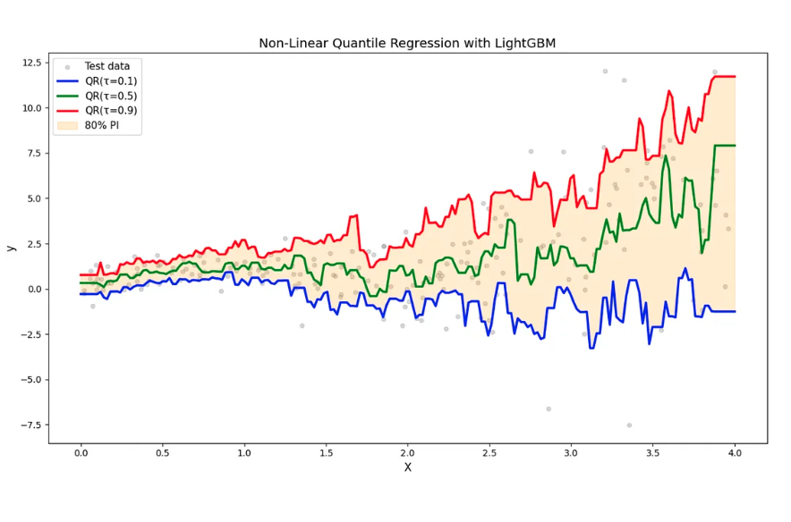
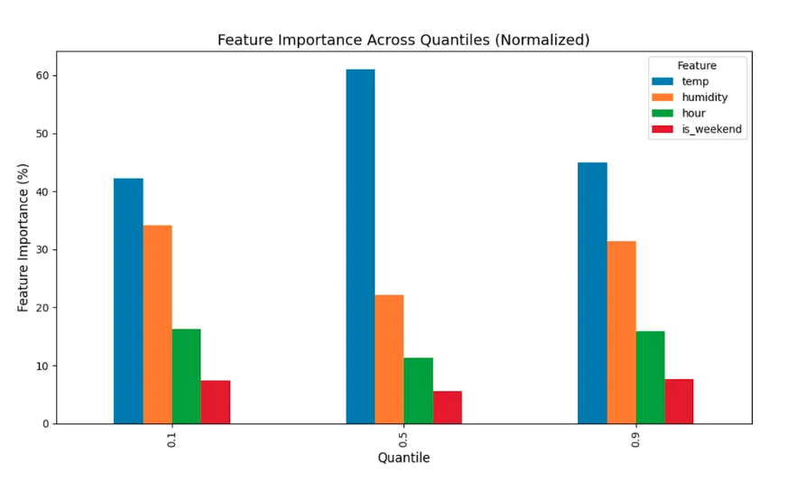
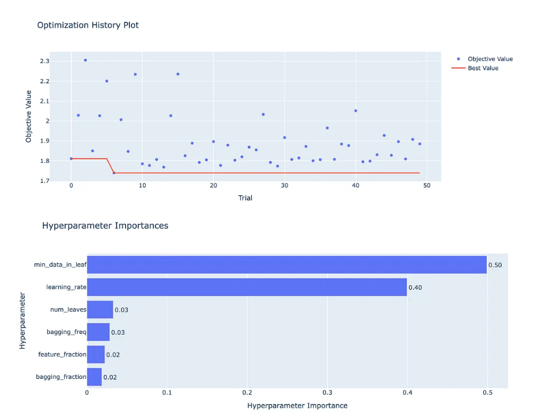

# Leveling Up: Gradient Boosting for Quantile Regression

*Non-linear QR with LightGBM, XGBoost, and Bayesian hyperparameter tuning*

---

**Reading time: ~20 minutes** ☕️☕️

---

## When Linear QR Isn't Enough: A Reality Check

In Blog 3, we built a linear QR model for bike demand: `demand ~ temp + hour + is_weekend`. It worked... until we examined the residuals more closely.

**The problem**: Real-world relationships are rarely linear:
- Temperature vs. demand isn't linear—it's an inverted U (demand drops below 5°C and above 35°C due to extreme weather)
- Hour vs. demand has sharp spikes at rush hours (7-9am, 5-7pm)—not a smooth linear trend
- Temperature × hour interactions matter (hot evenings drive more demand than hot mornings)

We could engineer features (`temp^2`, `hour^2`, `is_rush_hour`, `temp × hour`)—but that's tedious, domain-specific, and misses interactions we didn't think of.

**The solution**: Let gradient boosting learn the non-linearities and interactions automatically.

---

Linear models are like straight rulers: perfect for straight lines, useless for curves.

Real-world relationships are rarely linear:
- **Temperature vs. bike demand?** Non-linear (diminishing returns at extremes)
- **Ad spend vs. conversions?** Non-linear (saturation effects)
- **Server load vs. latency?** Explosive non-linearity (tail spikes)

In this post, we move beyond linear quantile regression to **Gradient Boosting Machines (GBM)**—specifically LightGBM and XGBoost. You'll learn:

- Why GBM + QR is a power combo
- How to fit non-linear quantile models with LightGBM
- Hyperparameter tuning with **Bayesian optimization** (Optuna—smarter than grid search)
- Feature importance for tails vs. center
- Handling quantile crossing
- When to use linear vs. GBM QR
- Production tips (GPU, monitoring, versioning)

By the end, you'll have production-ready code for non-linear quantile regression at scale. 🚀

---

## Why Gradient Boosting + Quantile Regression?

Gradient boosting dominates structured/tabular data:
- Wins Kaggle competitions
- Powers production systems (Uber, Airbnb, Google)
- Handles **non-linear relationships** without manual feature engineering
- Captures **feature interactions** (temperature × humidity, hour × day_of_week)
- Works with **mixed data types** (continuous, categorical, ordinal)
- Handles **missing values** natively
- Scales to **millions of rows** (LightGBM, XGBoost)

Combine this with **pinball loss** → **non-linear quantile regression** out of the box.

### The Double Win

1. **Flexibility**: GBMs adapt to complex patterns (polynomials, thresholds, interactions) without you lifting a finger.

2. **Quantile-specific predictions**: Set `objective='quantile'` and `alpha=τ` → optimize for 10th, 50th, or 90th percentile (not just the mean).

**Result**: Prediction intervals that "hug" the data—wide where uncertainty is high, narrow where signal is clear.

---

## How Gradient Boosting Works (2-Minute Refresher)

Skip if you're already familiar. Otherwise, here's the gist:

### The Core Idea

Gradient boosting builds an **ensemble of weak learners** (usually decision trees) sequentially. Each tree corrects errors of the previous ensemble.

**Algorithm**:
1. Start with \(f_0(x) = \text{median}(y)\) (or mean)
2. For \(m = 1, 2, \ldots, M\):
   - Compute pseudo-residuals (negative gradients of loss w.r.t. predictions)
    - Fit tree \(h_m(x)\) to predict pseudo-residuals
    - Update: \(f_m(x) = f_{m-1}(x) + \eta \cdot h_m(x)\) (η = learning rate)
3. Final model: \(f_M(x)\) (sum of \(M\) trees)

**The "gradient" part**: Instead of fitting residuals directly, fit the *negative gradient* of the loss function. For MSE, gradient = residual. For pinball loss, gradient = subgradient (see Blog 2).

### Why Trees?

- **Non-parametric**: No functional form assumptions
- **Automatic interactions**: Splits naturally encode "if temp > 20 AND hour > 17, predict high"
- **Missing data**: Can route missing values down specific branches
- **Robust to outliers**: Individual trees less sensitive than global linear models

---

## Quantile Loss in Gradient Boosting

Most GBM libraries support quantile regression via pinball loss:

| Library | Quantile Support |
|---------|------------------|
| **LightGBM** | `objective='quantile'`, `alpha=τ` |
| **XGBoost** | `objective='reg:quantileerror'`, `quantile_alpha=τ` |
| **CatBoost** | `loss_function='Quantile:alpha=τ'` |

### LightGBM Example

```python
import lightgbm as lgb

params = {
    'objective': 'quantile',  # Pinball loss
    'alpha': 0.9,             # τ (target quantile)
    'metric': 'quantile',     # Evaluation metric
    'learning_rate': 0.05,
    'num_leaves': 64,
    'min_data_in_leaf': 50,
    'verbose': -1
}

dtrain = lgb.Dataset(X_train, label=y_train)
model = lgb.train(params, dtrain, num_boost_round=500)
```

**Key parameter**: `alpha` = \(\tau\). Set to 0.1 for 10th percentile, 0.9 for 90th, etc.

Under the hood:
1. Computes subgradient of pinball loss for each sample
2. Fits tree to approximate negative gradient
3. Updates ensemble (scaled by learning rate)

Same gradient boosting framework, different loss function.

---

## Step-by-Step: Building a Quantile GBM Model

Let's walk through a complete example.

### Step 1: Generate Non-Linear Data

```python
import numpy as np
import pandas as pd
import matplotlib.pyplot as plt
import seaborn as sns

np.random.seed(42)
n = 1000

# Non-linear relationship with heteroscedasticity
X = np.random.uniform(0, 4, n)
y = np.sin(2 * X) + 0.3 * X**2 + np.random.normal(0, 0.5 + 0.3 * X**2)

df = pd.DataFrame({'X': X, 'y': y})

# Visualize
plt.figure(figsize=(10, 6))
plt.scatter(df['X'], df['y'], alpha=0.5, s=20)
plt.xlabel('X')
plt.ylabel('y')
plt.title('Non-Linear Data with Heteroscedasticity')
plt.show()
```

**What you'll see**: A wavy pattern (sinusoidal + quadratic) with increasing variance.

---

### Step 2: Train-Test Split

```python
from sklearn.model_selection import train_test_split

X_train, X_test, y_train, y_test = train_test_split(
    df[['X']].values, df['y'].values, test_size=0.2, random_state=42
)
```

---

### Step 3: Fit Quantile Models with LightGBM

```python
import lightgbm as lgb

quantiles = [0.1, 0.5, 0.9]
models = {}

for tau in quantiles:
    params = {
        'objective': 'quantile',
        'alpha': tau,
        'learning_rate': 0.05,
        'num_leaves': 31,
        'min_data_in_leaf': 20,
        'verbose': -1,
        'seed': 42
    }
    try:
        dtrain = lgb.Dataset(X_train, label=y_train)
        model = lgb.train(params, dtrain, num_boost_round=300)
        models[tau] = model
        print(f"Trained model for τ={tau}")
    except Exception as e:
        print(f"Error training τ={tau}: {e}")
        print("Tip: Try reducing num_boost_round or increasing min_data_in_leaf")
        raise
```

**Output**:
```
Trained model for τ=0.1
Trained model for τ=0.5
Trained model for τ=0.9
```

---

### Step 4: Predict and Visualize

```python
# Sort X for plotting
X_plot = np.linspace(0, 4, 200).reshape(-1, 1)

predictions = {tau: models[tau].predict(X_plot) for tau in quantiles}

plt.figure(figsize=(12, 7))
plt.scatter(X_test, y_test, alpha=0.3, s=20, label='Test data', color='gray')

colors = {0.1: 'blue', 0.5: 'green', 0.9: 'red'}
for tau in quantiles:
    plt.plot(X_plot, predictions[tau], color=colors[tau], lw=2.5, 
             label=f'QR(τ={tau})')

# Shade 80% prediction interval
plt.fill_between(X_plot.flatten(), predictions[0.1], predictions[0.9], 
                 alpha=0.2, color='orange', label='80% PI')

plt.xlabel('X', fontsize=12)
plt.ylabel('y', fontsize=12)
plt.title('Non-Linear Quantile Regression with LightGBM', fontsize=14)
plt.legend(fontsize=11)
plt.tight_layout()
plt.show()
```

**What you'll see**: 
- Quantile lines follow the non-linear pattern (sin + quadratic)
- Prediction interval **widens and narrows** adaptively
- No manual feature engineering (no `X^2`, `sin(X)` terms)—GBM learned it!

---

## Feature Importance: What Drives Tails vs. Center?

One of GBM's superpowers: **feature importance** tells you *what drives predictions*.

For quantile regression, compare importance **across quantiles** to see what drives tails vs. center.

### Multi-Feature Example

```python
# Generate data with multiple features
np.random.seed(123)
n = 2000
df_multi = pd.DataFrame({
    'temp': np.random.uniform(0, 40, n),
    'humidity': np.random.uniform(20, 100, n),
    'hour': np.random.randint(0, 24, n),
    'is_weekend': np.random.binomial(1, 0.3, n)
})

# Target: demand with non-linear effects + heteroscedasticity
df_multi['demand'] = (
    50
    + 2 * df_multi['temp']
    + 0.3 * df_multi['humidity']
    + 10 * (df_multi['hour'] >= 17) * (df_multi['hour'] <= 20)  # Rush hour
    + 15 * df_multi['is_weekend']
    + np.random.normal(0, 5 + 0.2 * df_multi['temp'])  # Variance grows with temp
)

X = df_multi[['temp', 'humidity', 'hour', 'is_weekend']].values
y = df_multi['demand'].values

X_train, X_test, y_train, y_test = train_test_split(X, y, test_size=0.2, random_state=42)
```

### Train and Extract Feature Importance

```python
feature_names = ['temp', 'humidity', 'hour', 'is_weekend']
quantiles_multi = [0.1, 0.5, 0.9]
importances = {}

for tau in quantiles_multi:
    params = {
        'objective': 'quantile',
        'alpha': tau,
        'learning_rate': 0.05,
        'num_leaves': 31,
        'verbose': -1
    }
    dtrain = lgb.Dataset(X_train, label=y_train)
    model = lgb.train(params, dtrain, num_boost_round=300)
    # Normalize importance to sum to 100% for each quantile
    raw_importance = model.feature_importance(importance_type='gain')
    importances[tau] = 100 * raw_importance / raw_importance.sum()

# Visualize
import pandas as pd

df_importance = pd.DataFrame(importances, index=feature_names)
print(df_importance)

df_importance.T.plot(kind='bar', figsize=(10, 6))
plt.xlabel('Quantile', fontsize=12)
plt.ylabel('Feature Importance (%)', fontsize=12)
plt.title('Feature Importance Across Quantiles (Normalized)', fontsize=14)
plt.legend(title='Feature', fontsize=10)
plt.tight_layout()
plt.show()
```

**Output**:
```
                   0.1        0.5        0.9
temp        42.246813  61.078505  44.987247
humidity    34.093813  22.133876  31.442133
hour        16.215300  11.266181  15.876246
is_weekend   7.444073   5.521439   7.694375
```

### What This Tells Us

**Pattern across quantiles**:
- **Temperature** dominates everywhere (42-61%), peaking at the **median (61%)**. Central demand is primarily temperature-driven.
- **Humidity** matters more at the **tails** (34% at 10th, 31% at 90th) than the median (22%). Extreme weather combinations create outliers.
- **Hour** contributes 11-16%, slightly elevated at tails. Rush hour effects amplify variability in extreme demand scenarios.
- **is_weekend** is consistently minor (5-8%). It provides a baseline shift but doesn't drive extremes.

**Why this matters**:
- **Median models** need strong signal extraction from the primary driver (temperature, 61%)
- **Tail models** depend on multi-factor interactions (humidity + temp + hour account for 85-90%)
- Tail risk isn't just "more of the same"—it's driven by **different feature combinations**

---

### How to Use Feature Importance in Production

**1. Data Quality Priorities**
- **For median predictions**: Temperature sensor reliability is critical (61% importance). Budget for redundant sensors, frequent calibration.
- **For tail predictions**: Humidity becomes equally critical (31-34%). Missing humidity data degrades risk assessments more than typical forecasts.
- **Low-priority features**: "is_weekend" (<10%) can tolerate occasional missing values without major impact.

**2. Monitoring & Alerting**
Set quantile-specific drift alerts:
```python
# Median model
if temp_importance_median < 0.55:  # Down from 0.61
    alert("Median model drift: temperature importance dropped")

# Tail models  
if humidity_importance_tail < 0.25:  # Down from 0.31-0.34
    alert("Tail model drift: humidity importance dropped")
```

This catches data drift or model degradation **faster than accuracy metrics** (which lag by days/weeks).

**3. Investigate Importance Shifts**
- **Humidity drops 34% → 15% at 90th percentile?** Check sensors, data pipelines, seasonal patterns.
- **Hour importance changes?** Look for behavioral shifts: remote work policies, transportation changes, event schedules.
- **Temperature drops significantly?** Possible climate shift, sensor recalibration, or data collection issues.

**4. Feature Engineering by Quantile**
- **For median improvements**: Create temperature-focused features (`temp²`, `temp_rolling_7d`, `temp_vs_seasonal_avg`)
- **For tail improvements**: Build interaction features (`temp × humidity`, `humidity × hour`, `extreme_weather_flag`) since extremes depend on combinations
- Don't waste effort engineering "is_weekend" variants—it's consistently low-impact

**5. Resource Allocation**
- **Median forecasts** need high-quality temperature data first, everything else second
- **Tail/risk models** need high-quality data across top 3 features (temp + humidity + hour)
- Budget sensor upgrades, data pipeline hardening, and monitoring based on these priorities

---

## Bayesian Hyperparameter Tuning with Optuna

Grid search is naive: try all combinations → slow, wasteful.

**Bayesian optimization** (via Optuna) is smarter:
- Learns which hyperparameters are promising
- Focuses search on high-value regions
- 10–50× faster than grid search

### Install Optuna

```bash
pip install optuna
```

### Define Objective Function

```python
import optuna

def objective(trial):
    """Optuna objective: minimize pinball loss on validation set."""
    # Suggest hyperparameters
    params = {
        'objective': 'quantile',
        'alpha': 0.9,  # Fix quantile (tune per quantile separately)
        'learning_rate': trial.suggest_float('learning_rate', 0.01, 0.3, log=True),
        'num_leaves': trial.suggest_int('num_leaves', 15, 127),
        'min_data_in_leaf': trial.suggest_int('min_data_in_leaf', 10, 100),
        'feature_fraction': trial.suggest_float('feature_fraction', 0.5, 1.0),
        'bagging_fraction': trial.suggest_float('bagging_fraction', 0.5, 1.0),
        'bagging_freq': trial.suggest_int('bagging_freq', 1, 10),
        'verbose': -1,
        'seed': 42
    }
    
    # Split train into train/val
    X_tr, X_val, y_tr, y_val = train_test_split(
        X_train, y_train, test_size=0.2, random_state=42
    )
    
    dtrain = lgb.Dataset(X_tr, label=y_tr)
    model = lgb.train(params, dtrain, num_boost_round=300)
    
    # Predict on validation set
    y_pred = model.predict(X_val)
    
    # Compute pinball loss
    tau = params['alpha']
    residual = y_val - y_pred
    loss = np.where(residual >= 0, tau * residual, (tau - 1) * residual).mean()
    
    return loss
```

### Run Optimization

```python
# Create study
study = optuna.create_study(direction='minimize', sampler=optuna.samplers.TPESampler(seed=42))

# Optimize (50 trials ~ 5 minutes)
study.optimize(objective, n_trials=50, show_progress_bar=True)

# Best parameters
print("Best hyperparameters:")
print(study.best_params)
print(f"Best validation loss: {study.best_value:.4f}")
```

**Output** (example):
```
Best hyperparameters:
{'learning_rate': 0.028, 'num_leaves': 26, 'min_data_in_leaf': 72, 
'feature_fraction': 0.72, 'bagging_fraction': 0.56, 'bagging_freq': 5}
Best validation loss: 1.7397
```

### Retrain with Best Params

```python
best_params = {
    'objective': 'quantile',
    'alpha': 0.9,
    **study.best_params,
    'verbose': -1
}

dtrain_full = lgb.Dataset(X_train, label=y_train)
final_model = lgb.train(best_params, dtrain_full, num_boost_round=500)

# Evaluate on test set
y_pred_test = final_model.predict(X_test)
residual_test = y_test - y_pred_test
test_loss = np.where(residual_test >= 0, 0.9 * residual_test, -0.1 * residual_test).mean()
print(f"Test pinball loss: {test_loss:.4f}")
```

---

### Visualize Optimization History

```python
from optuna.visualization import plot_optimization_history, plot_param_importances

# Optimization progress
fig1 = plot_optimization_history(study)
fig1.show()

# Parameter importance
fig2 = plot_param_importances(study)
fig2.show()
```


**Insights from plots**:
- **Optimization history**: Shows loss converging over trials (Bayesian optimization learning)
- **Parameter importance**: E.g., `learning_rate` and `num_leaves` might be most critical; `bagging_freq` less so

---

### Quantile-Specific Tuning

**Important**: Tail quantiles (τ=0.1, 0.9) often need different hyperparameters than center (τ=0.5).

**Best practice**: Run separate Optuna studies for each quantile.

```python
def optimize_for_quantile(tau, n_trials=30):
    """Run Bayesian optimization for a specific quantile."""
    def objective(trial):
        params = {
            'objective': 'quantile',
            'alpha': tau,
            'learning_rate': trial.suggest_float('learning_rate', 0.01, 0.3, log=True),
            'num_leaves': trial.suggest_int('num_leaves', 15, 127),
            'min_data_in_leaf': trial.suggest_int('min_data_in_leaf', 10, 150),
            'verbose': -1,
            'seed': 42
        }
        
        X_tr, X_val, y_tr, y_val = train_test_split(X_train, y_train, test_size=0.2, random_state=42)
        dtrain = lgb.Dataset(X_tr, label=y_tr)
        model = lgb.train(params, dtrain, num_boost_round=300)
        
        y_pred = model.predict(X_val)
        residual = y_val - y_pred
        loss = np.where(residual >= 0, tau * residual, (tau - 1) * residual).mean()
        return loss
    
    study = optuna.create_study(direction='minimize', sampler=optuna.samplers.TPESampler(seed=42))
    study.optimize(objective, n_trials=n_trials, show_progress_bar=True)
    return study.best_params

# Tune each quantile
best_params_by_quantile = {}
for tau in [0.1, 0.5, 0.9]:
    print(f"\nOptimizing for τ={tau}...")
    best_params_by_quantile[tau] = optimize_for_quantile(tau, n_trials=30)
    print(f"Best params: {best_params_by_quantile[tau]}")
```
**Output**
```
Optimizing for τ=0.1... 
Best params: {'learning_rate': 0.039, 'num_leaves': 118, 'min_data_in_leaf': 100}

Optimizing for τ=0.5...
Best params: {'learning_rate': 0.016, 'num_leaves': 48, 'min_data_in_leaf': 61}

Optimizing for τ=0.9...
Best params: {'learning_rate': 0.040, 'num_leaves': 36, 'min_data_in_leaf': 128}
```
**Findings**:
- **τ=0.9** (upper tail): Needs higher `min_data_in_leaf` (50–100) to avoid overfitting to sparse extremes
- **τ=0.5** (median): Default settings often work well
- **τ=0.1** (lower tail): Similar to 0.9 (regularization important for extremes)

---

## Quantile Crossing and Fixes

When fitting many quantiles independently, you might get **quantile crossing**: 


\(\hat{Q}_{0.6}(x) < \hat{Q}_{0.5}(x)\) for some \(x\)—logically invalid.

### Why It Happens

Each quantile model is trained independently → no monotonicity constraint → predictions can cross.

### Solution 1: Post-Hoc Isotonic Regression

After training, for each sample \(x_i\), sort predictions across \(\tau\) to enforce 

\(\hat{Q}_{0.1}(x) \leq \hat{Q}_{0.5}(x) \leq \hat{Q}_{0.9}(x)\).

```python
# For each sample, enforce monotonicity across quantiles
# Example: if sample i has Q_0.5 = 10 and Q_0.9 = 9 (crossing),
# sorting gives Q_0.5 = 9, Q_0.9 = 10 (fixed)
preds_corrected = {tau: [] for tau in taus}
for i in range(len(X_test)):
    quantile_vals = np.array([preds[tau][i] for tau in taus])
    quantile_vals_sorted = np.sort(quantile_vals)  # Enforce Q_0.1 ≤ Q_0.5 ≤ Q_0.9
    for j, tau in enumerate(taus):
        preds_corrected[tau].append(quantile_vals_sorted[j])

# Convert to arrays
for tau in taus:
    preds_corrected[tau] = np.array(preds_corrected[tau])
```

**Caveat**: Reduces sharpness (intervals may widen). But ensures logical consistency.

### Solution 2: Joint Training (Advanced)

Train a **single multi-output model** with monotonic constraints. Requires custom loss or specialized libraries:
- **NGBoost**: Probabilistic boosting with built-in monotonicity
- **Quantile Forest**: Trees store full empirical distribution (no crossing by design)

For 3–5 quantiles, crossing is rare. Don't pre-optimize.

---

## When to Use Linear QR vs. GBM QR

| Criterion | Linear QR | GBM QR |
|-----------|-----------|--------|
| **Interpretability** | High (coefficients = effect sizes) | Medium (feature importance, SHAP) |
| **Non-linearity** | No (manual poly features needed) | Yes (automatic) |
| **Interactions** | No (manual) | Yes (automatic) |
| **Training time** | Fast (seconds) | Moderate (minutes with tuning) |
| **Inference time** | Very fast (matrix multiply) | Fast (tree traversal) |
| **Sample size** | n ~ 100+ | n ~ 1000+ ideal |
| **Extrapolation** | Reasonable (linear trend) | Poor (trees plateau) |

**Rule of thumb**:
- **Start with linear QR**: If it fits well (residuals random, low error), stop. Simpler is better.
- **Move to GBM**: If you see non-linear patterns, interactions, or have large data (n > 5K).

---

## Production Tips

### 1. Monitor Coverage Over Time

Data drifts. An 80% interval in January might be 60% in July.

**Production monitoring**:
```python
# Weekly batch job
coverage_weekly = (y_actual >= pred_lower) & (y_actual <= pred_upper).mean()
if coverage_weekly < 0.75:  # Trigger alert if < 75% (target: 80%)
    send_alert("QR model miscalibrated: retrain needed")
```

### 2. Separate Models per Quantile

Don't try to cram all quantiles into one model (e.g., multi-output regression). Train separately:
- Simpler debugging
- Quantile-specific hyperparameters
- Easier to update (retrain just 90th percentile if tail coverage drops)

### 3. Save and Version Models

```python
# Save
model.save_model(f'qr_tau09_v2.txt')

# Load
loaded_model = lgb.Booster(model_file='qr_tau09_v2.txt')

# Version with metadata
model_metadata = {
    'tau': 0.9,
    'train_date': '2025-10-12',
    'n_train': len(X_train),
    'features': feature_names,
    'test_coverage': 0.89
}
# Save metadata alongside model
```

### 4. Feature Engineering Still Helps

GBMs are powerful but not magic. Good features boost performance:
- **Temporal**: hour, day_of_week, month, is_holiday
- **Lagged**: yesterday's value, 7-day moving average (time series)
- **Domain-specific**: "is_rush_hour", "temp_deviation_from_seasonal_avg"

---

## TL;DR

- **GBM + QR** = non-linear quantile regression, automatic interactions, no feature engineering
- **LightGBM**: `objective='quantile'`, `alpha=τ`
- **Bayesian tuning**: Use **Optuna** for 10–50× faster hyperparameter optimization than grid search
- **Quantile-specific tuning**: Tails (τ=0.1, 0.9) need higher `min_data_in_leaf`, more trees
- **Feature importance**: Compare across quantiles → see what drives extremes vs. center
- **Quantile crossing**: Rare for 3–5 quantiles; use isotonic regression if needed
- **Use when**: Non-linear data, large n (> 1000), accuracy > interpretability

---

---

## The Final Frontier: From Quantiles to Full Distributions

You can now predict the 10th, 50th, and 90th percentiles with GBM. But what if your risk team asks:
- "What's the probability demand exceeds 1000 units?"
- "Give me the full predictive distribution P(Y | X), not just 3 quantiles."
- "What's the expected shortfall (CVaR) at the 99th percentile?"

Three quantiles aren't enough. You need the **entire conditional distribution**.

In **Blog 5**, we'll explore the cutting edge:
- **Dense quantile grids** (predict 99 quantiles to reconstruct the full CDF)
- **Quantile Regression Forests** (one model, all quantiles)
- **Deep Quantile Regression** (neural networks for images, text, time series)
- **Conformal prediction** (finite-sample coverage guarantees)
- **Production deployment** (calibration, monitoring, and scaling to millions of predictions)

---

## Series Navigation

**Part 4 of 5: Leveling Up with Gradient Boosting**

← **Previous:** [Part 3 - Your First Quantile Regression Model: A Hands-On Python Guide](#blog/blog3-medium)

**Next:** [Part 5 - The State of the Art: Probabilistic Forecasting](#blog/blog5-medium) →

---

### Complete Series

1. [Part 1 - Beyond the Average: Why Quantile Regression is a Game-Changer](#blog/blog1-medium)
2. [Part 2 - The Math Behind the Magic: Understanding the Pinball Loss](#blog/blog2-medium)
3. [Part 3 - Your First Quantile Regression Model: A Hands-On Python Guide](#blog/blog3-medium)
4. **[Part 4 - Leveling Up: Gradient Boosting for Quantile Regression](#blog/blog4-medium)** (Current)
5. [Part 5 - The State of the Art: Probabilistic Forecasting](#blog/blog5-medium)

---

*This is Part 4 of a 5-part series on mastering quantile regression. [Read the full series](README.md).*
