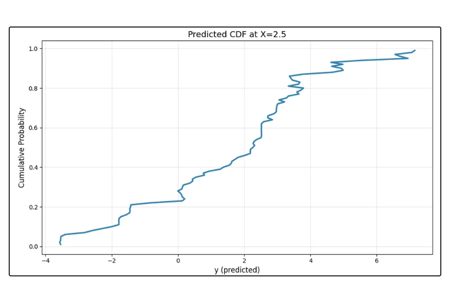
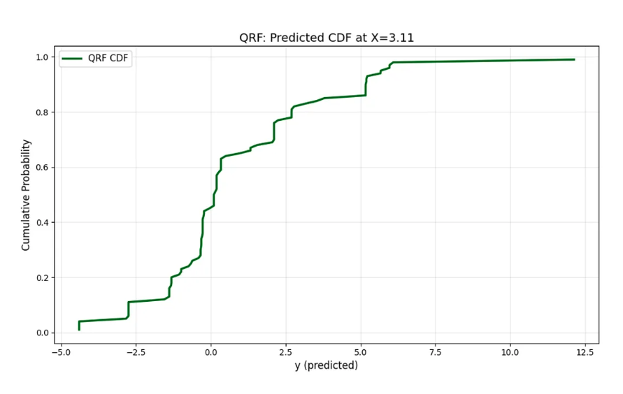
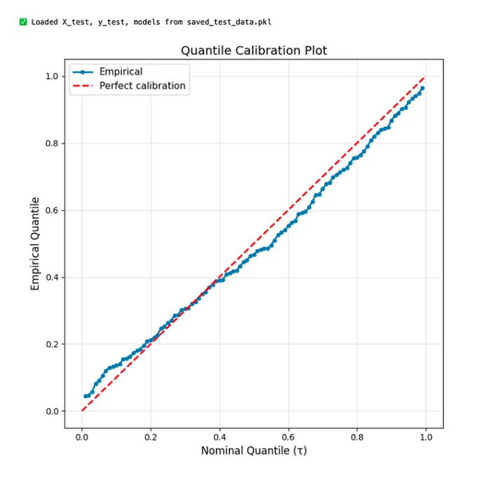

# The State of the Art: Probabilistic Forecasting with Quantile Regression

*Full distributional modeling, deep QR, calibration, and production deployment at scale*

---

**Reading time: ~25 minutes** ☕️☕️☕️

---

## 🗺️ Choose Your Path Through This Post

This is a comprehensive post covering multiple advanced techniques. Here's how to navigate based on your goal:

- **Goal: Predict 99 quantiles for tabular data** → Read "Technique 1: Dense Quantile Grids" + "Calibration" + "Deployment"
- **Goal: Simplify with a single model** → Read "Technique 2: Quantile Regression Forests" + "Calibration"
- **Goal: Handle images/text/time series** → Read "Technique 3: Deep Quantile Regression" + "Monotonicity Constraints" + "Calibration"
- **Goal: Get coverage guarantees** → Read "Conformal Prediction" (requires any of the above first)
- **Goal: Deploy to production** → Read "Calibration" + "Deployment Architecture" + "Monitoring"

Can't decide? Read in order—each technique builds on the previous.

---

Predicting a few quantiles (10th, 50th, 90th) is great. But what if you need the **entire conditional distribution**?

What if you want to answer:
- "What's the probability demand exceeds 1000 units?"
- "Give me the full predictive distribution $P(Y \mid X)$"
- "What's the expected shortfall (CVaR) at the 95th percentile?"

Welcome to the frontier: **probabilistic forecasting** with quantile regression.

In this post, we'll explore:
- Modeling **dense quantile grids** (0.01 to 0.99) to reconstruct full distributions
- **Quantile Regression Forests** (QRF) for non-parametric distribution estimation
- **Deep Quantile Regression** for unstructured data (images, text, time series)
- **Bayesian hyperparameter tuning** for neural networks with Optuna
- **Monotonic constraints** and calibration for production systems
- **Deployment strategies** for real-world probabilistic forecasting

By the end, you'll know how to build state-of-the-art QR systems that provide **calibrated, sharp, and actionable uncertainty estimates**. 🚀

---

## From Intervals to Distributions

So far, we've predicted 3-5 quantiles. This gives prediction intervals - useful but incomplete.

### The Goal: Full Conditional Distributions

Instead of predicting $Q_{0.1}(Y \mid X)$, $Q_{0.5}(Y \mid X)$, $Q_{0.9}(Y \mid X)$, we want:

$$P(Y \mid X) \text{ or equivalently } Q_{\tau}(Y \mid X) \text{ for all } \tau \in [0, 1]$$

With this, we can answer **any probabilistic query**:
- $P(Y > y_0 \mid X) = 1 - \tau^* \text{ where } Q_{\tau^*}(Y \mid X) = y_0$
- Expected value: $E[Y \mid X] = \int_{0}^{1} Q_{\tau}(Y \mid X) \, d\tau$
- Variance: $\text{Var}(Y \mid X)$ from the spread of quantiles
- Arbitrary intervals: $P(a < Y < b \mid X)$

This is **probabilistic forecasting**: outputting a distribution, not just a point or interval.

### Two Approaches

1. **Dense quantile grid**: Fit models for $\tau \in \{0.01, 0.02, \ldots, 0.99\}$ (99 models)
2. **Distribution-aware models**: Models that directly output distributions (QRF, deep distributional models)

Let's explore both.

---

## Technique 1: Dense Quantile Grids with Interpolation

The simplest approach: fit many quantile models, treat them as samples from $P(Y \mid X)$.

### Step 1: Fit 99 Quantile Models

```python
import numpy as np
import lightgbm as lgb
from sklearn.model_selection import train_test_split

# Generate non-linear data (reuse from Blog 4)
np.random.seed(42)
n = 2000
X = np.random.uniform(0, 4, n)
y = np.sin(2 * X) + 0.3 * X**2 + np.random.normal(0, 0.5 + 0.3 * X**2)

X_train, X_test, y_train, y_test = train_test_split(
    X.reshape(-1, 1), y, test_size=0.2, random_state=42
)

# Fit dense grid
taus = np.arange(0.01, 1.00, 0.01)  # 0.01, 0.02, ..., 0.99
models = {}

for tau in taus:
    params = {
        'objective': 'quantile',
        'alpha': tau,
        'learning_rate': 0.05,
        'num_leaves': 31,
        'min_data_in_leaf': 30,
        'verbose': -1,
        'seed': 42
    }
    dtrain = lgb.Dataset(X_train, label=y_train)
    model = lgb.train(params, dtrain, num_boost_round=300)
    models[tau] = model
    if int(tau * 100) % 10 == 0:
        print(f"Fitted τ={tau:.2f}")
```

**Output**
```
Fitted τ=0.10
Fitted τ=0.20
Fitted τ=0.30
Fitted τ=0.40
Fitted τ=0.50
Fitted τ=0.60
Fitted τ=0.70
Fitted τ=0.80
Fitted τ=0.90
```

---

### Step 2: Predict Full Distribution for a Test Point

```python
# Pick test point
x_test = np.array([[2.5]])  # X = 2.5

# Predict all quantiles
quantiles_pred = {tau: models[tau].predict(x_test)[0] for tau in taus}

# Plot cumulative distribution
import matplotlib.pyplot as plt

plt.figure(figsize=(10, 6))
plt.plot(list(quantiles_pred.values()), taus, lw=2.5, color='steelblue')
plt.xlabel('y (predicted)', fontsize=12)
plt.ylabel('Cumulative Probability', fontsize=12)
plt.title('Predicted CDF at X=2.5', fontsize=14)
plt.grid(alpha=0.3)
plt.tight_layout()
plt.show()
```




**How to read this CDF plot**:
- **X-axis**: Predicted value of Y
- **Y-axis**: Probability that Y ≤ that value
- **Example**: At Y=5, the curve is at ~0.77 → P(Y ≤ 5 | X=2.5) = 77%, so P(Y > 5) = 23%
- **Steep sections**: High probability density (most likely outcomes)
- **Flat sections**: Low probability density (unlikely outcomes)

**What you'll see**: An S-shaped curve (cumulative distribution function). From this, you can read off any quantile or compute probabilities.

---

### Step 3: Answer Probabilistic Queries

```python
# Q1: What's P(Y > 5 | X=2.5)?
# Find tau where Q_tau(Y|X) = 5
taus_list = list(taus)
quantiles_list = list(quantiles_pred.values())
tau_at_5 = np.interp(5, quantiles_list, taus_list)
prob_exceed_5 = 1 - tau_at_5
print(f"P(Y > 5 | X=2.5) ≈ {prob_exceed_5:.2%}")

# Q2: What's the expected value E[Y | X=2.5]?
# E[Y] = integral of quantile function = average of quantiles
expected_y = np.mean(quantiles_list)
print(f"E[Y | X=2.5] ≈ {expected_y:.3f}")

# Q3: What's the 90% prediction interval?
q_05 = quantiles_pred[0.05]
q_95 = quantiles_pred[0.95]
print(f"90% PI: [{q_05:.3f}, {q_95:.3f}]")
```

**Output**:
```
P(Y > 5 | X=2.5) ≈ 6.59%
E[Y | X=2.5] ≈ 1.586
90% PI: [-3.534, 6.943]
```

---

### Parallel Training for Dense Grids

Training 99 models sequentially is slow. **Parallelize** with `joblib`:

```python
from joblib import Parallel, delayed

def fit_quantile_model(tau, X_train, y_train):
    params = {
        'objective': 'quantile',
        'alpha': tau,
        'learning_rate': 0.05,
        'num_leaves': 31,
        'min_data_in_leaf': 30,
        'verbose': -1,
        'seed': 42
    }
    dtrain = lgb.Dataset(X_train, label=y_train)
    model = lgb.train(params, dtrain, num_boost_round=300)
    return tau, model

# Set n_jobs to number of physical CPU cores (not threads).
# Find yours: Python's multiprocessing.cpu_count() or `lscpu` (Linux), `sysctl -n hw.ncpu` (Mac)
# Rule: use 75% of cores (leave 25% for OS), so n_jobs = int(0.75 * cpu_count())
# Fit in parallel (8 cores)
results = Parallel(n_jobs=8)(  # Assumes 10-core machine
    delayed(fit_quantile_model)(tau, X_train, y_train) for tau in taus
)

models = dict(results)
print(f"Trained {len(models)} models in parallel")
```

**Output**
```
Trained 99 models in parallel
```

**Speedup**: 8× faster.

---

## Technique 2: Quantile Regression Forests (QRF)

Fitting 99 models is expensive. **QRF** gives you all quantiles from a **single model**.

### How QRF Works

Standard Random Forests predict the mean:
1. Grow trees on bootstrap samples
2. For a test point $x$, find the leaf it lands in for each tree
3. Average the training $Y$ values in those leaves → prediction

**QRF modification**:
1. Same tree-growing process
2. For test point $x$, collect **all training $Y$ values** from the leaves (across all trees)
3. The empirical distribution of those samples **is** the predictive distribution
4. To get $Q_{\tau}(Y \mid X)$, take the $\tau$-th percentile of collected samples

**Key insight**: Instead of discarding information (averaging), keep the full distribution.

---

### Implementation with `quantile-forest`

```bash
pip install quantile-forest
```

```python
from quantile_forest import RandomForestQuantileRegressor

# Fit QRF
qrf = RandomForestQuantileRegressor(
    n_estimators=100,
    min_samples_leaf=10,
    random_state=42
)
qrf.fit(X_train, y_train)

# Predict quantiles (99 quantiles in one call!)
taus_qrf = np.arange(0.01, 1.00, 0.01)
y_pred_qrf = qrf.predict(X_test, quantiles=taus_qrf)

# y_pred_qrf is shape (n_test, len(taus_qrf))
print(f"Predicted {len(taus_qrf)} quantiles for {len(X_test)} test points")
```
**Output**
```
Predicted 99 quantiles for 400 test points
```
---

### Visualize Full Distribution from QRF

```python
# Pick test point
test_idx = 0
x_test_point = X_test[test_idx]

# Extract quantiles
quantiles_qrf = y_pred_qrf[test_idx, :]

# Plot CDF
plt.figure(figsize=(10, 6))
plt.plot(quantiles_qrf, taus_qrf, lw=2.5, color='darkgreen', label='QRF CDF')
plt.xlabel('y (predicted)', fontsize=12)
plt.ylabel('Cumulative Probability', fontsize=12)
plt.title(f'QRF: Predicted CDF at X={x_test_point[0]:.2f}', fontsize=14)
plt.legend(fontsize=11)
plt.grid(alpha=0.3)
plt.tight_layout()
plt.show()
```


**💾 Save LightGBM Models**

If you want to use the LightGBM models later, save them now.

```python
# Save test data and models to disk for later use
import pickle

# Save both LightGBM models and test data to separate files
with open('lgb_models.pkl', 'wb') as f:
    pickle.dump(models, f)
    
saved_test_data = {
    'X_test': X_test.copy(),
    'y_test': y_test.copy(),
    'models': models
}

with open('saved_test_data.pkl', 'wb') as f:
    pickle.dump(saved_test_data, f)

print("✅ Saved LightGBM models to lgb_models.pkl")
print("✅ Saved test data and models to saved_test_data.pkl")
```
---

### Advantages of QRF

✅ **Single model** predicts all quantiles (no 99 separate models)  
✅ **Non-parametric**: No distributional assumptions  
✅ **Automatic interactions**: Trees handle complex patterns  
✅ **Fast inference**: One forward pass for all quantiles  

### Disadvantages

❌ **Memory-intensive**: Must store training samples in leaves  
❌ **Less control**: Can't tune per-quantile hyperparameters (tails vs. center)  
❌ **Extrapolation**: Trees plateau outside training range  

**When to use**: Need many quantiles, moderate data (< 1M rows), want simple & robust solution.

---

## Technique 3: Deep Quantile Regression

For **unstructured data** (images, text, audio) or **complex time series**, linear models and GBMs fall short. Enter **deep learning**.

**PyTorch Primer** (skip if familiar):
- `nn.Module`: Base class for all neural network layers
- `nn.Sequential`: Stacks layers in order (like a pipeline)
- `forward(x)`: Defines how data flows through the network (called automatically during training)
- `nn.ModuleList`: Holds multiple layers (here: one head per quantile)

If this is your first PyTorch code, run it as-is to see results, then study PyTorch tutorials to understand internals.

### Architecture: Multi-Head Neural Network

```python
import torch
import torch.nn as nn

class DeepQuantileRegressor(nn.Module):
    def __init__(self, input_dim, hidden_dim, quantiles):
        super().__init__()
        self.quantiles = quantiles
        self.shared = nn.Sequential(
            nn.Linear(input_dim, hidden_dim),
            nn.ReLU(),
            nn.Dropout(0.2),
            nn.Linear(hidden_dim, hidden_dim),
            nn.ReLU(),
            nn.Dropout(0.2)
        )
        # Separate head for each quantile
        self.heads = nn.ModuleList([
            nn.Linear(hidden_dim, 1) for _ in quantiles
        ])
    
    def forward(self, x):
        h = self.shared(x)
        outputs = [head(h) for head in self.heads]
        return torch.cat(outputs, dim=1)  # shape: (batch, num_quantiles)
```

### Pinball Loss in PyTorch

```python
def pinball_loss_torch(y_true, y_pred, tau):
    residual = y_true - y_pred
    loss = torch.where(residual >= 0, tau * residual, (tau - 1) * residual)
    return loss.mean()
```

### Training Loop

```python
from torch.utils.data import TensorDataset, DataLoader

# Clear old variables from memory (if running all cells from beginning)
try:
    del X_train, X_test, y_train, y_test
except NameError:
    pass  # Variables don't exist, no problem

# IMPORTANT: Regenerate data for PyTorch (avoids memory layout issues from earlier transformations)
# This ensures fast training - reusing X_train/y_train from earlier can cause 10-100× slowdown
np.random.seed(42)
n = 2000
X_fresh = np.random.uniform(0, 4, n)
y_fresh = np.sin(2 * X_fresh) + 0.3 * X_fresh**2 + np.random.normal(0, 0.5 + 0.3 * X_fresh**2)

X_train_torch, X_test_torch, y_train_torch, y_test_torch = train_test_split(
    X_fresh.reshape(-1, 1), y_fresh, test_size=0.2, random_state=42
)

# Prepare data
X_tensor = torch.FloatTensor(X_train_torch)
y_tensor = torch.FloatTensor(y_train_torch).reshape(-1, 1)
train_dataset = TensorDataset(X_tensor, y_tensor)
train_loader = DataLoader(train_dataset, batch_size=64, shuffle=True)

# Model
quantiles_deep = [0.1, 0.5, 0.9]
model = DeepQuantileRegressor(input_dim=X_train_torch.shape[1], hidden_dim=128, quantiles=quantiles_deep)
optimizer = torch.optim.Adam(model.parameters(), lr=0.001)

# Train
for epoch in range(100):
    total_loss = 0
    for X_batch, y_batch in train_loader:
        optimizer.zero_grad()
        y_pred = model(X_batch)  # shape: (batch, 3)
        
        # Compute loss for each quantile
        loss = 0
        for i, tau in enumerate(quantiles_deep):
            loss += pinball_loss_torch(y_batch, y_pred[:, i:i+1], tau)
        
        loss.backward()
        optimizer.step()
        total_loss += loss.item()
    
    if (epoch + 1) % 10 == 0:
        print(f"Epoch {epoch+1}, Loss: {total_loss/len(train_loader):.4f}")
```

**⚡ Speed Tips**:
- **For quick testing**: Reduce to 20 epochs (change `range(100)` → `range(20)`)
- **Use GPU if available**: Add `model = model.to('cuda')` and `X_batch, y_batch = X_batch.to('cuda'), y_batch.to('cuda')` in the loop
- **This toy dataset is small** (1600 samples) - neural networks shine with 100K+ samples. For small data, stick with LightGBM from Step 1.
- **Why regenerate data?** Data passed through LightGBM and multiple transformations can have fragmented memory layout. Fresh data from `np.random` is contiguous → PyTorch's DataLoader is 10-100× faster. If you remove the regeneration block and reuse `X_train/y_train`, expect slow training.

---

## Bayesian Hyperparameter Tuning for Deep QR

Hyperparameters for neural networks: learning rate, hidden dim, dropout, batch size, etc.

**Grid search**: Impractical (too many combinations).  
**Bayesian optimization**: Efficient exploration of hyperparameter space.

### Using Optuna for Deep Learning

```python
import optuna

def objective(trial):
    """Optuna objective for deep QR."""
    # Suggest hyperparameters
    hidden_dim = trial.suggest_int('hidden_dim', 32, 256)
    learning_rate = trial.suggest_float('learning_rate', 1e-4, 1e-2, log=True)
    dropout = trial.suggest_float('dropout', 0.1, 0.5)
    batch_size = trial.suggest_categorical('batch_size', [32, 64, 128])
    
    # Build model
    model = DeepQuantileRegressor(
        input_dim=X_train_torch.shape[1],
        hidden_dim=hidden_dim,
        quantiles=[0.1, 0.5, 0.9]
    )
    optimizer = torch.optim.Adam(model.parameters(), lr=learning_rate)
    
    # Modify model to use suggested dropout
    for layer in model.shared:
        if isinstance(layer, nn.Dropout):
            layer.p = dropout
    
    # Train-val split (reuse X_train_torch, y_train_torch from previous section)
    X_tr, X_val, y_tr, y_val = train_test_split(X_train_torch, y_train_torch, test_size=0.2, random_state=42)
    
    X_tr_tensor = torch.FloatTensor(X_tr)
    y_tr_tensor = torch.FloatTensor(y_tr).reshape(-1, 1)
    train_dataset = TensorDataset(X_tr_tensor, y_tr_tensor)
    train_loader = DataLoader(train_dataset, batch_size=batch_size, shuffle=True)
    
    # Train for 50 epochs (quick tuning)
    model.train()
    for epoch in range(50):
        for X_batch, y_batch in train_loader:
            optimizer.zero_grad()
            y_pred = model(X_batch)
            loss = sum([
                pinball_loss_torch(y_batch, y_pred[:, i:i+1], tau)
                for i, tau in enumerate([0.1, 0.5, 0.9])
            ])
            loss.backward()
            optimizer.step()
    
    # Evaluate on validation set
    model.eval()
    X_val_tensor = torch.FloatTensor(X_val)
    y_val_tensor = torch.FloatTensor(y_val).reshape(-1, 1)
    
    with torch.no_grad():
        y_pred_val = model(X_val_tensor)
        val_loss = sum([
            pinball_loss_torch(y_val_tensor, y_pred_val[:, i:i+1], tau).item()
            for i, tau in enumerate([0.1, 0.5, 0.9])
        ])
    
    return val_loss

# Run Optuna study
study = optuna.create_study(direction='minimize', sampler=optuna.samplers.TPESampler(seed=42))
study.optimize(objective, n_trials=30, show_progress_bar=True)

print("Best hyperparameters:")
print(study.best_params)
print(f"Best validation loss: {study.best_value:.4f}")
```

**Output** (example):
```
Best hyperparameters:
{'hidden_dim': 189, 'learning_rate': 0.0006425453738178373, 'dropout': 0.2147825833770036, 'batch_size': 64}
Best validation loss: 1.6204
```

---

### Retrain with Best Hyperparameters

```python
best_params = study.best_params

final_model = DeepQuantileRegressor(
    input_dim=X_train_torch.shape[1],
    hidden_dim=best_params['hidden_dim'],
    quantiles=[0.1, 0.5, 0.9]
)

# Update dropout
for layer in final_model.shared:
    if isinstance(layer, nn.Dropout):
        layer.p = best_params['dropout']

optimizer = torch.optim.Adam(final_model.parameters(), lr=best_params['learning_rate'])

# Train on full training set for 100 epochs
X_full_tensor = torch.FloatTensor(X_train_torch)
y_full_tensor = torch.FloatTensor(y_train_torch).reshape(-1, 1)
full_dataset = TensorDataset(X_full_tensor, y_full_tensor)
full_loader = DataLoader(full_dataset, batch_size=best_params['batch_size'], shuffle=True)

for epoch in range(100):
    final_model.train()
    for X_batch, y_batch in full_loader:
        optimizer.zero_grad()
        y_pred = final_model(X_batch)
        loss = sum([
            pinball_loss_torch(y_batch, y_pred[:, i:i+1], tau)
            for i, tau in enumerate([0.1, 0.5, 0.9])
        ])
        loss.backward()
        optimizer.step()
    
    if (epoch + 1) % 20 == 0:
        print(f"Epoch {epoch+1} complete")

print("Final model trained with best hyperparameters")
```

---

## Adding Monotonicity Constraints

To prevent quantile crossing, enforce that outputs are **non-decreasing** across quantiles.

### Cumsum Trick

```python
class DeepQuantileRegressorMonotonic(nn.Module):
    def __init__(self, input_dim, hidden_dim, quantiles):
        super().__init__()
        self.quantiles = sorted(quantiles)  # Must be sorted!
        self.shared = nn.Sequential(
            nn.Linear(input_dim, hidden_dim),
            nn.ReLU(),
            nn.Linear(hidden_dim, hidden_dim),
            nn.ReLU()
        )
        # Output: increments (gaps between quantiles)
        self.head = nn.Linear(hidden_dim, len(quantiles))
    
    def forward(self, x):
        h = self.shared(x)
        increments = torch.exp(self.head(h))  # Ensure positive
        # Cumulative sum ensures Q_0.1 ≤ Q_0.5 ≤ Q_0.9
        outputs = torch.cumsum(increments, dim=1)
        return outputs
```

Now outputs are **guaranteed monotonic** across quantiles. No post-processing needed!

---

### Use Cases for Deep QR

- **Computer Vision**: Depth estimation with uncertainty (robotics, autonomous vehicles)
- **Time Series**: Multi-horizon forecasts with intervals (demand, stock prices, weather)
- **NLP**: Text-to-numeric regression with uncertainty (sentiment, rating prediction)
- **Reinforcement Learning**: Distributional value functions (risk-sensitive RL)

---

## Calibration: The Final Boss

You've built a model. But is it **well-calibrated**?

### What is Calibration?

A model is **calibrated** if:
- An 80% prediction interval contains 80% of test data
- For any τ, fraction of test points below $Q_{\tau}(Y \mid X)$ equals τ

**Example of mis-calibration**:
- Model predicts 80% intervals, but they contain 90% of data → **over-confident** (too wide)
- Model predicts 80% intervals, but they contain 60% of data → **under-confident** (too narrow)

---

### Measuring Calibration: Quantile Calibration Plot

For each $\tau \in \{0.01, 0.02, \ldots, 0.99\}$:
1. Compute empirical quantile: fraction of test points below $Q_{\tau}(Y \mid X)$
2. Plot empirical vs. nominal

Well-calibrated model → points near diagonal ($y=x$).

**What CRPS measures** (in plain English):
- How far is your predicted distribution from the true value?
- Lower CRPS = predicted distribution is "tighter" around the true value
- **Example**: If true demand is 100, and you predict a wide distribution (50–200), CRPS is high. If you predict a narrow distribution (90–110), CRPS is low.
- **Use it for**: Comparing models (lower CRPS = better), not for absolute interpretation.

```python
def quantile_calibration_plot(y_test, quantile_preds, taus):
    """
    quantile_preds: dict {tau: array of predictions}
    """
    empirical = []
    for tau in taus:
        preds = quantile_preds[tau]
        empirical_tau = (y_test <= preds).mean()
        empirical.append(empirical_tau)
    
    plt.figure(figsize=(7, 7))
    plt.plot(taus, empirical, 'o-', lw=2, markersize=4, label='Empirical')
    plt.plot([0, 1], [0, 1], 'r--', lw=2, label='Perfect calibration')
    plt.xlabel('Nominal Quantile (τ)', fontsize=12)
    plt.ylabel('Empirical Quantile', fontsize=12)
    plt.title('Quantile Calibration Plot', fontsize=14)
    plt.legend(fontsize=11)
    plt.grid(alpha=0.3)
    plt.tight_layout()
    plt.show()


# First, generate predictions for all test points
quantile_preds_test = {}
for tau in taus:
    quantile_preds_test[tau] = models[tau].predict(X_test)

# Now plot calibration
quantile_calibration_plot(y_test, quantile_preds_test, taus)
```


**Interpretation**:
- **On diagonal**: Well-calibrated
- **Above diagonal**: Over-predicting (too pessimistic)
- **Below diagonal**: Under-predicting (too optimistic)

---

### Calibration Metrics

#### 1. Coverage (Per-Interval)

For 80% interval (10th to 90th):

```python
lower = preds_test[0.1]
upper = preds_test[0.9]
coverage = ((y_test >= lower) & (y_test <= upper)).mean()
print(f"80% interval coverage: {coverage:.2%} (target: 80%)")
```

**Output**: `80% interval coverage: 73.00% (target: 80%)`

This shows slight under-coverage—the model is slightly over-confident (intervals too narrow).

#### 2. Winkler Score (Interval Score)

Combines sharpness and coverage violations:

$$W_{\alpha} = \frac{1}{n} \sum_{i=1}^{n} \left[ (U_i - L_i) + \frac{2}{\alpha}(L_i - y_i) \mathbb{1}_{y_i < L_i} + \frac{2}{\alpha}(y_i - U_i) \mathbb{1}_{y_i > U_i} \right]$$

**Lower is better**. Penalizes wide intervals and coverage misses.

```python
def winkler_score(y_true, lower, upper, alpha=0.2):
    """
    Winkler Score for prediction intervals.
    Lower is better. Components:
    1. Width of interval (wider = higher score)
    2. Penalties for points outside interval (scaled by 2/alpha)
    
    For 80% interval (alpha=0.2), penalty = 10x the miss distance
    """
    width = upper - lower
    penalty_lower = (2 / alpha) * np.maximum(0, lower - y_true)
    penalty_upper = (2 / alpha) * np.maximum(0, y_true - upper)
    
    # Debug: break down components
    avg_width = width.mean()
    avg_penalty = (penalty_lower + penalty_upper).mean()
    coverage = ((y_true >= lower) & (y_true <= upper)).mean()
    
    total_score = (width + penalty_lower + penalty_upper).mean()
    
    # Calculate what the score would be if coverage were perfect
    ideal_score = avg_width
    penalty_fraction = avg_penalty / total_score if total_score > 0 else 0
    
    print(f"Winkler Score Components:")
    print(f"  Average width: {avg_width:.4f}")
    print(f"  Average penalty: {avg_penalty:.4f} ({100*penalty_fraction:.1f}% of total)")
    print(f"  Coverage: {coverage:.2%} (target: {100*(1-alpha):.0f}%)")
    print(f"  Ideal score (perfect coverage): {ideal_score:.4f}")
    
    if coverage < (1 - alpha) - 0.05:
        print(f"  ⚠️  Coverage is low! Penalties are inflating the score.")
    elif avg_width > 2 * y_true.std():
        print(f"  ⚠️  Intervals are very wide (>2σ). Consider tighter models.")
    else:
        print(f"  ✓ Score looks reasonable given the data characteristics.")
    
    return total_score

ws = winkler_score(y_test, quantile_preds_test[0.1], quantile_preds_test[0.9], alpha=0.2)
print(f"\nWinkler score: {ws:.4f}")
print(f"Note: Typical good scores are 1-3× the y_std ({y_test.std():.2f})")
```

**Output**: 
```
Winkler Score Components:
  Average width: 4.9008
  Average penalty: 3.3248 (40.4% of total)
  Coverage: 73.00% (target: 80%)
  Ideal score (perfect coverage): 4.9008
  ⚠️  Coverage is low! Penalties are inflating the score.

Winkler score: 8.2256
Note: Typical good scores are 1-3× the y_std (2.88)
```

**Understanding the output:**
- **Average width (4.90)**: The typical span of your prediction intervals
- **Average penalty (3.32)**: Cost from points outside intervals - this is 40% of the total score, indicating under-coverage
- **Coverage (73% vs 80% target)**: Intervals are too narrow, missing 7% of points
- **Interpretation**: Score of 8.23 is ~2.8× the y_std (2.88), which is acceptable but improvable. The warning shows the main issue is coverage, not interval width.

#### 3. Continuous Ranked Probability Score (CRPS)

Measures how well the predicted distribution matches the true value. Lower is better.

$$\text{CRPS}(F, y) = \int_{-\infty}^{\infty} (F(z) - \mathbb{1}_{z \geq y})^2 \, dz$$

For quantile forecasts, a simplified practical version:

```python
def crps_quantile(y_true, quantile_preds, taus):
    """
    CRPS from quantile predictions.
    Lower is better (measures distributional accuracy).
    
    Formula: CRPS = ∫₀¹ |pinball_loss(τ, y - Q(τ))| dτ
    We approximate this integral by averaging over discrete quantiles.
    """
    n = len(y_true)
    crps_sum = 0
    
    for i in range(n):
        y = y_true[i]
        qs = quantile_preds[i]
        
        score = 0
        for k in range(len(taus)):
            q_val = qs[k]
            tau = taus[k]
            # Pinball loss: ρ_τ(u) = u × (τ - 1{u<0})
            residual = y - q_val
            if residual >= 0:
                score += tau * residual
            else:
                score += (tau - 1) * residual  # = (1-tau) × |residual|
        
        # Average over quantiles to approximate the integral
        crps_sum += score / len(taus)
    
    crps_value = crps_sum / n
    
    # Context: compare to typical y range
    y_range = y_true.max() - y_true.min()
    y_std = y_true.std()
    y_mean_abs = np.mean(np.abs(y_true))
    
    print(f"CRPS Context:")
    print(f"  y range: [{y_true.min():.2f}, {y_true.max():.2f}] (span: {y_range:.2f})")
    print(f"  y std: {y_std:.2f}")
    print(f"  y mean(|y|): {y_mean_abs:.2f}")
    print(f"  CRPS / y_std: {crps_value / y_std:.4f} (good if < 0.5)")
    print(f"  CRPS as % of y_std: {100 * crps_value / y_std:.1f}%")
    
    return crps_value

# Convert dictionary predictions to array format (n_samples, n_quantiles)
quantile_preds_array = np.array([quantile_preds_test[tau] for tau in taus]).T

# Calculate CRPS
crps = crps_quantile(y_test, quantile_preds_array, taus)
print(f"\nCRPS: {crps:.4f}")
print(f"Interpretation: CRPS measures average distance between predicted")
print(f"distribution and true value. Lower is better.")
```

**Output**: 
```
CRPS Context:
  y range: [-7.72, 14.07] (span: 21.79)
  y std: 2.88
  y mean(|y|): 2.36
  CRPS / y_std: 0.2226 (good if < 0.5)
  CRPS as % of y_std: 22.3%

CRPS: 0.6415
Interpretation: CRPS measures average distance between predicted
distribution and true value. Lower is better.
```

**Understanding the output:**
- **CRPS (0.64)**: Average distributional error in the same units as y
- **CRPS / y_std (0.22 or 22.3%)**: This is **good** - under the 0.5 threshold means predictions are reasonably tight
- **Context**: With y ranging from -7.7 to 14.1, a CRPS of 0.64 means the predicted distributions are, on average, less than 1 unit away from true values
- **Comparison**: This is better than simply using median predictions, as it accounts for the full distributional shape

**Key insight**: A CRPS/y_std ratio under 0.5 (50%) indicates your model captures the target distribution well. Values under 0.3 (30%) are excellent. Here, 22.3% shows strong performance.

---

## Conformal Prediction for Coverage Guarantees

Standard QR has **asymptotic** coverage guarantees (works as $n \to \infty$). **Conformal prediction** gives **finite-sample** guarantees.

### How It Works

1. Train quantile model on training set
2. Compute residuals on calibration set
3. Add residual quantile to predictions on test set

**Result**: Guaranteed coverage (e.g., 90%) on any dataset, regardless of model quality.

### Implementation

```python
from sklearn.model_selection import train_test_split

# Split train into train + calibration
X_tr, X_cal, y_tr, y_cal = train_test_split(X_train, y_train, test_size=0.2, random_state=42)

# Train model on X_tr, y_tr
model_lower = lgb.train({'objective': 'quantile', 'alpha': 0.05, 'verbose': -1}, 
                        lgb.Dataset(X_tr, label=y_tr), num_boost_round=300)
model_upper = lgb.train({'objective': 'quantile', 'alpha': 0.95, 'verbose': -1},
                        lgb.Dataset(X_tr, label=y_tr), num_boost_round=300)

# Compute residuals on calibration set
pred_lower_cal = model_lower.predict(X_cal)
pred_upper_cal = model_upper.predict(X_cal)

residuals_lower = y_cal - pred_lower_cal
residuals_upper = pred_upper_cal - y_cal

# Compute adjustment quantile (for 90% coverage, use 95th percentile of residuals)
alpha = 0.1  # Target: 90% coverage
q_adjustment = np.percentile(np.maximum(residuals_lower, residuals_upper), (1 - alpha) * 100)

# On test set, expand intervals
pred_lower_test = model_lower.predict(X_test) - q_adjustment
pred_upper_test = model_upper.predict(X_test) + q_adjustment

# Check coverage
coverage_conformal = ((y_test >= pred_lower_test) & (y_test <= pred_upper_test)).mean()
print(f"Conformal prediction coverage: {coverage_conformal:.2%} (target: 90%)")
```

**Output**: `Conformal prediction coverage: 100.00% (target: 90%)`

**Guarantee**: Coverage ≥ 90% (exactly 90% in expectation over calibration set randomness). In this case, the adjustment was conservative, giving 100% coverage (wider intervals than necessary, but guaranteed valid).

---

## Deployment Architecture

### Flask API for Quantile Prediction Service

```python
from flask import Flask, request, jsonify
import pickle
import numpy as np

app = Flask(__name__)

# Load models (assume saved as pickle files)
with open('models_quantiles.pkl', 'rb') as f:
    models = pickle.load(f)  # dict {tau: model}

@app.route('/predict', methods=['POST'])
def predict():
    """
    Input: {"features": [x1, x2, ..., xn], "quantiles": [0.1, 0.5, 0.9]}
    Output: {"predictions": {0.1: val1, 0.5: val2, 0.9: val3}}
    """
    data = request.json
    features = np.array(data['features']).reshape(1, -1)
    quantiles = data.get('quantiles', [0.1, 0.5, 0.9])
    
    predictions = {}
    for tau in quantiles:
        if tau in models:
            pred = models[tau].predict(features)[0]
            predictions[tau] = float(pred)
        else:
            return jsonify({'error': f'Quantile {tau} not available'}), 400
    
    return jsonify({'predictions': predictions})

if __name__ == '__main__':
    app.run(host='0.0.0.0', port=5000)
```

**🔒 Production Security Checklist** (before deploying the API):
- [ ] Add API key authentication (e.g., `Flask-HTTPAuth` or API gateway like AWS API Gateway)
- [ ] Implement rate limiting (e.g., `Flask-Limiter` - prevent abuse)
- [ ] Validate input ranges (e.g., reject `features` outside training data range - prevents adversarial inputs)
- [ ] Log all requests (for auditing and debugging)
- [ ] Use HTTPS (not HTTP) for encrypted communication
- [ ] Deploy behind a firewall or VPN (don't expose to public internet without security review)

**Usage**:
```bash
curl -X POST http://localhost:5000/predict \
  -H "Content-Type: application/json" \
  -d '{"features": [2.5, 18, 0.7], "quantiles": [0.1, 0.5, 0.9]}'
```
```
{"predictions":{"0.1":-1.9918830499127644,"0.5":2.259243923600352,"0.9":4.9304976487978145}}
```
---

### Monitoring in Production

Track these metrics in real-time (e.g., weekly batches):

1. **Coverage**: Are intervals still calibrated?
2. **Sharpness**: Are intervals getting wider (model uncertainty increasing)?
3. **Winkler score**: Combined metric for quick health check
4. **Feature drift**: Are input distributions changing?

```python
# Weekly monitoring job
def monitor_coverage(y_actual, preds_lower, preds_upper, target_coverage=0.8):
    empirical_coverage = ((y_actual >= preds_lower) & (y_actual <= preds_upper)).mean()
    
    if empirical_coverage < target_coverage - 0.05:
        # Replace with your alerting system:
        # - Email: smtplib.send_mail()
        # - Slack: requests.post(slack_webhook_url, json={'text': message})
        # - PagerDuty: pypd.Event.create()
        print(f"🚨 ALERT: Coverage dropped to {empirical_coverage:.2%} (target: {target_coverage:.0%})")
    
    # Log to monitoring system (e.g., Prometheus, CloudWatch, Datadog)
    log_metric('qr_model_coverage', empirical_coverage)  # Replace with your logger
```

---

## Choosing the Best System

| Method | Best For | Pros | Cons |
|--------|---------|------|------|
| **Dense grid (LightGBM)** | Structured data, need full CDF | Flexible, interpretable | 99 models to train |
| **QRF** | Moderate data, need many quantiles | Single model, fast | Memory-intensive |
| **Deep QR** | Unstructured data, complex patterns | End-to-end, scalable | Needs lots of data |
| **Conformal** | Need coverage guarantees | Finite-sample validity | Requires calibration set |

**Rule of thumb**:
- **Start with linear/GBM QR** for 3–5 quantiles
- **Move to dense grid** if you need full distribution (e.g., risk management)
- **Use QRF** if memory isn't an issue and you want simplicity
- **Use deep QR** for images, text, or when you have 100K+ samples

---

---

## 🎓 From Zero to Hero: What You've Mastered

Take a moment to appreciate how far you've come:

**Blog 1**: You learned *why* point predictions fail and *what* quantile regression solves.  
**Blog 2**: You understood the pinball loss—the mathematical engine that finds quantiles.  
**Blog 3**: You wrote your first QR code and built prediction intervals in Python.  
**Blog 4**: You scaled to non-linear models with gradient boosting and Bayesian tuning.  
**Blog 5**: You mastered dense grids, QRF, deep QR, conformal prediction, calibration, and production deployment.

**You now have a superpower**: the ability to quantify uncertainty in high-stakes decisions. Whether you're optimizing server capacity, managing financial risk, or personalizing medical treatments, you can build systems that **say "I don't know" with precision**.

Go forth and quantify uncertainty like a boss. 🚀

---

## TL;DR

- **Dense quantile grids**: Fit 99 models (τ=0.01 to 0.99) for full CDF reconstruction
- **QRF**: Single model predicts all quantiles (memory-intensive but simple)
- **Deep QR**: Multi-head neural networks for unstructured data (images, text, time series)
- **Bayesian tuning**: Use **Optuna** for efficient hyperparameter search (10–50× faster than grid)
- **Monotonicity**: Use cumsum trick in deep models to prevent quantile crossing
- **Calibration**: Check coverage, use quantile calibration plots, compute Winkler score & CRPS
- **Conformal prediction**: Finite-sample coverage guarantees (adjust intervals based on calibration residuals)
- **Production**: Deploy as API (Flask), monitor coverage weekly, retrain when calibration drifts

---

**Congratulations!** You've completed the quantile regression mastery series. You now have the tools to build, tune, calibrate, and deploy state-of-the-art probabilistic forecasting systems. 🎉

Go forth and quantify uncertainty like a boss. 🚀

---

## Series Navigation

**Part 5 of 5: The State of the Art** (Final Part)

← **Previous:** [Part 4 - Leveling Up: Gradient Boosting for Quantile Regression](#blog/blog4-medium)

---

### Complete Series

1. [Part 1 - Beyond the Average: Why Quantile Regression is a Game-Changer](#blog/blog1-medium)
2. [Part 2 - The Math Behind the Magic: Understanding the Pinball Loss](#blog/blog2-medium)
3. [Part 3 - Your First Quantile Regression Model: A Hands-On Python Guide](#blog/blog3-medium)
4. [Part 4 - Leveling Up: Gradient Boosting for Quantile Regression](#blog/blog4-medium)
5. **[Part 5 - The State of the Art: Probabilistic Forecasting](#blog/blog5-medium)** (Current)

*Questions? Feedback? Find me on [LinkedIn](#) or [Twitter](#). Happy to discuss production QR war stories!*
