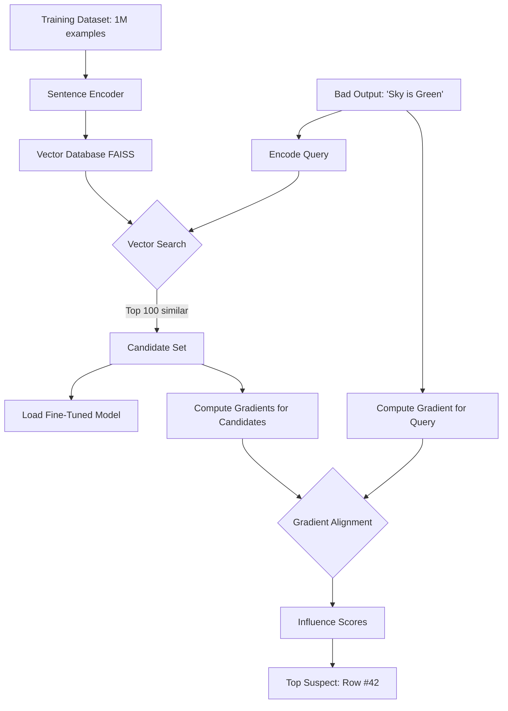

# Data Attribution Deep Dive: Part 1 - Foundations & Methods

*The "Who Broke the Build?" of AI: Finding the Exact Training Row That Made Your Model Say 2+2=5*

You know that feeling when you push code, the build fails, and you frantically search through git logs to find who committed the cursed code? 

Welcome to ML, where instead of a nice `git blame`, you have a black box of 7 billion parameters and a training dataset the size of the Library of Congress. When your LLM suddenly decides that "The Eiffel Tower was built in 1823 by Napoleon," you can't just check the commit history.

But what if you could? What if you could point at Row #42,857 in your training data and say, "That's the one. That's the tweet that broke my chatbot."

That's data attribution. And you're about to learn how to do it.

Grab your coffee (or Red Bull if you're that kind of engineer). This is Part 1: the foundations, the math, and the practical code to trace any model output back to its source.

---

## What You'll Learn In This Blog

**The Core Concept** - Why attribution matters and the two approaches (spoiler: one requires retraining a trillion times, the other uses calculus)

**Mathematical Foundations** - Influence Functions, Gradient Alignment, and why we ignore the Hessian (because who has 196 exabytes of storage?)

**Text Data Attribution** - Build a complete LLM attribution pipeline with vector search + gradient alignment. Find the training row that taught your model bad habits.

**Tabular Data** - Attribution for neural networks, XGBoost, and every tree-based model that can't backpropagate

---

## Part 1: The Core Concept (The "Why")

Imagine your model is a student. The training data is the textbooks. If the student answers a question wrong, you want to know which page of the textbook contained the confusing information.

In math terms, we are looking for the training example that, if removed, would change the model's prediction the most.

### But Why Do We Care?

Great question. Here are some very real scenarios where this matters:

1. **Legal Compliance**: Your LLM just recited copyrighted code verbatim. Which training sample did it memorize? You need to find it and potentially remove it from your dataset.

2. **Debugging Hallucinations**: Your chatbot claims that "The Eiffel Tower was built in 1823 by Napoleon." Somewhere in your training data, there is a poorly formatted Wikipedia edit or a random tweet that messed things up.

3. **Fairness Audits**: Your loan approval model is biased against a certain demographic. You need to trace it back to specific training examples that encoded this bias.

4. **Model Improvement**: You want to know which 10% of your dataset is "dead weight" (not contributing to performance) so you can remove it and save compute.

### The Two Approaches

There are fundamentally two ways to figure out which training data caused what:

**Approach 1: Leave-One-Out (LOO)**
- Retrain the model N times, each time removing one training example.
- If removing Example #42 changes the prediction, then Example #42 was important.
- **Problem**: If you have a trillion rows, you need to retrain a trillion times. Not happening.

**Approach 2: Influence Estimation (The Smart Way)**
- Use math to *estimate* what would happen if we removed a row, without actually retraining.
- This is what Influence Functions and Gradient Alignment do.
- **Problem**: It is an approximation. Sometimes it is wrong.

### The Golden Rule: Gradient Alignment

For Neural Networks (whether it is an LLM or a simple tabular MLP), the magic lies in the **Gradients**.

When you train a model, you calculate the gradient of the loss to update the weights. The gradient is basically a vector that says "move the weights in this direction to learn this example".

Here is the key insight:

> If the gradient of Training Row A points in the *same direction* as the gradient of your Test Query, then Training Row A is helping the model learn that query. They are friends. They are aligned.

Picture training like steering a sailboat. Every training example is a gust hitting your sail: gusts aligned with your heading accelerate you toward the destination; gusts from opposing angles force you off course and make you correct. Gradient alignment tells you which gusts are carrying you and which are fighting you.

---

## Part 2: Mathematical Foundations (The Beautiful, Scary Math)

Okay, buckle up. This is where we go from "intuition" to "proof". If you are allergic to Greek letters, you can skim this section. But if you want to truly understand what is happening under the hood, this is essential.

### The Setup

Let's define our variables:
- $\theta$: The model's parameters (weights).
- $L(\theta, z)$: The loss of the model on a single data point $z$.
- $z_i$: A training example (could be text, tabular row, etc.).
- $z_{test}$: The query we want to explain.

When we train, we minimize:

$$
\theta^* = \arg\min_{\theta} \frac{1}{n} \sum_{i=1}^{n} L(\theta, z_i)
$$

Simple enough. But now, suppose we want to know: *What if we had trained without $z_i$?*

The new optimal parameters would be:

$$
\theta^*_{-i} = \arg\min_{\theta} \frac{1}{n-1} \sum_{j \neq i} L(\theta, z_j)
$$

And the **influence** of $z_i$ on our test prediction is:

$$
\mathcal{I}(z_i, z_{test}) = L(\theta^*_{-i}, z_{test}) - L(\theta^*, z_{test})
$$

If this number is large and positive, removing $z_i$ would *increase* the test loss (the model gets worse). So $z_i$ was helpful.

If it is large and negative, removing $z_i$ would *decrease* the test loss. So $z_i$ was harmful (or misleading).

### The Problem: We Can't Compute This

To calculate $\theta^*_{-i}$, we need to retrain the model. And if we have a million training examples, we need to retrain a million times.

This is where **Influence Functions** save the day.

### Influence Functions: The Approximation

The genius idea (from a 1980 statistics paper by Cook and Weisberg) is to use a **Taylor Expansion**.

If we remove one training point, the optimal parameters don't change that much. So we can approximate:

$$
\theta^*_{-i} \approx \theta^* - \frac{1}{n} H^{-1} \nabla_{\theta} L(\theta^*, z_i)
$$

Where:
- $H = \frac{1}{n} \sum_{i=1}^{n} \nabla^2_{\theta} L(\theta, z_i)$ is the **Hessian** (the second derivative of the loss).
- $H^{-1}$ is the inverse Hessian.

Now, plug this into the influence formula:

$$
\mathcal{I}(z_i, z_{test}) \approx -\nabla_{\theta} L(\theta^*, z_{test})^T H^{-1} \nabla_{\theta} L(\theta^*, z_i)
$$

This is beautiful. We only need:
1. The gradient of the test point: $\nabla_{\theta} L(\theta^*, z_{test})$
2. The gradient of the training point: $\nabla_{\theta} L(\theta^*, z_i)$
3. The inverse Hessian: $H^{-1}$

### The Hessian Problem

For a modern LLM with 7 billion parameters, the Hessian is a \(7B \times 7B\) matrix. You cannot even store it, let alone invert it.

This is why we use approximations:
- **Conjugate Gradient**: An iterative method to approximate $H^{-1} v$ without computing $H^{-1}$.
- **Low-Rank Approximations**: Assume the Hessian has low rank and only store the important parts.
- **Identity Approximation** (what we do in practice): Just ignore the Hessian and use the dot product of gradients. This is the "Gradient Alignment" method.

$$
\text{Influence Score} \approx \nabla_{\theta} L(\theta^*, z_{test})^T \nabla_{\theta} L(\theta^*, z_i)
$$

Is this perfect? No. But it works surprisingly well in practice.

### Why Does Gradient Alignment Work?

Think of the Hessian as a "correction factor" that accounts for the curvature of the loss landscape. In a perfectly convex loss (like linear regression), the Hessian is constant and we can ignore it. In deep learning, the loss is highly non-convex, so the Hessian matters.

But here is the thing: **most of the signal is in the gradient**. The Hessian is a second-order correction. If you just want to know "which training points are similar to my test point?", the gradient already tells you 80% of the story.

---

## Part 3: Text Data (The LLM Challenge)

LLMs are huge. The datasets are huge. We can't check every row. So we need to be smart.

### The Challenge

A typical LLM fine-tuning scenario:
- **Model Size**: 7 billion parameters.
- **Training Data**: 500 million tokens across 1 million examples.
- **Compute**: Even a forward pass takes 100ms on a GPU.

If we naively compute the gradient for all 1 million training examples to compare against our test query, we are looking at:
- 1 million forward passes.
- 1 million backward passes.
- At 100ms each, that is **27 hours** just to attribute a single output.

This is not practical.

### The Strategy: Retrieval + Attribution

The key insight: **Not all training data is relevant**.

If your LLM outputs "The capital of France is Paris", the relevant training data is probably:
- Wikipedia articles about France.
- Geography textbooks.
- Maybe some tourist blog posts.

It is *not*:
- Code for implementing a binary search tree.
- A recipe for chocolate chip cookies.
- Random Reddit comments about video games.

So we use a two-stage approach:

**Stage 1: Coarse Filtering (Vector Search)**
- Embed all training examples using a sentence encoder (like `sentence-transformers`).
- Store them in a vector database (FAISS, Milvus, Pinecone).
- When we want to attribute an output, we search for the top $k$ (say, 100 or 1000) most similar training examples.
- This is fast. A FAISS search over 1 billion vectors takes milliseconds.

**Stage 2: Fine-Grained Attribution (Gradient Alignment)**
- Now we only need to compute gradients for 100 examples instead of 1 million.
- We compute the influence score for each of these 100.
- The top-scoring example is our culprit.

### The Architecture



### The Code

Let's break this down into functions with every single detail explained.

#### Step 1: Build the Vector Index (One-Time Setup)

This is the preprocessing step. You do this once and save the result.

```python
from sentence_transformers import SentenceTransformer
import faiss
import numpy as np
from datasets import load_dataset

def build_vector_index(training_data_path, save_path="training_embeddings.index"):
    """
    Embeds all training examples and builds a FAISS index.
    This is done ONCE and saved to disk.
    
    Args:
        training_data_path: Path to your training JSON file
        save_path: Where to save the FAISS index
    
    Returns:
        faiss.Index: The built index
    """
    # Load the embedding model
    # all-MiniLM-L6-v2: 384 dimensions, fast, good for semantic search
    # Alternatives: all-mpnet-base-v2 (768 dims, slower but more accurate)
    encoder = SentenceTransformer('all-MiniLM-L6-v2')
    
    # Load training data
    dataset = load_dataset("json", data_files=training_data_path, split="train")
    
    # We embed the "instruction + input + output" concatenation
    # Why all three? Because:
    # - Instruction: Defines the task context
    # - Input: The specific query
    # - Output: The learned pattern (this is what we want to trace back)
    texts = [
        f"{row['instruction']} {row['input']} {row['output']}" 
        for row in dataset
    ]
    
    print(f"Encoding {len(texts)} training examples...")
    # Batch encode for efficiency
    # batch_size=128 is a good balance between speed and memory
    embeddings = encoder.encode(
        texts, 
        batch_size=128, 
        show_progress_bar=True,
        normalize_embeddings=True  # L2 normalize for cosine similarity
    )
    embeddings = np.array(embeddings).astype('float32')
    
    # Build FAISS index
    # IndexFlatL2: Exact search using L2 distance (no approximation)
    # For billion-scale datasets, use:
    # - IndexIVFFlat: Inverted file index (approximate, much faster)
    # - IndexHNSW: Hierarchical Navigable Small World (graph-based)
    dimension = embeddings.shape[1]  # 384 for MiniLM
    index = faiss.IndexFlatL2(dimension)
    
    # Add vectors to index
    index.add(embeddings)
    
    # Save to disk
    faiss.write_index(index, save_path)
    
    print(f"Index built with {index.ntotal} vectors and saved to {save_path}")
    return index

# Usage (run once during setup)
# index = build_vector_index("data/train.json")
```

**Why FAISS?** It is ridiculously fast. A search over 1 billion 128-dimensional vectors takes about 10ms on a GPU. Alternatives like Elasticsearch or Milvus work too, but FAISS is simple and battle-tested.

#### Step 2: Retrieve Candidate Rows

Now, given a query, we find the most similar training examples.

```python
def get_candidate_rows(query_text, index_path, dataset_path, top_k=100):
    """
    Given a query, find the top_k most similar training examples.
    
    Args:
        query_text: The output you want to explain
        index_path: Path to the FAISS index
        dataset_path: Path to the training data (to look up row IDs)
        top_k: Number of candidates to return
    
    Returns:
        List of row indices
    """
    encoder = SentenceTransformer('all-MiniLM-L6-v2')
    index = faiss.read_index(index_path)
    
    # Encode the query (same way we encoded training data)
    query_embedding = encoder.encode([query_text], normalize_embeddings=True).astype('float32')
    
    # Search
    # Returns:
    # - distances: L2 distances to nearest neighbors
    # - indices: Row IDs of nearest neighbors
    distances, indices = index.search(query_embedding, top_k)
    
    # indices[0] is the array of row IDs (batch size = 1)
    candidate_ids = indices[0].tolist()
    
    print(f"Retrieved {len(candidate_ids)} candidate rows.")
    print(f"Distance range: {distances[0][0]:.4f} to {distances[0][-1]:.4f}")
    
    return candidate_ids

# Example
# candidates = get_candidate_rows(
#     "The sky is green because of chlorophyll in the atmosphere.",
#     "training_embeddings.index",
#     "data/train.json",
#     top_k=50
# )
```

**Interpreting Distances**: Lower distance = more similar. If the first result has distance 0.1 and the last has 2.5, you are probably safe using only the top 20 or so. The tail is noise.

#### Step 3: Compute Gradients (The Heavy Lifting)

This is where we actually do the neural network math.

```python
import torch
from transformers import AutoModelForCausalLM, AutoTokenizer
from peft import PeftModel

def get_gradient(model, tokenizer, text, device):
    """
    Computes the gradient of the loss for a single text input.
    
    Args:
        model: The fine-tuned model (with LoRA adapters)
        tokenizer: The tokenizer
        text: Input text (formatted as instruction + input + response)
        device: 'cuda' or 'cpu'
    
    Returns:
        torch.Tensor: Flattened gradient vector for all trainable parameters
    """
    model.zero_grad()
    
    # Tokenize
    # truncation=True: If text is too long, cut it off
    # max_length=512: Trade-off between context and speed
    inputs = tokenizer(
        text, 
        return_tensors="pt", 
        truncation=True, 
        max_length=512
    ).to(device)
    
    # Forward pass
    # For causal LM, we predict the next token at each position
    # labels = input_ids means "use the input itself as the target"
    outputs = model(**inputs, labels=inputs["input_ids"])
    loss = outputs.loss
    
    # Backward pass
    # This computes gradients for ALL parameters
    loss.backward()
    
    # Collect gradients from trainable parameters only
    # For LoRA fine-tuning, only LoRA matrices have requires_grad=True
    grads = []
    for name, param in model.named_parameters():
        if param.requires_grad and param.grad is not None:
            # Flatten to 1D vector
            grads.append(param.grad.view(-1))
    
    # Concatenate into a single vector
    # This is a vector in R^d where d = total number of trainable parameters
    # For LoRA r=64 on a 7B model, d is about 27 million
    grad_vector = torch.cat(grads)
    
    return grad_vector

def load_model_for_attribution(base_model_name, adapter_path, device):
    """
    Loads the fine-tuned model in training mode (gradients enabled).
    
    Args:
        base_model_name: HuggingFace model ID (e.g., "mistralai/Mistral-7B-v0.1")
        adapter_path: Path to LoRA adapters
        device: 'cuda' or 'cpu'
    
    Returns:
        (model, tokenizer)
    """
    tokenizer = AutoTokenizer.from_pretrained(base_model_name)
    tokenizer.pad_token = tokenizer.eos_token
    tokenizer.padding_side = "right"
    
    # Load base model
    # torch_dtype=float16: Saves memory (important for 7B models)
    # device_map="auto": Automatically splits across GPUs if available
    model = AutoModelForCausalLM.from_pretrained(
        base_model_name,
        torch_dtype=torch.float16,
        device_map="auto",
    )
    
    # Load LoRA adapter
    model = PeftModel.from_pretrained(model, adapter_path)
    
    # CRITICAL: Set to training mode
    # This enables gradient computation
    model.train()
    
    # Ensure LoRA parameters have requires_grad=True
    # (Sometimes they get frozen during loading)
    trainable_params = 0
    for name, param in model.named_parameters():
        if "lora" in name.lower():
            param.requires_grad = True
            trainable_params += param.numel()
    
    print(f"Loaded model with {trainable_params:,} trainable LoRA parameters.")
    
    return model, tokenizer
```

**Memory Note**: With float16 and a 7B model, you need about 14GB of VRAM. If you have less, use `load_in_8bit=True` or `load_in_4bit=True` from `bitsandbytes`.

#### Step 4: Compute Influence Scores

Now we tie it all together.

```python
from tqdm import tqdm

def compute_influence_scores(model, tokenizer, query_text, candidate_rows, dataset, device):
    """
    Computes the gradient alignment score for each candidate row.
    
    Args:
        model: Fine-tuned model
        tokenizer: Tokenizer
        query_text: The output you want to explain
        candidate_rows: List of row IDs to check
        dataset: The full training dataset (for looking up rows)
        device: 'cuda' or 'cpu'
    
    Returns:
        List of (row_id, influence_score) tuples, sorted descending
    """
    # Get gradient for the query
    print("Computing gradient for query...")
    query_grad = get_gradient(model, tokenizer, query_text, device)
    
    # Normalize to unit length
    # This makes the dot product equivalent to cosine similarity
    # Cosine similarity is in [-1, 1] and is scale-invariant
    query_grad = query_grad / torch.norm(query_grad)
    
    scores = []
    
    print(f"Computing gradients for {len(candidate_rows)} candidate training rows...")
    for row_id in tqdm(candidate_rows):
        sample = dataset[row_id]
        
        # Format the training example EXACTLY the same way it was during training
        # This is critical. If your training used a different format, use that.
        sample_text = f"### Instruction:\n{sample['instruction']}\n\n### Input:\n{sample['input']}\n\n### Response:\n{sample['output']}"
        
        # Get gradient
        sample_grad = get_gradient(model, tokenizer, sample_text, device)
        sample_grad = sample_grad / torch.norm(sample_grad)
        
        # Compute influence (cosine similarity via dot product)
        # High value = gradients point in same direction
        # This training row "helped" the model learn this output
        influence = torch.dot(query_grad, sample_grad).item()
        
        scores.append((row_id, influence))
    
    # Sort by influence (highest first)
    scores.sort(key=lambda x: x[1], reverse=True)
    
    return scores
```

#### Step 5: The Complete Pipeline

```python
def find_influential_rows(query_text, base_model, adapter_path, training_data_path, index_path, top_k=50):
    """
    The main attribution pipeline.
    
    Args:
        query_text: The model output you want to explain
        base_model: Base model ID
        adapter_path: Path to LoRA adapters
        training_data_path: Path to training JSON
        index_path: Path to FAISS index
        top_k: Number of candidates to check
    
    Returns:
        List of (row_id, influence_score) tuples
    """
    device = "cuda" if torch.cuda.is_available() else "cpu"
    
    # Step 1: Retrieve candidates via vector search
    print("="*60)
    print("STEP 1: Retrieving candidate rows via vector search")
    print("="*60)
    candidates = get_candidate_rows(query_text, index_path, training_data_path, top_k=top_k)
    
    # Step 2: Load model
    print("\n" + "="*60)
    print("STEP 2: Loading fine-tuned model")
    print("="*60)
    model, tokenizer = load_model_for_attribution(base_model, adapter_path, device)
    
    # Step 3: Load dataset
    dataset = load_dataset("json", data_files=training_data_path, split="train")
    
    # Step 4: Compute influence scores
    print("\n" + "="*60)
    print("STEP 3: Computing influence scores via gradient alignment")
    print("="*60)
    scores = compute_influence_scores(model, tokenizer, query_text, candidates, dataset, device)
    
    # Step 5: Display results
    print("\n" + "="*60)
    print("RESULTS: Top 5 Most Influential Training Rows")
    print("="*60)
    for rank, (row_id, score) in enumerate(scores[:5], 1):
        print(f"\n#{rank}: Row {row_id} (Influence Score: {score:.4f})")
        print(f"Instruction: {dataset[row_id]['instruction'][:60]}...")
        print(f"Input: {dataset[row_id]['input'][:60]}...")
        print(f"Output: {dataset[row_id]['output'][:60]}...")
    
    return scores

# Complete example usage:
# query = """### Instruction:
# Improve this resume bullet point to use strong action verbs and metrics.
# 
# ### Input:
# I was responsible for the database and made it faster.
# 
# ### Response:
# Optimized PostgreSQL database performance by 40% through query indexing and schema normalization, reducing latency for 1M+ daily users.
# """
# 
# scores = find_influential_rows(
#     query,
#     base_model="mistralai/Mistral-7B-v0.1",
#     adapter_path="mistral-7b-resume-finetuned",
#     training_data_path="data/train.json",
#     index_path="training_embeddings.index",
#     top_k=50
# )
```

### Interpretation of Scores

The influence score is a number between -1 and 1 (because we normalized the gradients to unit length).

- **Score close to 1 (0.8 - 1.0)**: The training row and the query have nearly identical gradients. They are pushing the model in the exact same direction. This is your smoking gun. The model almost certainly learned this pattern from this specific row.
  
- **Score around 0.5 - 0.8**: Strong positive correlation. The training row is related and contributed to the output, but it is not the sole cause.

- **Score close to 0 (-0.2 to 0.2)**: No correlation. The training row is irrelevant to this query. This happens when the vector search retrieved semantically similar text but the actual gradient patterns are different.

- **Score close to -1 (-1.0 to -0.5)**: Negative correlation. The training row is pushing the model in the *opposite* direction. This is rare but can happen if the training data contains contradictory examples. For instance, if one row says "Paris is in France" and another says "Paris is in Texas", they will have opposite gradients for a France-related query.

### A Real Example Walkthrough

Let's say you have finetuned an LLM to improve resume. You run this on a query where the model generates:
> "Implemented a RESTful API using Node.js, reducing response time by 35%."

**Step 1: Vector Search**
The system retrieves 50 rows. The top 5 by semantic similarity might be:
- Row 127: "Built backend services with Express.js..."
- Row 54: "Developed REST endpoints for user authentication..."
- Row 203: "Created microservices architecture..."
- Row 91: "Improved API performance by caching..."
- Row 12: "Designed database schema for..."

**Step 2: Gradient Alignment**
The system computes influence scores:
- Row 127: 0.87 (very high)
- Row 91: 0.62 (moderate)
- Row 54: 0.41 (low)
- Row 203: 0.19 (very low)
- Row 12: 0.05 (irrelevant)

**Step 3: Inspection**
You look at Row 127:
> Input: "Worked on backend code"  
> Output: "Built backend services with Express.js, cutting latency by 30%."

Aha! The model learned the phrase "reducing/cutting [metric] by [percentage]" from this specific training example. The "35%" in the query output is a slight variation, but the pattern definitely came from Row 127.

---

## Part 4: Tabular Data (The Excel Nightmare)

Tabular data is a different beast. You might be using:
- A neural network (MLP, TabNet, etc.)
- A tree-based model (XGBoost, LightGBM, CatBoost, Random Forest)
- A linear model (Logistic Regression, Ridge, etc.)

The attribution strategy changes based on the model type.

### Scenario A: Neural Networks for Tabular Data

Good news! You can use the **exact same Gradient Alignment method** as we just used for LLMs.

The only difference is that instead of text, your input is a feature vector.

```python
def get_tabular_gradient(model, features, label, device):
    """
    Computes the gradient for a tabular neural network.
    
    Args:
        model: Your trained MLP/TabNet/etc
        features: A single row of features (e.g., [age, income, credit_score])
        label: The true label (or predicted label for test data)
        device: 'cuda' or 'cpu'
    
    Returns:
        torch.Tensor: Gradient vector
    """
    model.zero_grad()
    
    # Convert to tensor
    if not isinstance(features, torch.Tensor):
        features = torch.tensor(features, dtype=torch.float32).unsqueeze(0).to(device)
    
    # Forward pass
    output = model(features)
    
    # Compute loss
    # For regression: MSE
    # For classification: CrossEntropy or BCE
    if model.task == 'regression':
        loss = torch.nn.MSELoss()(output, torch.tensor([[label]], dtype=torch.float32).to(device))
    else:
        loss = torch.nn.CrossEntropyLoss()(output, torch.tensor([label], dtype=torch.long).to(device))
    
    # Backward pass
    loss.backward()
    
    # Collect gradients
    grads = torch.cat([p.grad.view(-1) for p in model.parameters() if p.grad is not None])
    
    return grads

def find_influential_rows_tabular_nn(model, test_row, training_data, training_labels, device):
    """
    Find which training rows influenced a test prediction (Neural Network).
    
    Args:
        model: Trained neural network
        test_row: The row you want to explain (numpy array or list)
        training_data: All training features (N x D array)
        training_labels: All training labels (N array)
        device: 'cuda' or 'cpu'
    
    Returns:
        List of (row_index, influence_score)
    """
    model.train()  # Enable gradients
    
    # Get gradient for test row
    # Use the model's prediction as the "label" for consistency
    test_output = model(torch.tensor([test_row], dtype=torch.float32).to(device))
    test_label = test_output.argmax().item() if model.task == 'classification' else test_output.item()
    
    test_grad = get_tabular_gradient(model, test_row, test_label, device)
    test_grad = test_grad / torch.norm(test_grad)
    
    scores = []
    
    for i in range(len(training_data)):
        train_row = training_data[i]
        train_label = training_labels[i]
        
        train_grad = get_tabular_gradient(model, train_row, train_label, device)
        train_grad = train_grad / torch.norm(train_grad)
        
        influence = torch.dot(test_grad, train_grad).item()
        scores.append((i, influence))
    
    scores.sort(key=lambda x: x[1], reverse=True)
    
    return scores
```

### Scenario B: Tree-Based Models (The Hard Part)

Trees are not differentiable. You cannot backpropagate through an `if age > 30` statement.

But we have clever workarounds.

#### Option 1: TreeInfluence

TreeInfluence adapts Influence Functions to tree-based models. The idea:
- Each leaf in a tree represents a "cluster" of training examples.
- If a test point falls into Leaf #42, the training examples in that leaf influenced the prediction.
- We compute a weighted influence based on how the leaf's statistics would change if we removed each training point.

```python
# Pseudocode for TreeInfluence
def tree_influence(model, test_row, training_data):
    # Find which leaf the test row falls into
    leaf_id = model.apply(test_row)  # XGBoost/LightGBM support this
    
    # Get all training examples in the same leaf
    leaf_samples = []
    for i, train_row in enumerate(training_data):
        if model.apply(train_row) == leaf_id:
            leaf_samples.append(i)
    
    # Compute influence for each sample in the leaf
    # (This involves recalculating leaf statistics without each point)
    influences = []
    for sample_id in leaf_samples:
        # Estimate how the prediction would change if we removed this sample
        # This is model-specific (different for XGBoost vs. Random Forest)
        influence = compute_leaf_influence(model, leaf_id, sample_id)
        influences.append((sample_id, influence))
    
    return sorted(influences, reverse=True)
```

This works but is computationally expensive for ensembles with hundreds of trees.

#### Option 2: SimplEx (Representation-Based Attribution)

This is my favorite for tabular data because it is simple and interpretable.

The idea: Instead of gradients, we use the **latent representation** (the internal "embedding" the model creates).

For a neural network, this is the output of the second-to-last layer.  
For a tree ensemble, we can create a representation based on which leaves the data point lands in.

```python
def get_tree_representation(model, row):
    """
    Creates a binary representation of which leaves a row lands in.
    
    For an ensemble with 100 trees, this returns a vector like:
    [Leaf 23, Leaf 7, Leaf 91, ..., Leaf 12]
    
    We can then measure similarity in this space.
    """
    leaf_indices = model.apply(row)  # Returns leaf ID for each tree
    return leaf_indices

def simplex_attribution(model, test_row, training_data, k=10):
    """
    SimplEx: Find the k training examples most similar to test_row
    in the model's latent space.
    
    Args:
        model: Trained XGBoost/LightGBM model
        test_row: The row to explain
        training_data: All training data
        k: Number of prototypes to return
    
    Returns:
        List of (row_index, similarity_score)
    """
    # Get latent representation for test row
    test_repr = get_tree_representation(model, test_row)
    
    similarities = []
    
    for i, train_row in enumerate(training_data):
        train_repr = get_tree_representation(model, train_row)
        
        # Measure similarity
        # For leaf indices, we use: "How many trees put them in the same leaf?"
        similarity = np.sum(test_repr == train_repr) / len(test_repr)
        
        similarities.append((i, similarity))
    
    similarities.sort(key=lambda x: x[1], reverse=True)
    
    return similarities[:k]
```

**Interpretation**: If SimplEx returns Row #45 with similarity 0.92, it means the test row lands in the same leaf as Row #45 in 92% of the trees. They are basically "twins" in the model's view.

You can then say: *"This loan was denied because it looks just like Row #45, who also defaulted."*

### Scenario C: SHAP (The Universal Explainer)

SHAP (SHapley Additive exPlanations) is not strictly a data attribution method, but it can be adapted.

Normally, SHAP tells you **feature importance**: "Age contributed +0.3 to the prediction, Income contributed -0.1..."

But you can also use SHAP to estimate **training data importance** by computing the Shapley value of including/excluding each training point.

```python
import shap

def shap_data_attribution(model, test_row, training_data, max_samples=100):
    """
    Use SHAP to attribute the prediction to training samples.
    
    This is expensive (exponential in the worst case), so we sample.
    """
    explainer = shap.Explainer(model, training_data)
    
    # Compute SHAP values for the test row
    shap_values = explainer(test_row)
    
    # The SHAP values tell us which features mattered
    # We can then find training examples with similar feature patterns
    # (This is a heuristic, not a true influence function)
    
    # Find training rows with similar SHAP patterns
    # ...implementation depends on your specific use case...
    
    return influential_rows
```

SHAP is powerful but slow. For data attribution, I prefer SimplEx or Gradient Alignment.

### Summary of Tabular Methods

| Model Type | Recommended Method | Pros | Cons |
|:-----------|:-------------------|:-----|:-----|
| **Neural Network** | Gradient Alignment | Accurate, consistent with LLM approach | Requires differentiable model |
| **XGBoost/Trees** | SimplEx | Fast, interpretable | Approximate (not true influence) |
| **XGBoost/Trees** | TreeInfluence | Theoretically sound | Slow for large ensembles |
| **Any Model** | SHAP | Universal, well-studied | Expensive, not designed for data attribution |

---

## Conclusion: Part 1

You now understand:
- **Why** data attribution matters (legal, debugging, fairness, optimization)
- **How** Influence Functions work mathematically
- **Why** Gradient Alignment is a practical approximation
- **How** to implement the pipeline for text data (Vector Search + Gradient Alignment)
- **How** to adapt these methods for tabular data (Neural Networks, Trees, etc.)

Ready to dive deeper? Continue to Part 2 where we cover Data Perturbation (the ground-truth verification), Advanced Techniques (TRAK, DataInf), Scaling Strategies, Real-World Implementation, and Common Pitfalls.
