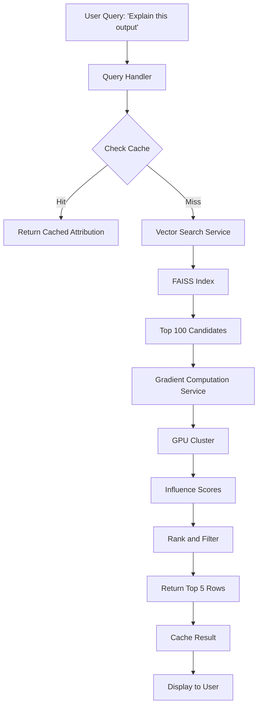

# Data Attribution Deep Dive: Part 2 - Verification, Advanced Methods & Production

*Trust But Verify: Proving Your Attribution Was Right (Then Scaling to a Trillion Rows Without a PhD in Infrastructure)*

So you ran gradient alignment and it says Row #42 is the smoking gun. The math checks out. The influence score is 0.94. You're ready to present this to your team.

But here's the thing: **approximations lie**.

What if the model learned from 5 different rows that all said similar things? What if your gradient was noisy? What if the algorithm just... got it wrong?

There's only one way to know for sure: **actually remove the data and retrain**.

Welcome to Part 2, where we apply the scientific method to machine learning. Remove the suspect, retrain the model, and see if the behavior changes. If it does? You found your culprit. If it doesn't? Back to the drawing board.

Then, once you've proven your method works on small datasets, we'll scale it to production. Because "works on 1,000 rows" and "works on 1 trillion rows" are two very different engineering problems.

Let's finish this.

---

## What You'll Learn In This Blog

**Data Perturbation** - The ground-truth verification. Remove the row, retrain, and prove you were right (or wrong). The scientific method for ML.

**Advanced Techniques** - TRAK (random projections that compress billions of gradients), DataInf (10x faster with token sampling), and Datamodels (the regression approach)

**Scaling to Production** - Trillion-row datasets, hierarchical filtering, distributed computation, and caching strategies that don't bankrupt your company

**Real-World Implementation** - A complete production system with Redis caching, GPU clusters, and all the infrastructure you actually need

**Pitfalls and Debugging** - Every failure mode I've encountered and how to fix them (OOM errors, noisy gradients, false positives, and more)

---

## Part 5: Data Perturbation (The "Trust but Verify")

So the math says Row #42 is the culprit. Do we trust the math?

No. We are engineers. We verify.

**Data Perturbation** is the act of messing with the data to prove our theory. It is the scientific method applied to machine learning.

### The Philosophy

Attribution algorithms (Gradient Alignment, Influence Functions, SimplEx) give us **predictions** about causality. But they are approximations. They can be wrong because:

1. **Model Non-linearity**: Deep learning loss landscapes are complex. Small changes can have unexpected effects.
2. **Gradient Noise**: Gradients can be noisy, especially with small batch sizes or high learning rates.
3. **Data Redundancy**: Multiple training examples might teach the same pattern. Removing one might not matter because the others compensate.

Perturbation is the **ground truth test**: We actually remove the data and see what happens.

### The Process (Detailed)

#### Step 1: Baseline

Train the model normally and record the output for your test query.

```python
from transformers import TrainingArguments
from datasets import load_dataset

def train_baseline(training_data_path, model_config):
    """
    Train the model on the full dataset.
    
    Args:
        training_data_path: Path to training JSON
        model_config: Dict with hyperparameters
    
    Returns:
        Trained model
    """
    dataset = load_dataset("json", data_files=training_data_path, split="train")
    
    # Your normal training code
    # (Using the same setup as your original finetune.py)
    model = AutoModelForCausalLM.from_pretrained(model_config['base_model'])
    # ... LoRA config, trainer setup, etc ...
    trainer.train()
    
    return model

def get_baseline_output(model, tokenizer, test_prompt):
    """
    Get the model's output for a specific prompt.
    """
    inputs = tokenizer(test_prompt, return_tensors="pt").to(model.device)
    outputs = model.generate(**inputs, max_new_tokens=100, temperature=0.7)
    output_text = tokenizer.decode(outputs[0], skip_special_tokens=True)
    
    # Extract just the response part (after "### Response:")
    response = output_text.split("### Response:")[-1].strip()
    
    return response

# Baseline run
baseline_model = train_baseline("data/train.json", config)
baseline_output = get_baseline_output(baseline_model, tokenizer, test_prompt)
print(f"Baseline Output: {baseline_output}")
```

#### Step 2: Perturb the Dataset

Remove the suspected influential row(s).

```python
import json

def remove_rows_from_dataset(input_path, output_path, row_ids_to_remove):
    """
    Create a new dataset with specific rows removed.
    
    Args:
        input_path: Original training data JSON
        output_path: Where to save the perturbed dataset
        row_ids_to_remove: List of row indices to exclude
    """
    with open(input_path, 'r') as f:
        data = json.load(f)
    
    # Remove the rows (in reverse order to avoid index shifting)
    for row_id in sorted(row_ids_to_remove, reverse=True):
        del data[row_id]
    
    with open(output_path, 'w') as f:
        json.dump(data, f, indent=2)
    
    print(f"Removed {len(row_ids_to_remove)} rows. New dataset has {len(data)} examples.")

# Example: Remove Row #42
remove_rows_from_dataset(
    "data/train.json",
    "data/train_without_row42.json",
    [42]
)
```

#### Step 3: Retrain

Train a new model on the perturbed dataset.

**Important**: Use the **exact same hyperparameters** as the baseline. Same learning rate, same number of epochs, same random seed (if possible). Otherwise, any difference in output could be due to training variance, not the missing data.

```python
# Retrain on perturbed data
perturbed_model = train_baseline("data/train_without_row42.json", config)
perturbed_output = get_baseline_output(perturbed_model, tokenizer, test_prompt)
print(f"Perturbed Output: {perturbed_output}")
```

#### Step 4: Compare Outputs

Now comes the moment of truth.

```python
def compare_outputs(baseline, perturbed, threshold=0.7):
    """
    Compare two outputs to determine if they are meaningfully different.
    
    Args:
        baseline: Original model output
        perturbed: Output after removing suspected row
        threshold: Similarity threshold (0-1). Below this = significant change.
    
    Returns:
        (is_different, similarity_score)
    """
    # Option 1: Exact match
    if baseline == perturbed:
        return False, 1.0
    
    # Option 2: Semantic similarity
    from sentence_transformers import SentenceTransformer
    encoder = SentenceTransformer('all-MiniLM-L6-v2')
    
    emb1 = encoder.encode([baseline])
    emb2 = encoder.encode([perturbed])
    
    # Cosine similarity
    similarity = np.dot(emb1[0], emb2[0]) / (np.linalg.norm(emb1[0]) * np.linalg.norm(emb2[0]))
    
    is_different = similarity < threshold
    
    return is_different, similarity

# Compare
is_different, sim_score = compare_outputs(baseline_output, perturbed_output)

if is_different:
    print(f"✓ CONFIRMED: Row #42 was influential (similarity: {sim_score:.2f})")
    print(f"Baseline: {baseline_output}")
    print(f"Perturbed: {perturbed_output}")
else:
    print(f"✗ INCONCLUSIVE: Output barely changed (similarity: {sim_score:.2f})")
    print("The suspected row might not be the sole cause.")
```

### Advanced Perturbation Strategies

#### Strategy 1: Batch Removal

Instead of removing one row, remove the **top 5** influential rows.

Why? Because often multiple rows contribute to the same pattern. Removing just one might not be enough.

```python
# Remove top 5 influential rows
top_5_ids = [score[0] for score in influence_scores[:5]]
remove_rows_from_dataset(
    "data/train.json",
    "data/train_without_top5.json",
    top_5_ids
)
```

#### Strategy 2: Label Flipping

Instead of removing the row, **flip its label** or **corrupt its output**.

This is useful for detecting "mislabeled" data.

```python
def flip_row_label(input_path, output_path, row_id):
    """
    Corrupt a specific row's output to test if it causes hallucinations.
    """
    with open(input_path, 'r') as f:
        data = json.load(f)
    
    # Corrupt the output
    data[row_id]['output'] = "CORRUPTED DATA - IGNORE THIS"
    
    with open(output_path, 'w') as f:
        json.dump(data, f, indent=2)
    
    print(f"Flipped label for Row #{row_id}")
```

#### Strategy 3: Leave-One-Out Cross-Validation

For small datasets (< 1000 rows), you can actually do full Leave-One-Out.

Train N models, each with one row removed. Measure the variance in outputs.

```python
def leave_one_out_experiment(training_data_path, test_prompt, config):
    """
    Train N models, each missing one row.
    Track which removals cause the biggest change.
    """
    dataset = load_dataset("json", data_files=training_data_path, split="train")
    n = len(dataset)
    
    results = []
    
    for i in range(n):
        print(f"Training model without Row #{i} ({i+1}/{n})")
        
        # Remove row i
        perturbed_data = [dataset[j] for j in range(n) if j != i]
        
        # Train (this is expensive, so only do for small datasets)
        model = train_model(perturbed_data, config)
        
        # Get output
        output = get_baseline_output(model, tokenizer, test_prompt)
        
        results.append((i, output))
    
    return results
```

This is the **gold standard** for attribution, but it is computationally prohibitive for large datasets.

### Interpreting Results

**Case 1: Output changes significantly**
```
Baseline:  "Optimized database performance by 40%"
Perturbed: "Worked on improving the backend system"
```
→ **Confirmation**: Row #42 definitely taught the model the "40%" phrasing.

**Case 2: Output changes slightly**
```
Baseline:  "Optimized database performance by 40%"
Perturbed: "Optimized database performance by 35%"
```
→ **Partial Influence**: Row #42 contributed, but the overall pattern exists elsewhere in the data.

**Case 3: Output stays the same**
```
Baseline:  "Optimized database performance by 40%"
Perturbed: "Optimized database performance by 40%"
```
→ **False Positive**: The attribution algorithm was wrong. The model learned this from multiple sources, and Row #42 was redundant.

### A Complete Perturbation Workflow

```python
def full_perturbation_experiment(
    training_data_path,
    test_prompt,
    suspected_row_id,
    config
):
    """
    The complete end-to-end perturbation test.
    """
    print("="*60)
    print("PERTURBATION EXPERIMENT")
    print("="*60)
    
    # Step 1: Train baseline
    print("\n[1/4] Training baseline model...")
    baseline_model = train_baseline(training_data_path, config)
    baseline_output = get_baseline_output(baseline_model, tokenizer, test_prompt)
    print(f"Baseline Output: {baseline_output}")
    
    # Step 2: Create perturbed dataset
    print(f"\n[2/4] Removing Row #{suspected_row_id}...")
    perturbed_path = "data/train_perturbed.json"
    remove_rows_from_dataset(training_data_path, perturbed_path, [suspected_row_id])
    
    # Step 3: Retrain
    print("\n[3/4] Retraining on perturbed data...")
    perturbed_model = train_baseline(perturbed_path, config)
    perturbed_output = get_baseline_output(perturbed_model, tokenizer, test_prompt)
    print(f"Perturbed Output: {perturbed_output}")
    
    # Step 4: Compare
    print("\n[4/4] Comparing outputs...")
    is_different, similarity = compare_outputs(baseline_output, perturbed_output)
    
    print("\n" + "="*60)
    print("RESULTS")
    print("="*60)
    if is_different:
        print(f"✓ Row #{suspected_row_id} WAS influential (similarity: {similarity:.3f})")
    else:
        print(f"✗ Row #{suspected_row_id} was NOT influential (similarity: {similarity:.3f})")
    
    return {
        'baseline': baseline_output,
        'perturbed': perturbed_output,
        'similarity': similarity,
        'confirmed': is_different
    }

# Run the experiment
# result = full_perturbation_experiment(
#     "data/train.json",
#     test_prompt,
#     suspected_row_id=42,
#     config=training_config
# )
```

---

## Part 6: Advanced Techniques (When Simple Isn't Enough)

The methods we have covered so far (Gradient Alignment, SimplEx) are great starting points. But for production-scale systems or cutting-edge research, you need heavier artillery.

### TRAK: The State-of-the-Art for LLMs

**TRAK** (Tracing with Random-projection Analog of the Kernel) is currently the gold standard for data attribution in large models.

#### The Problem TRAK Solves

Standard Influence Functions require computing and storing the Hessian inverse. For a 7B parameter model:
- Hessian size: $$7 \times 10^9 \times 7 \times 10^9 = 4.9 \times 10^{19}$$ elements
- Storage: About 196 exabytes (if stored as float32)

This is not happening.

#### The TRAK Solution

TRAK uses **random projections** (Johnson-Lindenstrauss lemma) to compress the gradient from billions of dimensions to a few thousand.

The algorithm:
1. **During Training**: At each checkpoint, compute gradients for all training examples. Project them down to 10,000 dimensions using a random matrix. Store these "sketches".
2. **At Query Time**: Compute the gradient for your test query, project it the same way, and compare against the stored sketches.

```python
# Pseudocode for TRAK
import torch
import numpy as np

class TRAKAttributor:
    def __init__(self, model, projection_dim=10000):
        self.model = model
        self.projection_dim = projection_dim
        
        # Random projection matrix (fixed across all gradients)
        param_count = sum(p.numel() for p in model.parameters() if p.requires_grad)
        self.projection_matrix = torch.randn(projection_dim, param_count) / np.sqrt(projection_dim)
        
        self.train_sketches = []  # Will store projected gradients for each training example
    
    def project_gradient(self, gradient):
        """
        Projects a high-dimensional gradient to low-dimensional space.
        """
        return torch.matmul(self.projection_matrix, gradient)
    
    def build_training_sketches(self, training_data):
        """
        Precompute and store sketches for all training data.
        This is done ONCE after training.
        """
        for train_example in training_data:
            grad = self.get_gradient(train_example)
            sketch = self.project_gradient(grad)
            self.train_sketches.append(sketch)
        
        # Save to disk
        torch.save(self.train_sketches, "trak_sketches.pt")
    
    def find_influential(self, test_example, top_k=10):
        """
        Find the most influential training examples for a test query.
        """
        test_grad = self.get_gradient(test_example)
        test_sketch = self.project_gradient(test_grad)
        
        # Compute dot products (fast because sketches are low-dimensional)
        scores = []
        for i, train_sketch in enumerate(self.train_sketches):
            score = torch.dot(test_sketch, train_sketch).item()
            scores.append((i, score))
        
        scores.sort(key=lambda x: x[1], reverse=True)
        return scores[:top_k]
```

#### Why TRAK is Better

1. **Scalability**: Sketches are tiny (10K dimensions vs. billions). You can store them for the entire dataset.
2. **Multi-Checkpoint Ensembling**: TRAK computes sketches at multiple training checkpoints (e.g., epoch 1, 2, 3...) and averages them. This makes the attribution more stable.
3. **Theoretical Guarantees**: The random projection preserves distances with high probability (JL lemma).

#### Using the Official TRAK Library

```python
# pip install traker
from trak import TRAKer

# Initialize TRAK
traker = TRAKer(
    model=model,
    task='text_classification',  # or 'image_classification'
    train_set_size=len(training_data),
    proj_dim=8192  # Lower = faster but less accurate
)

# Step 1: Compute gradients during training (or after)
for checkpoint in checkpoints:
    model.load_state_dict(checkpoint)
    for batch in training_data:
        traker.featurize(batch, num_samples=len(batch))

# Step 2: Finalize (compute the sketches)
traker.finalize_features()

# Step 3: Query
test_gradient = traker.featurize(test_data, num_samples=1)
scores = traker.score(test_gradient)

# Top influential training examples
top_indices = np.argsort(scores)[::-1][:10]
```

### DataInf: Faster Than TRAK

**DataInf** is a newer method (2024) that is even faster than TRAK for LLMs.

The key idea: Instead of computing gradients for every token, sample a subset of "influential tokens" and only compute gradients for those.

```python
# Pseudocode for DataInf
def datainf_attribution(model, test_prompt, training_data, sample_rate=0.1):
    """
    DataInf: Sample-based influence estimation.
    
    Args:
        model: Trained model
        test_prompt: Query to explain
        training_data: All training examples
        sample_rate: What fraction of tokens to sample (0.1 = 10%)
    
    Returns:
        Influence scores
    """
    # Get the full gradient for the test prompt
    test_grad = get_gradient(model, test_prompt)
    
    # Identify "influential tokens" (high gradient norm)
    token_grads = compute_per_token_gradients(test_grad)
    top_tokens = np.argsort(token_grads)[:int(len(token_grads) * sample_rate)]
    
    # Only compute training gradients for these tokens
    scores = []
    for train_example in training_data:
        # Compute gradient only for the sampled tokens
        partial_grad = get_partial_gradient(model, train_example, top_tokens)
        score = torch.dot(test_grad[top_tokens], partial_grad).item()
        scores.append(score)
    
    return scores
```

DataInf is 5-10x faster than TRAK with minimal loss in accuracy.

### Datamodels: The "Regression" Approach

**Datamodels** flip the problem on its head.

Instead of asking "Which training row influenced this prediction?", they ask: "Can we predict the model's output as a linear function of the training data?"

$$
\text{Model Output} \approx \sum_{i=1}^{n} w_i \cdot \mathbb{1}[\text{Training row } i \text{ is in dataset}]
$$

You train a **meta-model** (usually linear regression) where:
- Input: Binary vector indicating which training rows were used.
- Output: The model's prediction.

Then you can say: "This prediction is 30% due to Row #5, 25% due to Row #12, ..."

```python
# Pseudocode for Datamodels
def train_datamodel(base_model_config, training_data, num_subsets=100):
    """
    Train a datamodel by training the base model on random subsets.
    """
    results = []
    
    for _ in range(num_subsets):
        # Sample a random subset (e.g., 80% of the data)
        subset_mask = np.random.rand(len(training_data)) < 0.8
        subset = training_data[subset_mask]
        
        # Train the model on this subset
        model = train(base_model_config, subset)
        
        # Evaluate on a test set
        accuracy = evaluate(model, test_data)
        
        results.append((subset_mask, accuracy))
    
    # Fit a linear regression
    # X = binary matrix (num_subsets x num_training_examples)
    # Y = accuracies
    X = np.array([mask for mask, _ in results])
    Y = np.array([acc for _, acc in results])
    
    from sklearn.linear_model import LinearRegression
    datamodel = LinearRegression().fit(X, Y)
    
    # The coefficients tell us the importance of each training example
    importances = datamodel.coef_
    
    return importances
```

This is expensive (you train many models), but it gives you a global view of data importance, not just per-prediction.

---

## Part 7: Scaling to Production (Trillion-Row Datasets)

You work at BigCorp. You have a trillion rows of training data. How do you make attribution practical?

### Strategy 1: Hierarchical Filtering

Use a **cascade** of increasingly expensive filters:

1. **Filter 1: Metadata** (0.001ms per row)  
   If you have metadata (e.g., "source: Wikipedia", "date: 2023-05-12"), filter by that first.  
   Example: If the bad output is about history, only check Wikipedia rows.

2. **Filter 2: Vector Search** (0.01ms per row)  
   Use FAISS to narrow down to the top 10,000 rows.

3. **Filter 3: Cheap Heuristics** (0.1ms per row)  
   Use BM25 (keyword search) or n-gram overlap to further narrow to 1,000 rows.

4. **Filter 4: Gradient Alignment** (100ms per row)  
   Only now do you compute gradients for the final 1,000 candidates.


This reduces the search space from \(10^{12}\) to \(10^{3}\) before doing any expensive computation.

### Strategy 2: Distributed Gradient Computation

If you absolutely must compute gradients for millions of rows, parallelize it.

```python
import ray

@ray.remote
def compute_gradient_remote(model_path, data_chunk, device_id):
    """
    Compute gradients for a chunk of data on a specific GPU.
    """
    model = load_model(model_path)
    model.to(f"cuda:{device_id}")
    
    gradients = []
    for row in data_chunk:
        grad = get_gradient(model, row)
        gradients.append(grad)
    
    return gradients

# Distribute across 8 GPUs
chunks = np.array_split(candidate_rows, 8)
futures = [
    compute_gradient_remote.remote(model_path, chunk, i)
    for i, chunk in enumerate(chunks)
]
all_gradients = ray.get(futures)
```

With 8 GPUs, you get 8x speedup.

### Strategy 3: Precompute and Cache

If you know you will be doing attribution often, precompute gradients for all training data **once** and store them.

```python
def precompute_all_gradients(model, training_data, save_path):
    """
    Compute and save gradients for the entire dataset.
    This is expensive but you only do it once.
    """
    gradients = []
    
    for i, row in enumerate(training_data):
        if i % 1000 == 0:
            print(f"Processing row {i}/{len(training_data)}")
        
        grad = get_gradient(model, row)
        # Compress: Store in float16 instead of float32
        grad = grad.half()
        gradients.append(grad)
    
    # Save to disk (might be terabytes for large datasets)
    torch.save(gradients, save_path)
    
    print(f"Saved {len(gradients)} gradients to {save_path}")

# Later, when you want to attribute:
def fast_attribution(test_example, precomputed_gradients_path):
    test_grad = get_gradient(model, test_example)
    
    # Load precomputed gradients (might need streaming if file is huge)
    train_grads = torch.load(precomputed_gradients_path)
    
    scores = []
    for i, train_grad in enumerate(train_grads):
        score = torch.dot(test_grad, train_grad.float()).item()
        scores.append((i, score))
    
    return sorted(scores, reverse=True)
```

**Trade-off**: Storage cost vs. query speed. For a 1 billion row dataset with 27 million parameters, you need about 50TB of storage.

### Strategy 4: Approximate Nearest Neighbors (ANN)

Instead of computing exact dot products, use an ANN library like **ScaNN** or **Annoy** to find approximate top-k gradients.

```python
import annoy

def build_ann_index(gradients, dimension, num_trees=100):
    """
    Build an Annoy index for fast approximate search.
    """
    index = annoy.AnnoyIndex(dimension, 'angular')  # Angular = cosine similarity
    
    for i, grad in enumerate(gradients):
        index.add_item(i, grad.cpu().numpy())
    
    index.build(num_trees)
    index.save('gradients.ann')
    
    return index

def fast_approximate_attribution(test_grad, index_path, top_k=10):
    """
    Use ANN to find the most similar gradients (faster but approximate).
    """
    index = annoy.AnnoyIndex(test_grad.shape[0], 'angular')
    index.load(index_path)
    
    # Get approximate top-k nearest neighbors
    top_indices = index.get_nns_by_vector(test_grad.cpu().numpy(), top_k)
    
    return top_indices
```

This is **1000x faster** than exact search, with only a small loss in accuracy.

---

## Part 8: Real-World Implementation (Putting It All Together)

Let's build a complete, production-ready attribution system.

### The Architecture



### The Code

```python
# main.py
import faiss
import torch
from sentence_transformers import SentenceTransformer
from transformers import AutoModelForCausalLM, AutoTokenizer
from peft import PeftModel
import redis

class ProductionAttributionSystem:
    def __init__(self, config):
        self.config = config
        
        # Load components
        print("Loading models...")
        self.encoder = SentenceTransformer('all-MiniLM-L6-v2')
        self.faiss_index = faiss.read_index(config['faiss_index_path'])
        
        self.model, self.tokenizer = self.load_lm()
        
        # Redis for caching
        self.cache = redis.Redis(host='localhost', port=6379, db=0)
    
    def load_lm(self):
        """Load the fine-tuned language model."""
        tokenizer = AutoTokenizer.from_pretrained(self.config['base_model'])
        model = AutoModelForCausalLM.from_pretrained(
            self.config['base_model'],
            torch_dtype=torch.float16,
            device_map="auto"
        )
        model = PeftModel.from_pretrained(model, self.config['adapter_path'])
        model.train()
        
        # Enable gradients for LoRA
        for name, param in model.named_parameters():
            if "lora" in name.lower():
                param.requires_grad = True
        
        return model, tokenizer
    
    def attribute(self, query_text, top_k=5, use_cache=True):
        """
        Main attribution pipeline.
        
        Args:
            query_text: The output to explain
            top_k: Number of influential rows to return
            use_cache: Whether to check cache first
        
        Returns:
            List of (row_id, score, row_data) tuples
        """
        # Check cache
        cache_key = f"attribution:{hash(query_text)}"
        if use_cache:
            cached = self.cache.get(cache_key)
            if cached:
                return json.loads(cached)
        
        # Step 1: Vector search
        print("Step 1: Vector search...")
        candidates = self.vector_search(query_text, k=100)
        
        # Step 2: Gradient alignment
        print("Step 2: Computing influence scores...")
        scores = self.compute_influences(query_text, candidates)
        
        # Step 3: Get top results
        top_results = scores[:top_k]
        
        # Fetch full row data
        results_with_data = []
        for row_id, score in top_results:
            row_data = self.get_row_data(row_id)
            results_with_data.append((row_id, score, row_data))
        
        # Cache results
        self.cache.setex(cache_key, 3600, json.dumps(results_with_data))
        
        return results_with_data
    
    def vector_search(self, query_text, k=100):
        """Use FAISS to find candidate rows."""
        query_embedding = self.encoder.encode([query_text], normalize_embeddings=True).astype('float32')
        distances, indices = self.faiss_index.search(query_embedding, k)
        return indices[0].tolist()
    
    def compute_influences(self, query_text, candidate_ids):
        """Compute gradient alignment scores."""
        test_grad = self.get_gradient(query_text)
        test_grad = test_grad / torch.norm(test_grad)
        
        scores = []
        for row_id in candidate_ids:
            row_data = self.get_row_data(row_id)
            row_text = self.format_sample(row_data)
            
            train_grad = self.get_gradient(row_text)
            train_grad = train_grad / torch.norm(train_grad)
            
            score = torch.dot(test_grad, train_grad).item()
            scores.append((row_id, score))
        
        return sorted(scores, key=lambda x: x[1], reverse=True)
    
    def get_gradient(self, text, device='cuda'):
        """Compute gradient for a text sample."""
        self.model.zero_grad()
        
        inputs = self.tokenizer(
            text, 
            return_tensors="pt", 
            truncation=True, 
            max_length=512
        ).to(device)
        
        outputs = self.model(**inputs, labels=inputs["input_ids"])
        loss = outputs.loss
        
        loss.backward()
        
        grads = []
        for name, param in self.model.named_parameters():
            if param.requires_grad and param.grad is not None:
                grads.append(param.grad.view(-1))
        
        return torch.cat(grads)
    
    def format_sample(self, sample):
        """Format a dataset sample for gradient computation."""
        return f"### Instruction:\n{sample['instruction']}\n\n### Input:\n{sample['input']}\n\n### Response:\n{sample['output']}"


# Usage
config = {
    'base_model': 'mistralai/Mistral-7B-v0.1',
    'adapter_path': 'mistral-7b-resume-finetuned',
    'faiss_index_path': 'training_embeddings.index',
    'training_data': 'data/train.json'
}

system = ProductionAttributionSystem(config)

query = """### Instruction:
Improve this resume bullet point to use strong action verbs and metrics.

### Input:
I was responsible for the database and made it faster.

### Response:
Optimized PostgreSQL database performance by 40% through query indexing.
"""

results = system.attribute(query, top_k=5)

for rank, (row_id, score, row_data) in enumerate(results, 1):
    print(f"\n#{rank}: Row {row_id} (Score: {score:.4f})")
    print(f"Input: {row_data['input'][:60]}...")
    print(f"Output: {row_data['output'][:60]}...")
```

---

## Part 9: Pitfalls and Debugging (When Things Go Wrong)

Attribution is tricky. Here are the common failure modes and how to fix them.

### Pitfall 1: All Scores Are Near Zero

**Symptom**: Every influence score is between -0.1 and 0.1.

**Cause**: Your gradients are noisy or the model has converged to a flat region.

**Fix**:
- Use more training data in your candidate set (increase $k$ from 50 to 500).
- Check if your model is overtrained (gradients vanish).
- Try computing gradients at an earlier checkpoint (before convergence).

### Pitfall 2: Vector Search Returns Irrelevant Rows

**Symptom**: The top FAISS results are semantically unrelated to your query.

**Cause**: Your embedding model is bad, or you embedded the wrong fields.

**Fix**:
- Use a better encoder (`all-mpnet-base-v2` instead of `all-MiniLM-L6-v2`).
- Embed only the **output** field, not the concatenation of instruction + input + output.
- Fine-tune your encoder on your specific domain.

### Pitfall 3: Perturbation Doesn't Change the Output

**Symptom**: You remove the top influential row and retrain. The output stays exactly the same.

**Cause**: Data redundancy. Multiple rows teach the same pattern.

**Fix**:
- Remove the **top 10** rows, not just the top 1.
- Use clustering to find "duplicate" training examples and remove entire clusters.

### Pitfall 4: Out-of-Memory Errors

**Symptom**: `torch.cuda.OutOfMemoryError` when computing gradients.

**Cause**: The model is too big for your GPU.

**Fix**:
- Use `load_in_8bit=True` or `load_in_4bit=True` (requires `bitsandbytes`).
- Reduce batch size to 1.
- Use gradient checkpointing (`model.gradient_checkpointing_enable()`).
- Offload to CPU (`device_map="auto"` with `offload_folder="offload"`).

### Pitfall 5: Attribution Takes Forever

**Symptom**: Computing gradients for 100 rows takes 30 minutes.

**Cause**: Your model is too big or your hardware is slow.

**Fix**:
- Use a smaller adapter (LoRA rank 8 instead of 64).
- Precompute gradients for all training data once.
- Use TRAK or DataInf instead of naive gradient alignment.
- Parallelize across multiple GPUs.

### Pitfall 6: Influence Scores Are Inconsistent

**Symptom**: Running attribution twice gives different top rows.

**Cause**: Gradient noise from dropout or batch normalization.

**Fix**:
- Set the model to eval mode first: `model.eval()`, then back to `model.train()` (this freezes BN stats).
- Disable dropout during attribution: `model.eval()` or manually set `dropout=0`.
- Use a fixed random seed.

---

## Summary: Part 2

You now have the complete toolkit for data attribution in production:

- **Perturbation**: The ground-truth verification method that proves attribution results
- **Advanced Methods**: TRAK, DataInf, Datamodels for scaling and accuracy
- **Scaling Strategies**: Hierarchical filtering, distributed computation, caching, and ANN
- **Production System**: A complete, caching-enabled attribution service
- **Debugging**: Common failure modes and their solutions

---

## Final Summary: The Complete Journey

From Part 1 & 2, you now understand the complete data attribution pipeline:

1. **Why** data attribution matters (legal, debugging, fairness, optimization)
2. **How** Influence Functions work mathematically
3. **Why** Gradient Alignment is a practical approximation
4. **How** to implement the pipeline for text data (Vector Search + Gradient Alignment)
5. **How** to adapt methods for tabular data (Neural Networks, Trees, etc.)
6. **How** to verify results with Data Perturbation
7. **How** to scale with TRAK, DataInf, and hierarchical filtering
8. **How** to build production systems with caching and monitoring
9. **How** to debug common failure modes

Now go forth and find out who taught your model to say "the sky is green."

And remember: Just because the math says Row #42 is the culprit doesn't mean it's true. Always verify with perturbation.

Happy debugging!
